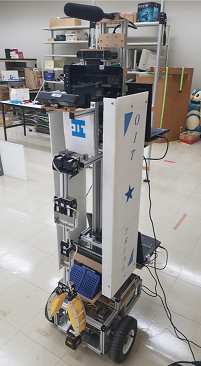
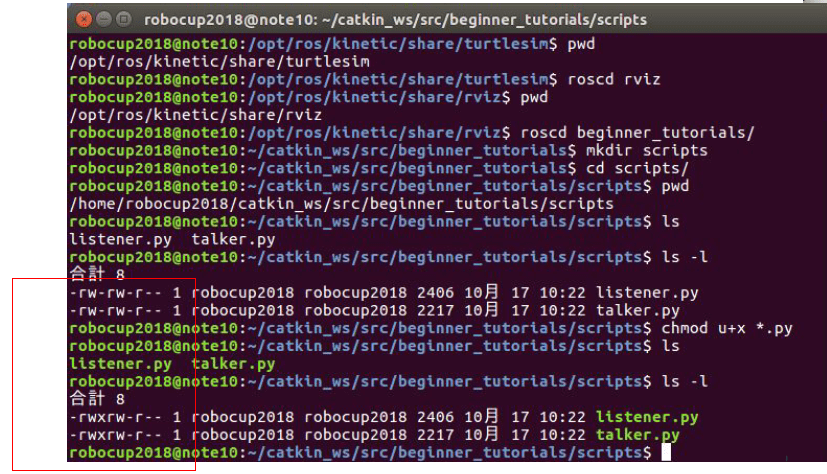
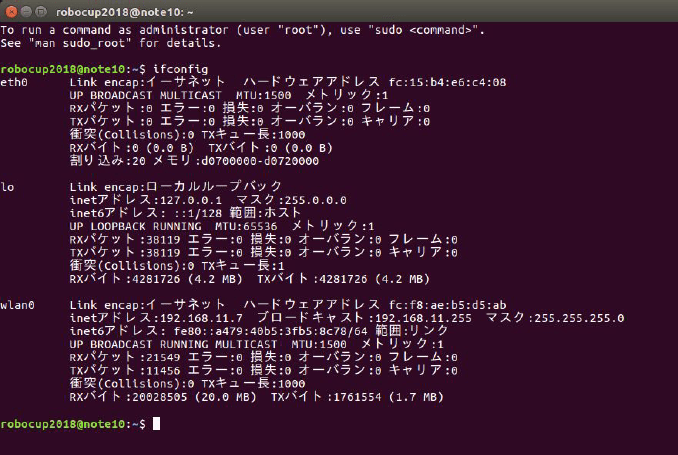

# ROS(1)

[ros/Home](Home)

---

## ROSとは

* Robot Operating System の略
  * [ROS のサイト](http://www.ros.org/)
* 複数の実行プログラムが協調する分散システムの構築をしやすくするミドルウェア
  * OSと皆さんが作成するアプリケーションの間に位置するソフト
* 実行プログラム間の通信を隠蔽してくれる仕組み、という理解でも可。

---

## 何故分散システムなのか

### ソフトウェアの面から

* ロボカップのタスクを達成するにはたくさんの機能が必要。
  * 音声認識
  * 画像処理
  * アクチュエータ制御
  * 統合
* 全てを含んだ一つの実行プログラムを作成するとどうなるか
  * 一つの機能(関数)を変更した際にその影響が全体に及ぶ。
  * 一つの機能に問題があって、実行時エラーが発生した際に全ての機能が停止する。
  * 分担して開発しにくい。一つの機能だけをテストしにくい。

---

### ハードウェアの面から

* ロボットはたくさんのセンサを積んでいる。



* 実行プログラムを一つにまとめてしまうと、1台のPCしか使えない。
  * 処理能力は足りる? USBポートは足りる?
  * 「ハブで増設すれば?」というのはUSB通信帯域の問題でうまくいかない場合も。

---

## ROS 用語

* ノード(`Node`)・・・一つの実行プログラム
* トピック(`Topic`)・・・ノード間で送受信されるデータ。名前(トピック名)と型を持つ。
* パブリッシャ(`Publisher`)・・・トピックを発信するノード
* サブスクライバ(`Subscriber`)・・・トピックを受信(購読)するノード
* ROS マスター・・・ノード同士を結び付けてくれるプログラム
* ワークスペース・・・ノードを作成するための場所。通常はホームディレクトリに作成する。
* パッケージ・・・作成したノードをある程度のまとまりでグルーピングしたもの。

---

## 実習（１）

* ROSマスターの起動。ターミナルで下記コマンドを実行。

```shell
roscore
```

* 出力されたメッセージを確認。`kinetic`という文字が出ているはず。

### Kinetic KAME

* ROS の LTS (Long Term Support) バージョンの一つ。
* 確認できたら、`Ctrl+C`で終了させておく。

---

## ワークスペースの作成

```shell
mkdir -p ~/catkin_ws/src
cd ~/catkin_ws/src
catkin_init_workspace
cd ~/catkin_ws/
catkin_make
```

* 任意のエディタで`~/.bashrc`を開き、ファイル最下段に下記を追記。

```shell
source ~/catkin_ws/devel/setup.bash
```

* `.bashrc`：シェル(ターミナル)起動時に実行されるスクリプト
* `source`：スクリプトを実行するコマンド
* この修正により、ターミナル起動時に`~/catkin_ws/devel/setup.bash`が実行され、`ROS`の実行に必要な環境変数がセットされる。
* 作業中のターミナルを閉じる。
* ここまでの作業はワークスペース作成時に一度だけ必要。

---

## catkin_create_pkg コマンドによるパッケージの作成

* 第一引数：作成するパッケージの名前（例：`beginner_tutorials`）
* 第二引数以降：使用する機能（例：`std_msgs rospy roscpp`）を指定。

```shell
cd ~/catkin_ws/src
catkin_create_pkg beginner_tutorials std_msgs rospy roscpp
cd ~/catkin_ws
catkin_make
```

* ここでターミナルを閉じる
  * 必須の操作ではない。演習の都合上の操作。

---

## 簡単なパブリッシャとサブスクライバの作成（１）

* 参考：[ROS/Tutorials/WritingPublisherSubscriber(python)](http://wiki.ros.org/ROS/Tutorials/WritingPublisherSubscriber%28python%29)
* ターミナルを開き、次のコマンドを実行

```shell
roscd beginner_tutorials
```

### 問題（１）

* カレントディレクトリを確認しなさい。

---

## roscd [パッケージ名]

* `ROS`パッケージのディレクトリに移動できる。
* `.bashrc`に`source`コマンドを追記したので、自作パッケージのディレクトリを簡単に取得できるようになっている。
* 下記のコマンドでその他のパッケージを見に行こう。

```shell
roscd turtlesim
pwd
roscd rviz
pwd
roscd beginner_tutorial
```

---

## 簡単なパブリッシャとサブスクライバの作成（２）

```shell
mkdir scripts
cd scripts
pwd
/home/ユーザ名/catkin_ws/src/beginner_tutorials/scripts
```

* `scripts`ディレクトリに下記二つのファイルをダウンロード
  * [talker.py](https://raw.github.com/ros/ros_tutorials/kinetic-devel/rospy_tutorials/001_talker_listener/talker.py)
  * [listener.py](https://raw.github.com/ros/ros_tutorials/kinetic-devel/rospy_tutorials/001_talker_listener/listener.py)

### 問題（２）

* ダウンロードした2つのファイルにユーザの実行権限をつけなさい。

---

```shell
chmod u+x talker.py
chmod u+x listener.py
```

* 権限が付与されたことを`ls -l`で確認すること。



---

## talker.py の実行

```shell
cd ~/catkin_ws
catkin_make
rosrun beginner_tutorials talker.py
```

* エラーが出て何も起きないはず。
  * どんなメッセージか確認する。
* エラーが出ずに無事実行できた人は手順を飛ばしているか、勘の良い人。

---

## rosrun [パッケージ名] [ノード名]

* あるパッケージに含まれるノードを実行する。
  * ただし、ノードの実行には原則事前に ROS マスターを起動しておくことが必要。
* 別のターミナルを開き`roscore`を実行する。
* さらに別のターミナルを開き次のコマンドを実行。

```shell
rosrun beginner_tutorials talker.py
```

* さらに別のターミナルを開き次のコマンドを実行。

```shell
rosrun beginner_tutorials listener.py
```

* 二つのノードを動かしたまま、次項のコマンドを実行すること。

---

## rqt_graph

* ROS のノード同士のつながりを可視化する。


## rostopic list

* 現在流れているトピックのリストを得る。

---

## rostopic echo [トピック名]

* [トピック名]のデータを表示する。
* 例:`rostopic echo /chatter` 
  * トピック名は`tab`キー補完可能

## rostopic type [トピック名]

* [トピック名]の型を表示する。
* 例:`rostopic type /chatter`

---

## talker.py のポイント

* エディタ等で`talker.py`を見てみる。

```python
def talker():
    # 'chatter'というトピック名にデータをパブリッシュする準備。
    pub = rospy.Publisher('chatter', String, queue_size=10)
    # 'talker'という名前でノードを生成する。
    # anonymous=True により、名前にランダムな番号が追加される。
    rospy.init_node('talker', anonymous=True)
    rate = rospy.Rate(10) # 10hzでループを回す。
    while not rospy.is_shutdown():
        hello_str = "hello world %s" % rospy.get_time()
        rospy.loginfo(hello_str) # 端末上に hello_str の内容を表示。
        pub.publish(hello_str) # hello_str をパブリッシュ。
        rate.sleep()
```

---

## listener.py のポイント

* エディタ等で`listener.py`を見てみる。

```python
def callback(data):
    # 受信したデータを表示。
    rospy.loginfo(rospy.get_caller_id() + 'I heard %s', data.data)

def listener():
    rospy.init_node('listener', anonymous=True)
    # 'chatter'というトピック名のデータを受信する準備。
    # 受信した瞬間に callback というメソッドが呼ばれるようにしている。
    rospy.Subscriber('chatter', String, callback)
    # 無限ループ開始
    rospy.spin()

if __name__ == '__main__':
    listener()
```

### 問題（３）

* ROS マスター、`talker.py`、`listener.py` を全て`Ctrl+C`で終了させなさい。

---

## 他のPCとの通信

* 誰かと二人組みになりなさい。

### 問題（４）

* `ifconfig`コマンドで自 PC の IP アドレスを調べ、パートナーに教えなさい。
* パートナーと相互に通信できることを`ping`コマンドで確認しなさい。
 * 参考:[ロボット理工学科 演習](http://robot.isc.chubu.ac.jp/?p=538)

## ping [IPアドレス]

* 指定したIPアドレスに接続できるかどうかを調べる。

---

## ifconfig

* PC の IP アドレスを調べる。
  * `lo` (ローカルループバック)は自分自身のこと。
  * 有線と無線が接続されている場合は両方のアドレスが出ることがある。



---

## 他のPCとの通信（２）

* 複数の PC を使う場合も ROS マスターは一つの PC のみで動かす。
* ROS マスターを動作させる PC をマスター、それ以外をスレーブと呼ぶ。

1. 二人組みのうち、マスター側とスレーブ側を決める。
2. マスター・スレーブ両方とも`roscore`,`listener.py`,`talker.py`を停止する。

### マスター側

* 任意のエディタで`~/.bashrc`を編集し、下記を末尾に追記。

```shell
export ROS_IP=○○○.○○○.○○○.○○○ <- 〇には自分の IPアドレス
export ROS_MASTER_URI=http://○○○.○○○.○○○.○○○:11311 <-同上
```

* ターミナルを開きなおして ROS マスターと`talker.py`を起動。

```shell
rosrun beginner_tutorials talker.py
```

---

### スレーブ側

* 任意のエディタで`~/.bashrc`を編集する。

```shell
export ROS_IP=○○○.○○○.○○○.○○○ <- 〇には自分の IPアドレス
export ROS_MASTER_URI=http://△△△.△△△.△△△.△△△:11311 <-△にはマスタのアドレス
```

* ターミナルを開きなおして`listener.py`を起動。

```shell
rosrun beginner_tutorials listener.py
```

---

## 応用問題（１）

* `talker.py`が出力するデータを好きな文字に変えて再び実行し、パートナーに
メッセージを届けなさい。
* マスターとスレーブの役割を交代しながら実施すること。

## 応用問題（２）

* ROS の`std_msg`について調べなさい。
 * `String`以外にどのような型が用意されているか、[std_msgs](http://wiki.ros.org/std_msgs)を参考に調べなさい。

---

## 応用問題（３）

* `talker.py`を次のように変更しなさい。

* 修正（１）

```python
from std_msgs.msg import String
from std_msgs.msg import Int32 # 追記
```

* 修正（２）

```python
pub = rospy.Publisher('chatter', String, queue_size=10)
pubInt32 = rospy.Publisher('number', Int32, queue_size=10) # 追記
```

---

* 修正（３）

```python
pub.publish(hello_str)
pubInt32.publish(number) # 追記
number = (number + 1) % 20 # 追記
```

* `talker.py`を実行しなさい。
* `rostpic list`を使って、どのようなトピックが流れるようになったかを確認しなさい。
* `rostopic echo`で実際にデータの内容を確認しなさい。

---

## 応用問題（４）

* `listener.py`を次のように編集し、実行結果を確認しなさい。
* 修正（１）

```python
from std_msgs.msg import String
from std_msgs.msg import Int32 #追記
```

* 修正（２）

```python
rospy.Subscriber('chatter', String, callback)
rospy.Subscriber('number', Int32, callbackInt32) # 追記
```

* 修正（３）

```python
def callback(data):
    rospy.loginfo(rospy.get_caller_id() + 'I heard %s', data.data)

def callbackInt32(data): # 追記
    rospy.loginfo(rospy.get_caller_id() + 'I heard %d', data.data) # 追記
```

---

## 後始末

* 任意のエディタで`~/.bashrc`を編集し、`ROS_IP`と`ROS_MASTER_URI`の`export`をコメントアウトしておくこと。
 * 行の先頭に「#」をつける。

```shell
# export ROS_IP=〇〇〇.〇〇〇.〇〇〇.〇〇〇
# export ROS_MASTER_URI=〇〇〇.〇〇〇.〇〇〇.〇〇〇
```

---

[ros/Home](Home)
