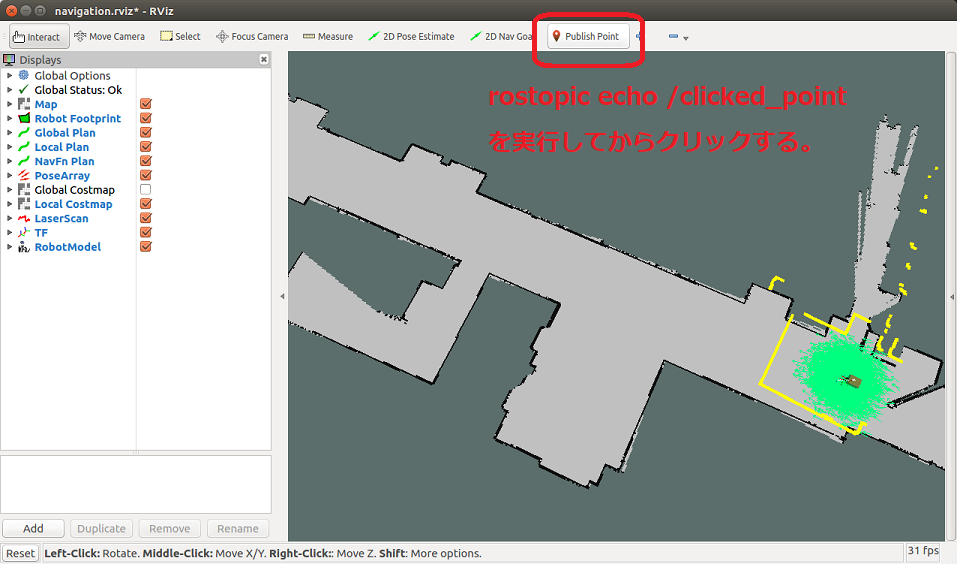

# マップ上の座標の調べ方

[smach/Home](Home.md)

---

- スクリプトでマップ上の特定の場所にロボットをナビゲーションさせる際に、ゴールの座標が必要となる。
- RViz の`Publish Point`ボタンで座標を調べることができる。
- 以下のコマンドを実行する前にシミュレータか実際のロボットのナビゲーションを起動しておく必要がある。
- 新しいターミナルを開いて下記コマンドを実行する。

```shell
$ rostopic echo /clicked_point
WARNING: no messages received and simulated time is active.
Is /clock being published?
```

- RViz 上で`Publish Point`ボタンを押し、地図上の任意の場所をクリックする。



- `rostopic echo /clicked_point`を実行したターミナル上にクリックした場所の座標が表示される。この情報の`x`と`y`を使えば良い。

```shell
$ rostopic echo /clicked_point
WARNING: no messages received and simulated time is active.
Is /clock being published?
header:
  seq: 4
  stamp:
    secs: 491
    nsecs: 500000000
  frame_id: "map"
point:
  x: 17.6272621155
  y: -0.0404167175293
  z: -0.00174522399902
---
```

---

[smach/Home](Home.md)
