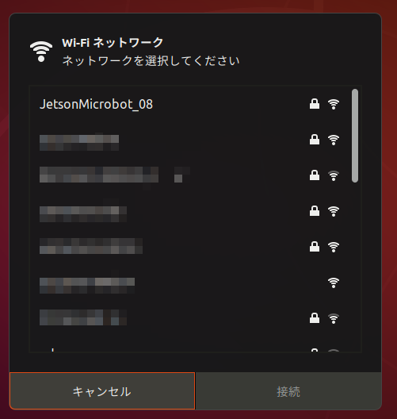
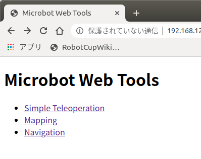
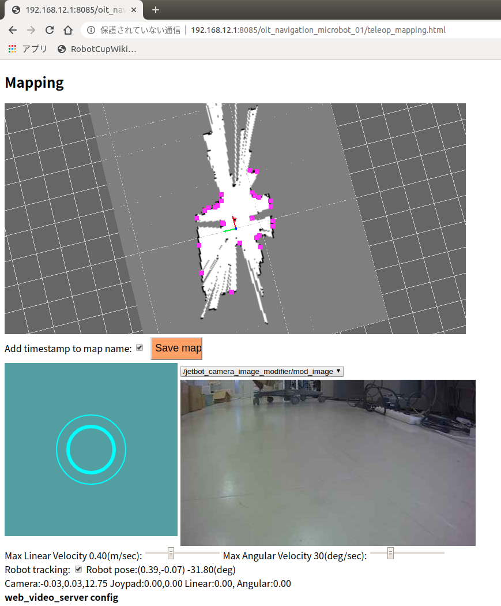

# 国際 PBL 用小型ロボットを動かす

[ros/navigation/Home.md](Home.md)

---

## ロボットに電池を接続する

## ロボットの Wifi に接続する

- 一般的な Wifi 接続と同じようにネットワークマネージャから接続する。
- 自分のロボットのアクセスポイントに間違えないように接続すること。



## ロボットに ssh 接続する

- ロボットのアクセスポイントの IP アドレスは常に 192.168.12.1 である。

```shell
$ ssh jetson@192.168.12.1
# 初回接続時は下記のようなメッセージが出る
The authenticity of host '192.168.12.1 (192.168.12.1)' can't be established.
ECDSA key fingerprint is SHA256:TWbqfYU13hikGcBWcVtTBkibHWB/eLuxqFTkPze3Ikw.
Are you sure you want to continue connecting (yes/no)?
# yesとタイプしてEnter
Warning: Permanently added '192.168.12.1' (ECDSA) to the list of known hosts.
jetson@192.168.12.1's password: # jetson と入力してEnter
Welcome to Ubuntu 18.04.3 LTS (GNU/Linux 4.9.140-tegra aarch64)

 * Documentation:  https://help.ubuntu.com
 * Management:     https://landscape.canonical.com
 * Support:        https://ubuntu.com/advantage

 * Multipass 1.0 is out! Get Ubuntu VMs on demand on your Linux, Windows or
   Mac. Supports cloud-init for fast, local, cloud devops simulation.

     https://multipass.run/
This system has been minimized by removing packages and content that are
not required on a system that users do not log into.

To restore this content, you can run the 'unminimize' command.

0 個のパッケージがアップデート可能です。
0 個のアップデートはセキュリティアップデートです。

Last login: Thu Feb  6 12:29:34 2020
jetson@jetson-desktop:~$ # Jetson NANO にログインできた
```

## ロボットの動作テストを行う

- ロボットに ssh 接続した端末（以降ロボット側と表記）で以下のコマンドを実行すると、レーザレンジファインダ（ロボット上部の青い回転体：以降 LRF と表記）が回る。

```shell
jetson@jetson-desktop:~$ roscd my_microbot_apps/launch/real
jetson@jetson-desktop:~/catkin_ws/src/my_microbot_apps/launch/real$ pwd
/home/jetson/catkin_ws/src/my_microbot_apps/launch/real
jetson@jetson-desktop:~/catkin_ws/src/my_microbot_apps/launch/real$ ls
detectnet.launch  mapping.launch  navigation.launch  simple.launch
jetson@jetson-desktop:~/catkin_ws/src/my_microbot_apps/launch/real$ roslaunch simple.launch
... logging to /home/jetson/.ros/log/367c367c-4893-11ea-b235-96b48cdee2b1/roslaunch-jetson-desktop-7543.log
Checking log directory for disk usage. This may take awhile.
Press Ctrl-C to interrupt
Done checking log file disk usage. Usage is <1GB.

xacro: in-order processing became default in ROS Melodic. You can drop the option.
・・・
[YDLidar]: [YDLIDAR]:SDK Version: 1.4.1
fhs_lock: creating lockfile:       7688

[YDLidar]: YDLidar running correctly ! The health status is good
[YDLIDAR] Connection established in [/dev/ydlidar]:
Firmware version: 1.5
Hardware version: 1
Model: X4
Serial: 2018101900004171
[YDLidar]: [YDLIDAR INFO] Current Sampling Rate : 4K
[YDLidar]: [YDLIDAR INFO] Now YDLIDAR is scanning ......
```

- Chrome Web ブラウザで http://192.168.12.1:8085/my_microbot_apps/ にアクセスする。



- Simple Teleoperation をクリックする。
- 仮想ジョイスティックでロボットをコントロールする。
- ブラウザを閉じる。
- ロボット側のターミナルで Ctrl+C でソフトを終了させる。
- LRF が止まる。

## 地図を作成する

- LRF のデータを重ね合わせることでロボットを動作させる場所の地形の全体像をロボットに記憶させる。
  - より正確には SLAM(Simultanious Localization and Mapping)と呼ばれる技術で占有格子地図（Occupancy Grid Map）を作成する、と言う。
  - ROS では[`gmapping`](http://wiki.ros.org/gmapping)が SLAM の機能を提供している。
- ロボット側で以下のコマンドを実行する。

```shell
jetson@jetson-desktop:~$ roscd my_microbot_apps/launch/real
jetson@jetson-desktop:~/catkin_ws/src/my_microbot_apps/launch/real$ roslaunch mapping.launch
```

- Chrome Web ブラウザで http://192.168.12.1:8085/my_microbot_apps/ にアクセスする。
- Mapping をクリックする。
- 仮想ジョイスティックでしばらく走らせると徐々に地図が出来上がっていく。



- PC でもう一つターミナルを起動し、ssh でロボットに接続する。

```shell
$ ssh jetson@192.168.12.1
jetson@jetson-desktop:~$ # Jetson NANO にログインできた
jetson@jetson-desktop:~$ roscd my_microbot_apps/maps/
jetson@jetson-desktop:~/catkin_ws/src/my_microbot_apps/maps$ rosrun map_server map_saver -f my_map_01
[ INFO] [1580968465.085593705]: Waiting for the map
[ INFO] [1580968465.327182908]: Received a 448 X 192 map @ 0.050 m/pix
[ INFO] [1580968465.327336145]: Writing map occupancy data to my_map_01.pgm
[ INFO] [1580968465.337047638]: Writing map occupancy data to my_map_01.yaml
[ INFO] [1580968465.337516204]: Done
jetson@jetson-desktop:~/catkin_ws/src/my_microbot_apps/maps$ ls
my_map_01.pgm my_map_01.yaml # この2つのファイルがあるかどうかを確認する。
```

## 作成した地図でナビゲーションする

- SLAM により作成した地図と LRF を使うと、ロボットは地図上で自分がどこにいるかを知ることができる。これを自己位置推定（Localization）と言う。
- Localization ができていれば、ROS の[`navigation メタパッケージ`](http://wiki.ros.org/navigation)により地図上で指定した目的地までロボットを自律移動させられる。
- ロボットに ssh 接続する。

```shell
$ ssh jetson@192.168.12.1
jetson@jetson-desktop:~$ roscd my_microbot_apps/launch/real
jetson@jetson-desktop:~/catkin_ws/src/my_microbot_apps/launch/real$ roslaunch navigation.launch map_name:=my_map_01 # ここで先程保存した地図の名前を指定する。
... logging to /home/jetson/.ros/log/c8391c46-48b2-11ea-a704-96b48cdee2b1/roslaunch-jetson-desktop-11973.log
Checking log directory for disk usage. This may take awhile.
Press Ctrl-C to interrupt
Done checking log file disk usage. Usage is <1GB.

xacro: in-order processing became default in ROS Melodic. You can drop the option.
started roslaunch server http://192.168.12.1:39223/

SUMMARY
========

PARAMETERS
・・・
[ INFO] [1580974341.202901592]: Created local_planner dwa_local_planner/DWAPlannerROS
[ INFO] [1580974341.217795966]: Sim period is set to 0.10
[ INFO] [1580974341.839433661]: Recovery behavior will clear layer 'obstacles'
[ INFO] [1580974341.866837087]: Recovery behavior will clear layer 'obstacles'
[ INFO] [1580974342.064977135]: odom received!
```

- Chrome Web ブラウザで http://192.168.12.1:8085/my_microbot_apps/ にアクセスする。
- Navigation をクリックする。

## ロボットから電池を外して充電する

---

[ros/navigation/Home.md](Home.md)
