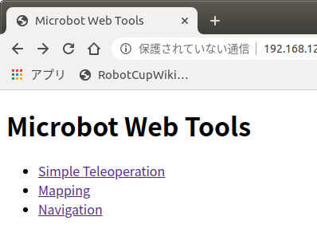
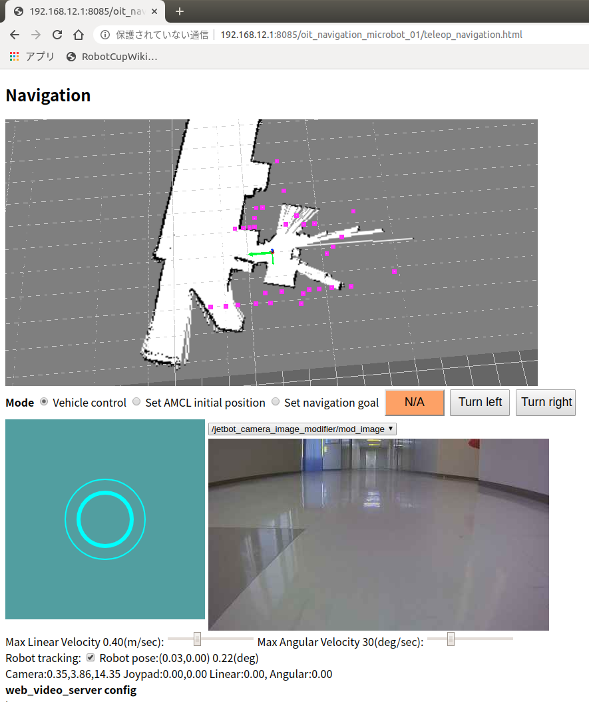
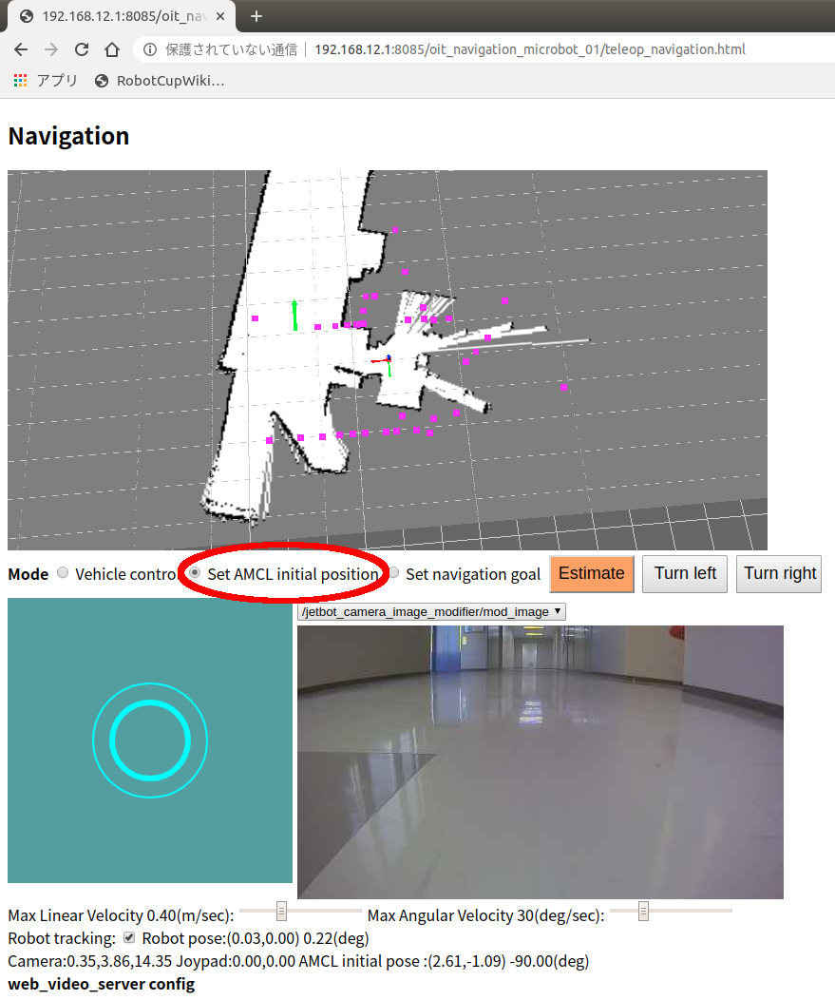
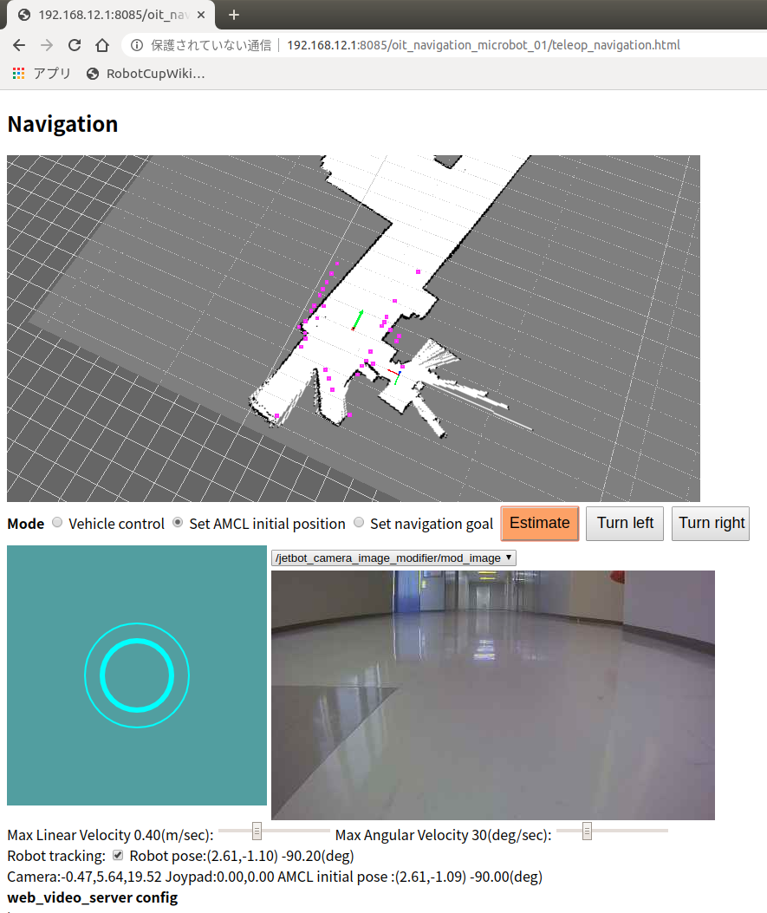
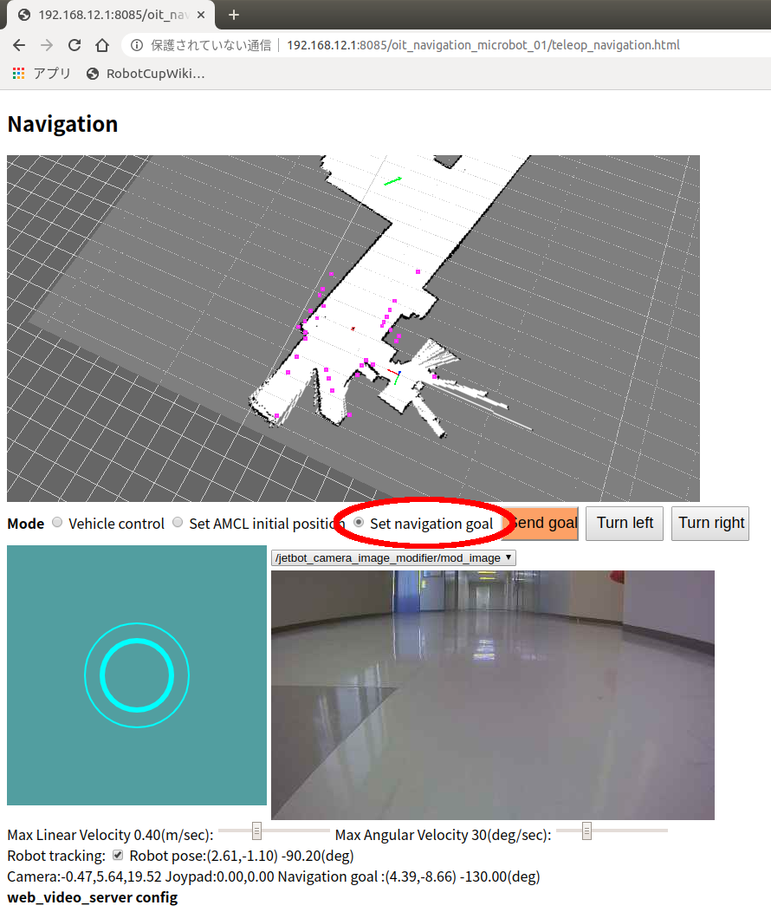

# JetsonMicrobot を動かす

[ros/robots/Home](Home.md)

---

## ロボットを起動する

- [起動して`ssh`接続まで](./robot_for_ipbl_microbot_boot_shutdown.md)を実施する。

## ロボットの動作テストを行う

- ロボットに ssh 接続した端末（以降ロボット側の端末と表記）で以下のコマンドを実行すると、レーザレンジファインダ（ロボット上部の青い回転体：以降 LRF と表記）が回る。

```shell
jetson@jetson-desktop:~$ roscd my_microbot_apps/launch/real
jetson@jetson-desktop:~/catkin_ws/src/my_microbot_apps/launch/real$ pwd
/home/jetson/catkin_ws/src/my_microbot_apps/launch/real
jetson@jetson-desktop:~/catkin_ws/src/my_microbot_apps/launch/real$ ls
detectnet.launch  mapping.launch  navigation.launch  simple.launch
jetson@jetson-desktop:~/catkin_ws/src/my_microbot_apps/launch/real$ roslaunch simple.launch
... logging to /home/jetson/.ros/log/367c367c-4893-11ea-b235-96b48cdee2b1/roslaunch-jetson-desktop-7543.log
Checking log directory for disk usage. This may take awhile.
Press Ctrl-C to interrupt
Done checking log file disk usage. Usage is <1GB.

xacro: in-order processing became default in ROS Melodic. You can drop the option.
・・・
[YDLidar]: [YDLIDAR]:SDK Version: 1.4.1
fhs_lock: creating lockfile:       7688

[YDLidar]: YDLidar running correctly ! The health status is good
[YDLIDAR] Connection established in [/dev/ydlidar]:
Firmware version: 1.5
Hardware version: 1
Model: X4
Serial: 2018101900004171
[YDLidar]: [YDLIDAR INFO] Current Sampling Rate : 4K
[YDLidar]: [YDLIDAR INFO] Now YDLIDAR is scanning ......
```

- Chrome Web ブラウザで http://192.168.12.1:8085/my_microbot_apps/ にアクセスする。



- Simple Teleoperation をクリックする。
- 仮想ジョイスティックでロボットをコントロールする。
- ブラウザを閉じる。
- ロボット側の端末で`Ctrl+C`でソフトを終了させる。
- LRF が止まる。

## 地図を作成する

- LRF のデータを重ね合わせることでロボットを動作させる場所の地形の全体像をロボットに記憶させる。
  - より正確には SLAM（Simultaneous Localization and Mapping）と呼ばれる技術で占有格子地図（Occupancy Grid Map）を作成する、と言う。
  - ROS では[`gmapping`](http://wiki.ros.org/gmapping)が SLAM の機能を提供している。
- ロボット側端末で以下のコマンドを実行する。以降、この端末をロボット側端末(1)とする。

```shell
jetson@jetson-desktop:~$ roscd my_microbot_apps/launch/real
jetson@jetson-desktop:~/catkin_ws/src/my_microbot_apps/launch/real$ roslaunch mapping.launch
```

- Chrome Web ブラウザで http://192.168.12.1:8085/my_microbot_apps/ にアクセスする。
- Mapping をクリックする。
- 仮想ジョイスティックでしばらく走らせると徐々に地図が出来上がっていく。


- PC でもう一つターミナルを起動し、`ssh`でロボットに接続する。以降この端末をロボット側端末(2)とする。

```shell
$ ssh jetson@192.168.12.1
jetson@jetson-desktop:~$ # Jetson NANO にログインできた
jetson@jetson-desktop:~$ roscd my_microbot_apps/maps/
jetson@jetson-desktop:~/catkin_ws/src/my_microbot_apps/maps$ rosrun map_server map_saver -f my_map_01
[ INFO] [1580968465.085593705]: Waiting for the map
[ INFO] [1580968465.327182908]: Received a 448 X 192 map @ 0.050 m/pix
[ INFO] [1580968465.327336145]: Writing map occupancy data to my_map_01.pgm
[ INFO] [1580968465.337047638]: Writing map occupancy data to my_map_01.yaml
[ INFO] [1580968465.337516204]: Done
jetson@jetson-desktop:~/catkin_ws/src/my_microbot_apps/maps$ ls
my_map_01.pgm my_map_01.yaml # この2つのファイルがあるかどうかを確認する。
jetson@jetson-desktop:~/catkin_ws/src/my_microbot_apps/maps$ exit # ロボット側端末(2)はログアウトする。
```

- 地図が保存できたら、ロボット側端末(1)のソフトを`Ctrl+C`で終了させる。

## 作成した地図でナビゲーションする

- SLAM により作成した地図と LRF を使うと、ロボットは地図上で自分がどこにいるかを知ることができる。これを自己位置推定（Localization）と言う。
- Localization ができていれば、ROS の[`navigation メタパッケージ`](http://wiki.ros.org/navigation)により地図上で指定した目的地までロボットを自律移動させられる。
- ロボットに`ssh`接続する。

```shell
$ ssh jetson@192.168.12.1
jetson@jetson-desktop:~$ roscd my_microbot_apps/launch/real
jetson@jetson-desktop:~/catkin_ws/src/my_microbot_apps/launch/real$ roslaunch navigation.launch map_name:=my_map_01 # ここで先程保存した地図の名前を指定する。
... logging to /home/jetson/.ros/log/c8391c46-48b2-11ea-a704-96b48cdee2b1/roslaunch-jetson-desktop-11973.log
Checking log directory for disk usage. This may take awhile.
Press Ctrl-C to interrupt
Done checking log file disk usage. Usage is <1GB.

xacro: in-order processing became default in ROS Melodic. You can drop the option.
started roslaunch server http://192.168.12.1:39223/

SUMMARY
========

PARAMETERS
・・・
[ INFO] [1580974341.202901592]: Created local_planner dwa_local_planner/DWAPlannerROS
[ INFO] [1580974341.217795966]: Sim period is set to 0.10
[ INFO] [1580974341.839433661]: Recovery behavior will clear layer 'obstacles'
[ INFO] [1580974341.866837087]: Recovery behavior will clear layer 'obstacles'
[ INFO] [1580974342.064977135]: odom received!
```

- Chrome Web ブラウザで http://192.168.12.1:8085/my_microbot_apps/ にアクセスする。
- Navigation をクリックする。

### 自己位置を推定する

- 多くの場合、ナビゲーション開始時にロボットは自分が地図上のどこにいるのかが分かっていない。
- そのため、次の図のようにレーザのデータが地図の地形と一致していない場合がある。



- 次のようにしてロボットに現在地を教え、自己位置を推定させる。
- Set AMCL Initial Pose にチェックを入れる。
  - [AMCL: Adaptive Monte Carlo localization](http://wiki.ros.org/amcl)



- 仮想ジョイスティックで緑の矢印をロボットの正しい現在地に移動させる。
- Turn left、Turn right ボタンによりロボットの正しい方向に矢印を向ける。
- Estimate ボタンを押す。
- うまく行くと、次の図のように LRF のデータが地形とおおよそ一致する。
  - 完全に一致する必要はない。



### 目標地点を指定して自律移動させる

- Set navigation goal にチェックを入れる。
- 仮想ジョイスティックで緑の矢印をロボットに行ってほしい場所に移動させる。
- Turn left、Turn right ボタンによりロボットが目的地に着いた後に向いてほしい方向を指定する。
- Send goal ボタンを押すと、ロボットが目的地に向かう。
  - 途中に予期しない障害物が出現すると回避するかその場で止まる。



- 問題がなければ目的地で止まる。
- 姿勢を調節するために目的地付近で回転する場合もある。
  - たどり着けなかった場合、ssh でログインしているロボット側の端末にエラーメッセージが出ている。

## ロボットの電源を OFF にする

- [電源 OFF から充電まで](./robot_for_ipbl_microbot_boot_shutdown.md)を実施する。

---

[ros/robots/Home](Home.md)
