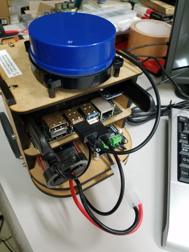
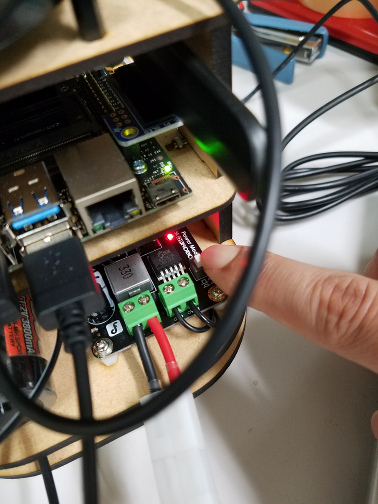
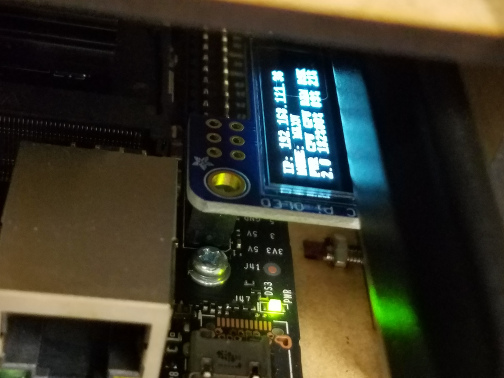
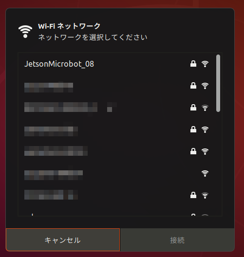

# Jetson Microbot の起動と終了

[ros/robots/Home](Home.md)

---

## ロボットに電池を接続する

- コネクタの向き（リード線の色）に注意して電池を接続する。



### Jetson NANO 用の電源を ON にする

- DC-DC コンバータの LED（図中指差ししている箇所）が赤くなっていなければ電源ボタンを押す。



- 液晶ディスプレイに IP アドレスその他の情報が表示されると、Jetson NANO の起動は完了している。



## ロボットの Wifi に接続する

- 一般的な Wifi 接続と同じようにネットワークマネージャから接続する。
- 自分のロボットのアクセスポイントに間違えないように接続すること。



## ロボットに`ssh`接続する

- ロボットのアクセスポイントの IP アドレスは常に 192.168.12.1 である。
- ロボットに`ssh`接続した端末を以降**ロボット側端末**と表記する。

```shell
$ ssh jetson@192.168.12.1
# 初回接続時は下記のようなメッセージが出る
The authenticity of host '192.168.12.1 (192.168.12.1)' can't be established.
ECDSA key fingerprint is SHA256:XXXXXXXXXXXXXXXXXXXXXXXXXXXXXXX
Are you sure you want to continue connecting (yes/no)?
# yesとタイプしてEnter
Warning: Permanently added '192.168.12.1' (ECDSA) to the list of known hosts.
jetson@192.168.12.1's password: # jetson と入力してEnter
Welcome to Ubuntu 18.04.3 LTS (GNU/Linux 4.9.140-tegra aarch64)

 * Documentation:  https://help.ubuntu.com
 * Management:     https://landscape.canonical.com
 * Support:        https://ubuntu.com/advantage

 * Multipass 1.0 is out! Get Ubuntu VMs on demand on your Linux, Windows or
   Mac. Supports cloud-init for fast, local, cloud devops simulation.

     https://multipass.run/
This system has been minimized by removing packages and content that are
not required on a system that users do not log into.

To restore this content, you can run the 'unminimize' command.

0 個のパッケージがアップデート可能です。
0 個のアップデートはセキュリティアップデートです。

Last login: Thu Feb  6 12:29:34 2020
jetson@jetson-desktop:~$ # Jetson NANO にログインできた
```

## ロボットを動かす

- [WEB ブラウザから動かす場合](./robot_for_ipbl_microbot_chrome.md)
- [RViz から動かす場合](./robot_for_ipbl_microbot_rviz.md)

## ロボットの電源を OFF にする

- ロボット側端末で Jetson NANO をシャットダウンする。

```shell
jetson@jetson-desktop:~/catkin_ws/src/my_microbot_apps/launch/real$ shutdown -h now
```

- 起動時に押下した、Jetson NANO 用の電源スイッチを OFF にする。
  - DC-DC コンバータの LED が消灯する。

## ロボットから電池を外して充電する

- コネクタのロックを十分に押して完全に外す。
- リード線ではなく、コネクタをしっかりと掴んで引き抜く。
  - リード線を強引に引っ張ると、DC-DC コンバータからリード線が抜けてしまう。注意して引き抜くこと。


- 充電器に電池を接続し、BATTERY ボタンを長押しする。
- NiMH の LED が赤く点灯し充電が始まる。
  - 充電中は点滅する。詳細は[充電器のマニュアル](https://hitecrcd.co.jp/download/x1nano-jpn/)を参照。


- NiMH の LED が緑色に点灯すると充電は完了している。


---

[ros/robots/Home](Home.md)
