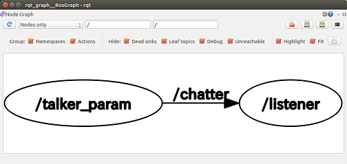
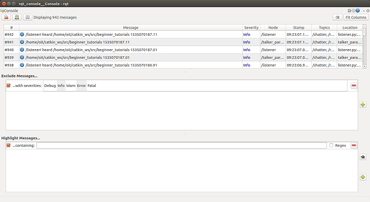

# roslaunch（ロスランチ）

多数の`node`を一度に起動するための便利な仕組み。

[Home.md](Home.md)

---

## 一つのシステムに必要な node 数は膨大

- ROS は複数の`node`を連携させて一つのシステムとして動作させる。
- 一つのロボットを動作させるノード群の構成例。

  - ロボット全体の統合＝状態遷移に基づくタスク遂行
  - 音声対話
  - 台車のモータコントローラの ROS ドライバ
  - ステッピングモータ・サーボモータの ROS ドライバ
  - 台車のナビゲーション（目的地への経路生成など）
  - アームの逆運動学計算
  - 画像認識
    - 物体の認識
    - 人間の姿勢推定と動作認識
    - 人間の顔、性別、年齢認識

- 各パッケージに複数の`node`が含まれる。他の ROS の`node`に依存するものもある。
- **一つのシステムにつき大量の`node`を実行する必要がある。全ての`node`を逐一`rosrun`することは不可能。**

---

## roslaunch コマンド

- 構文

```shell
roslaunch [パッケージ名] launchファイル名
```

- `launch`ファイル
  - XML で書かれたバッチファイル（実行プログラムのリストを記述し順番に実行するための小さなプログラム）
  - 拡張子は`.launch`。一般的な XML の拡張子`.xml`とは異なる。

---

## 実習（1）

- **実習に入る前に必ず全ての端末を閉じなさい。**

- 端末を開き`roscore`を起動。以降この端末を「端末(1)」とする。
- 端末を開き`rosrun turtlesim turtlesim_node`で亀のシミュレータを起動。以降この端末を「端末(2)」とする。
- 端末を開き`rosrun turtlesim turtle_teleop_key`を実行。以降この端末を「端末(3)」とする。
- 端末(3)で矢印キーを適当に押して、亀が移動することを確認する。
- 端末(1)~(3)を全て終了し、閉じる。

---

## 実習（2）

- **実習に入る前に必ず全ての端末を閉じなさい。**

- `launch`ファイルを作成する。

```shell
roscd beginner_tutorials/
mkdir launch
cd launch
emacs turtle.launch &
```

- `turtle.launch`の内容は次の通り。保存して`emacs`を終了。

```xml
<launch>
  <node name="turtlesim" type="turtlesim_node" pkg="turtlesim" />
  <node name="teleop_key" type="turtle_teleop_key" pkg="turtlesim" />
</launch>
```

---

- 次のコマンドを実行して、実習（１）と同様に矢印キーで亀をコントロールできることを確認しなさい。

```shell
roslaunch beginner_tutorials turtle.launch
```

- **roslaunch した端末をクリックしてからでないと矢印キーでのコントロールはできない。**

- 亀の移動ができたら`Ctrl+C`で終了させ、端末を閉じなさい。
- さらに、次のやり方でも`roslaunch`できることを確認しなさい。

```shell
roscd beginner_tutorials/launch
roslaunch turtle.launch
```

- 亀の移動ができたら`Ctrl+C`で終了させ、端末を閉じなさい。

---

## 問題（1）

- 実習（１）と実習（２）で起動した端末の数や実行手順に着目し`roslaunch`の優位性を述べなさい。
  - 単に起動した端末数が少なくなっただけではなく、一つ非常に重要な違いがある。

---

## launch ファイルのタグ

- XML において`<`と`>`で囲まれる部分を「タグ」と呼ぶ。
- 「タグ」には開始タグと終了タグがある。`</タグ名>`のように`/（スラッシュ）`が入っているのが終了タグ。
- XML では **開始タグと終了タグが必ず対になっている。** 開始タグと終了タグの間に他の要素を記述する。
- ただし、開始タグと終了タグの間に何も書かない場合は`<タグ名 />`とすることで終了タグを省略できる。

```xml
終了タグ省略の例。
<node name="teleop_key" type="turtle_teleop_key" pkg="turtlesim" />
```

---

## launch タグ

- `launch`ファイルの全ての内容はこのタグの間に記述される。

## node タグ

- `name="ノードに付ける名前"`
- `type="ノードの実行形式ファイル名"` Python だとスクリプト名を指定する。（例）`type="talker.py"`
- `pkg="パッケージ名"`

---

## 実習（３）

- 新たな`launch`ファイルを作成する。

```shell
roscd beginner_tutorials/
mkdir launch
cd launch
emacs pair.launch &
```

- `pair.launch`の内容は次の通り。保存して`emacs`を終了。

```xml
<launch>
  <node name="talker_param" type="talker_param.py" pkg="beginner_tutorials" />
  <node name="listener" type="listener.py" pkg="beginner_tutorials" />
</launch>
```

- 次のコマンドで`pair.launch`を実行しなさい。**これまでのように画面上に文字が流れることはない。**

```shell
roslaunch beginner_tutorials pair.launch
```

---

- 別の端末を開き`rqt_graph`を実行し、確かに 2 つのノードが起動していることを確認しなさい。



- 結果を確認したら、`Ctrl+C`で終了させなさい。
- `rostopic echo /chatter`コマンドを実行して`/chatter`トピックにデータが流れていることも確認しなさい。

```shell
data: "Good Bye 1535068294.95"
---
data: "Good Bye 1535068295.05"
---
```

- データが流れていることを確認したら、`Ctrl+C`で終了させなさい。

---

- `rqt_console`コマンドを実行し、トピックが流れていることを GUI でも確認しなさい。



- 最後に全ての端末を`Ctrl+C`で終了させ、端末を閉じなさい。

---

## 実習（４）

- `pair.launch`を編集し、`talker_param.py`を起動している`node`タグを次のように変更しなさい。**param タグを追加するために node の終了タグが必要になったことに注意**

```xml
  <node name="talker_param" type="talker_param.py" pkg="beginner_tutorials" />
```

を

```xml
  <node name="talker_param" type="talker_param.py" pkg="beginner_tutorials">
    <param name="text" type="str" value="Hello ROS launch" />
  </node>
```

にする。

---

- `listener.py`を起動している`node`タグを次のように変更しなさい。

```xml
  <node name="listener" type="listener.py" pkg="beginner_tutorials" output="screen" />
```

- 変更を保存して`emacs`を終了させなさい。
- 次のコマンドで`pair.launch`を実行しなさい。

```shell
roslaunch beginner_tutorials pair.launch
```

- 出力例

```shell
・・・launch の起動メッセージ・・・
[INFO] [1535068920.480185]: /listenerI heard Hello ROS launch 1535068920.48
[INFO] [1535068920.579530]: /listenerI heard Hello ROS launch 1535068920.58
[INFO] [1535068920.680067]: /listenerI heard Hello ROS launch 1535068920.68
```

- 動作が確認できたら`Ctrl+C`で終了させ、端末を閉じなさい。

---

- `talker_param.py`を起動している`node`タグを次のように変更しなさい。

```xml
  <node name="talker_param" type="talker_param.py" pkg="beginner_tutorials">
    <param name="text" type="str" value="$(find beginner_tutorials)" />
  </node>
```

- 変更を保存して`emacs`を終了させなさい。
- これまで同様`pair.launch`を実行しなさい。
- 実行結果

```shell
・・・launch の起動メッセージ・・・
[INFO] [1535069164.599809]: /listenerI heard /home/「ユーザ名」/catkin_ws/src/beginner_tutorials 1535069164.6
[INFO] [1535069164.700438]: /listenerI heard /home/「ユーザ名」/catkin_ws/src/beginner_tutorials 1535069164.7
[INFO] [1535069164.799238]: /listenerI heard /home/「ユーザ名」/catkin_ws/src/beginner_tutorials 1535069164.8
```

---

## node タグ（追加）

- `output="screen"`
  - `roslaunch`で`node`を起動した場合、`rospy.loginfo`のような ROS 固有の出力関数は画面に文字を出さなくなる。それを画面にも出力するように変更する。

## param タグ

- `name="パラメータ名"`
  - `node`タグ内に記述した場合、自動的にプライベートパラメータ扱いになるので`~（チルダ）`不要。
- `type="パラメータの型"`
  - 省略可能。`str int double bool yaml`のいずれか。省略した場合は自動的に型が推測される。
- `value="パラメータの値"`

---

## 変数 \$(find パッケージ名)

- **超重要** 指定されたパッケージの絶対パスを得る。
- この変数を使うことで`node`が使う設定ファイルのパスなどを簡単に取得できる。
- 例えば`~/catkin_ws/src/beginner_tutorials/config.txt`のような設定ファイルがあったとしたら、`launch`ファイル内では`$(find beginner_tutorials)/config.txt`としてファイルのパスを取得できる。

---

## 参考文献

- [http://wiki.ros.org/ja/roslaunch/XML](http://wiki.ros.org/ja/roslaunch/XML)
- [Roslaunch tips for large projects](http://wiki.ros.org/ROS/Tutorials/Roslaunch%20tips%20for%20larger%20projects)

---

[Home.md](Home.md)
