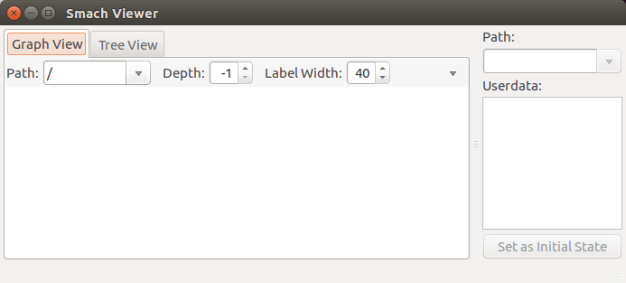
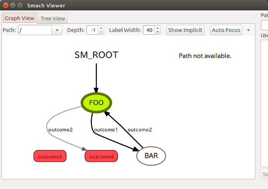

# [SMACH（スマッシュ）（1）](http://wiki.ros.org/smach)

階層構造のあるステートマシンを作成するためのノード

[smach/Home](Home.md)

---

## インストール

- ROS のプログラミング環境を[セットアップ](https://github.com/KMiyawaki/setup_robot_programming)した PC（仮想環境、WSL 可）で行う。

```shell
$ sudo apt-get install ros-melodic-smach
$ sudo apt-get install ros-melodic-smach-viewer
```

- `ros-melodic-smach-viewer`をインストールする際にスクリプトが入らない場合があるので、一度`rosrun`して確認する。
- `roscore`起動後に下記のコマンドを実行。

```shell
$ rosrun smach_viewer smach_viewer.py
```

- ここで`smach_viewer.py`が無い旨のエラーが出たらスクリプトがインストールされていない。
- インストールされていれば次のような GUI のウィンドウが開く。



- インストールされていない場合は[smach_viewer.py](https://github.com/ros-visualization/executive_smach_visualization/blob/indigo-devel/smach_viewer/scripts/smach_viewer.py)をダウンロードし、`/opt/ros/melodic/share/smach_viewer/scripts`に配置する。
- ただし、`mkdir`、`mv`などのコマンドは`sudo`でないと失敗するので注意。

## チュートリアル

- [state_machine_simple.py](https://raw.githubusercontent.com/KMiyawaki/lectures/master/ros/smach/smach_01/state_machine_simple.py)をダウンロードして`scripts`ディレクトリに配置する。
  - **実行権限追加を忘れないように。**

```shell
$ roscd my_microbot_apps/scripts
$ pwd
/home/[user name]/catkin_ws/src/my_microbot_apps/scripts
$ chmod u+x state_machine_simple.py
$ ls -l
-rwxr--r-- 1 oit oit 1364  2月 11 13:03 state_machine_simple.py
```

- `roscore`を起動後（既に起動しているなら再起動の必要はない）、`state_machine_simple.py`を実行する。

```shell
$ ./state_machine_simple.py
[INFO] [1536725370.457410]: State machine starting in initial state 'FOO' with userdata:
	[]
[INFO] [1536725370.457685]: Executing state FOO
[INFO] [1536725370.457901]: State machine transitioning 'FOO':'outcome1'-->'BAR'
[INFO] [1536725370.458119]: Executing state BAR
[INFO] [1536725370.458326]: State machine transitioning 'BAR':'outcome2'-->'FOO'
[INFO] [1536725370.458534]: Executing state FOO
[INFO] [1536725370.458734]: State machine transitioning 'FOO':'outcome1'-->'BAR'
[INFO] [1536725370.458938]: Executing state BAR
[INFO] [1536725370.459134]: State machine transitioning 'BAR':'outcome2'-->'FOO'
[INFO] [1536725370.459336]: Executing state FOO
[INFO] [1536725370.459625]: State machine transitioning 'FOO':'outcome1'-->'BAR'
[INFO] [1536725370.459924]: Executing state BAR
[INFO] [1536725370.460229]: State machine transitioning 'BAR':'outcome2'-->'FOO'
[INFO] [1536725370.460433]: Executing state FOO
[INFO] [1536725370.460627]: State machine terminating 'FOO':'outcome2':'outcome4'
```

## 可視化

- 参考
  - [Viewing State Machines (ROS)](http://wiki.ros.org/smach/Tutorials/Smach%20Viewer)
- `state_machine_simple.py`の以下の部分を変更。
- まず、先頭に`# -*- coding: utf-8 -*-`を以下のように追記。

```python
#!/usr/bin/env python
# -*- coding: utf-8 -*-
```

- これで、プログラム中で日本語が使えるようになる。
- 次に以下のような修正を加える。

```python
       rospy.loginfo('Executing state FOO')
       rospy.sleep(1) # 追記
       if self.counter < 500: # 変更
・・・
       rospy.loginfo('Executing state BAR')
       rospy.sleep(1) # 追記
・・・
                              transitions={'outcome2':'FOO'})

   sis = smach_ros.IntrospectionServer('state_machine_simple', sm, '/SM_ROOT') # 追記
   sis.start() # 追記
   # Execute SMACH plan
   outcome = sm.execute()
   # Wait for ctrl-c to stop the application # 追記
   rospy.spin() # 追記
   sis.stop() # 追記
```

- スクリプトを作成し終わったら、`roscore`を起動後（既に起動しているなら再起動の必要はない）`state_machine_simple.py`を実行する。

```shell
$ roscd my_microbot_apps/scripts
$ ./state_machine_simple.py
[INFO] [1536725370.457410]: State machine starting in initial state 'FOO' with userdata:
	[]
```

- さらに別コンソールで、`rosrun smach_viewer smach_viewer.py`を実行する。

```shell
$ rosrun smach_viewer smach_viewer.py
```

- 次のように状態遷移図を見ることができる。



---

[smach/Home](Home.md)
