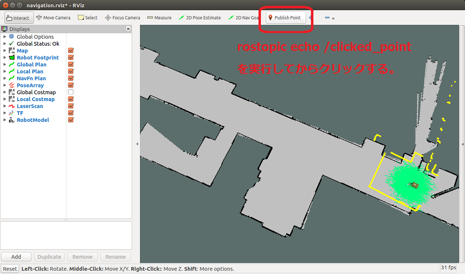

# [SMACH（スマッシュ）(4)](http://wiki.ros.org/smach)

SMACH から Action を使う

[smach/Home](Home.md)

---

## 実習(1)

- まず、[シミュレータを起動する](../stage_simulator/stage_simulator_01.md)。
- 次のファイルを`~/catkin_ws/src/my_microbot_apps/scripts`にダウンロードし実行しなさい。
  - [state_machine_action_1.py](https://raw.githubusercontent.com/KMiyawaki/lectures/master/ros/smach/smach_04/state_machine_action_1.py)

```shell
$ roscd my_microbot_apps/scripts/
$ pwd
/home/[user name]/catkin_ws/src/my_microbot_apps/scripts
$ wget https://raw.githubusercontent.com/KMiyawaki/lectures/master/ros/smach/smach_04/state_machine_action_1.py
--2020-10-28 12:09:25--  https://raw.githubusercontent.com/KMiyawaki/lectures/master/ros/smach/smach_04/state_machine_action_1.py
・・・
2020-10-28 12:09:26 (4.14 MB/s) - ‘state_machine_action_1.py’ saved [2568/2568]

$ chmod u+x state_machine_action_1.py
$ ls -l
・・・
-rwxr--r-- 1 oit oit 2568 Oct 28 12:09 state_machine_action_1.py
```

## [SimpleActionState](http://wiki.ros.org/smach/Tutorials/Calling%20Actions)

- `smach`から`action`クライアントの機能を簡単に呼び出すための状態。

## 実習(2)

- 上記プログラムを別名でコピーする。

```shell
$ roscd my_microbot_apps/scripts
$ cp state_machine_action_1.py state_machine_action_2.py
$ ls
state_machine_action_1.py state_machine_action_2.py
```

- コピーして生成した`state_machine_action_2.py`の下記部分を編集する。

```python
coord_type = "base_link" # ロボットローカル座標系
を
coord_type = "map" # マップ座標系
にして、
move_base_goal.target_pose.pose.position.x = 4.0
move_base_goal.target_pose.pose.position.y = 3.0
move_base_goal.target_pose.pose.orientation.w = 1.0
```

- 編集が終了したら、上記と同様の手順でスクリプトを実行する。

## 問題(1)

- 上記のプログラムが何を行っているか類推してから任意の目標地点を数個（4 点程度）地図上に設定し、それらを順番に回っていくプログラムを作成しなさい。
  - このように最終目的地に至るまでのサブゴールをウェイポイントと呼びます。
  - 本来、ウェイポイントで停止して欲しくはないですが、現状では止まってしまう問題があります。

## マップ上の座標の調べ方

- スクリプトでマップ上の特定の場所にロボットをナビゲーションさせる際に、ゴールの座標が必要となる。
- RViz の`Publish Point`ボタンで座標を調べることができる。
- まず、[シミュレータを起動する](../stage_simulator/stage_simulator_01.md)。
- 新しいターミナルを開いて下記コマンドを実行する。

```shell
$ rostopic echo /clicked_point
WARNING: no messages received and simulated time is active.
Is /clock being published?
```

- RViz 上で`Publish Point`ボタンを押し、地図上の任意の場所をクリックする。



- `rostopic echo /clicked_point`を実行したターミナル上にクリックした場所の座標が表示される。この情報の`x`と`y`を使えば良い。

```shell
$ rostopic echo /clicked_point
WARNING: no messages received and simulated time is active.
Is /clock being published?
header:
  seq: 4
  stamp:
    secs: 491
    nsecs: 500000000
  frame_id: "map"
point:
  x: 17.6272621155
  y: -0.0404167175293
  z: -0.00174522399902
---
```

---

[smach/Home](Home.md)
