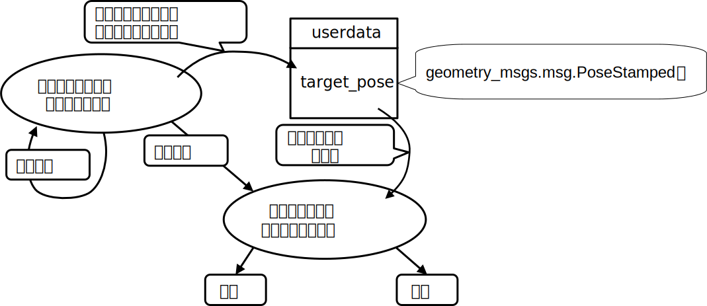

# [SMACH（スマッシュ）（5）](http://wiki.ros.org/smach)

SMACH の状態に外部からデータを与える

[smach/Home](Home.md)

---

## 実習（１）

- 次のファイルを`smach_tutorials/example`にダウンロードし，`roscore`を起動してから実行しなさい。
  - [user_data_sample_1.py](user_data_sample_1.py)
- 別ターミナルで`smach_viewer`も起動して状態遷移を可視化しなさい。

```shell
$ rosrun smach_viewer smach_viewer.py
```

## [Passing User Data between States](http://wiki.ros.org/smach/Tutorials/User%20Data)

- `input_keys`、`output_keys`によって状態間でデータを受け渡しできるようにする。
- 例えば、ロボットをある地点にナビゲーションすることを考える。現状では特定の座標を指定して`move_base`にコマンドを送っている。
- しかし、ロボカップのタスクでは人間との対話によって行き先が決まることがほとんどである。
- つまり、ロボットをどこに移動させるか、最初は分からない（＝プログラムに書けない）。
- 従って、ロボットをナビゲーションする、という状態は人間との対話によって決定する座標を与えて実行されるようにしておかなければならない。
- これは`userdata`を使い状態間で座標情報を受け渡しすることで実現できる。
- 上記の一連の動作を状態遷移として作るとすると下の図のようになる。



## 実習（２）

- 次のファイルを`smach_tutorials/example`にダウンロードし，`roscore`を起動してから実行しなさい。
  - [user_data_sample_2.py](user_data_sample_2.py)
- 次にプログラムの一番下にある`main_1`を`main_2`に変更して再度実行し、何が違うかを検証しなさい。

## 問題（１）

- 上記のプログラムが何を行っているか類推してから、
  - `main_2`のコーヒーを緑茶に変更して再度実行しなさい。エラーが発生しプログラムが停止するはずなので、それを防ぎなさい。
    - `GetObjectPositionDummy`が`ng`を返すようにする。
  - `GrabItemDummy`は現状ではいかなる場合も把持成功するようになっている。
    - 高さ（z 座標）が 1.0 より大きいとき、把持失敗というメッセージを出して、`ng`を返すようにしなさい。
    - 完成したら、`main_1`を使って動作確認しなさい。

---

[smach/Home](Home.md)
