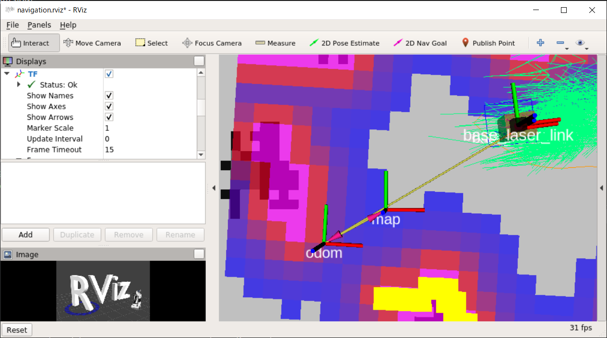

# ROS navigation の Action Server を使う

[ros/stage_simulator/Home](Home.md)

---

## move_base にコマンドを送る

- `move_base`は`ROS navigation`メタパッケージの全体 ( SLAM 以外) を束ねるものである。

  - [move_base](http://wiki.ros.org/move_base)
  - 現状でも`/cmd_vel`に速度をパブリッシュすればロボットを動かせる。しかし今やりたいのは、`move_base`が持つ、大域的・局所的な経路計画と障害物回避機能である。

- スクリプトを格納するディレクトリを作る

```shell
$ roscd my_microbot_apps/scripts
```

- `scripts`に下記ファイルをダウンロード
  - [simple_navigation_local_goals.py](https://raw.githubusercontent.com/KMiyawaki/lectures/master/ros/stage_simulator/navigation_action_server/simple_navigation_local_goals.py)
  - 実行権限を付けておくこと。

```shell
$ wget https://raw.githubusercontent.com/KMiyawaki/lectures/master/ros/stage_simulator/navigation_action_server/simple_navigation_local_goals.py
・・・
simple_navigation_local_goals.py                         100%[===============================================================================================================================>]   1.16K  --.-KB/s    in 0s      

2020-10-13 07:47:48 (27.9 MB/s) - ‘simple_navigation_local_goals.py’ saved [1191/1191]
```

- [Stage Simulator (1)](./stage_simulator_01.md)で使用した`navigation.launch`を起動しておく。

```shell
$ roscd my_microbot_apps/launch/simulation/
$ roslaunch navigation.launch use_teleop:=true use_mouse:=false map_name:=sample_02
```

- スクリプトを実行する。

```shell
$ rosrun my_microbot_apps simple_navigation_local_goals.py
[INFO] [1581057085.133475, 13.100000]: Waiting for the move_base action server to come up
[INFO] [1581057085.369557, 13.300000]: The server comes up
[INFO] [1581057085.370793, 13.300000]: Sending goal
[INFO] [1581057087.550210, 15.500000]: Finished: (3)
```

- ロボットが少し前進し停止するはず。
- スクリプトを別名でコピーし編集する。

```shell
$ roscd my_microbot_apps/scripts
$ cp simple_navigation_local_goals.py simple_navigation_global_goals.py
```

- 編集箇所は次の通り

```python
coord_type = "base_link" # ロボットローカル座標系
を
coord_type = "map" # マップ座標系
にして、
goal.target_pose.pose.position.x = 4.0 #（x 座標変更）
goal.target_pose.pose.position.y = 3.0 # (y 座標追記)
```

## 課題

- 以下の課題は`simple_navigation_global_goals.py`に順番に実装して行けば良い。

### 課題（１）

- 任意の目標地点にロボットを自律移動させる関数`goto_point`を作成し、`main`関数で使用しなさい。返却値はなし。仮引数は`actionlib.SimpleActionClient`のインスタンス`ac`、目標地点の座標`x, y`
  - 関数化するのは`simple_navigation_local_goals.py`でいうと、下記の範囲である。
    - [20行目](https://github.com/KMiyawaki/lectures/blob/master/ros/stage_simulator/navigation_action_server/simple_navigation_local_goals.py#L20)～[36行目](https://github.com/KMiyawaki/lectures/blob/master/ros/stage_simulator/navigation_action_server/simple_navigation_local_goals.py#L36)

### 課題（２）

- 任意の目標地点を数個（4 点程度）地図上に設定し、それらを順番に回っていくプログラムを作成しなさい。
  - このように最終目的地に至るまでのサブゴールをウェイポイントと呼びます。
  - 本来、ウェイポイントで停止して欲しくはないですが、現状では止まってしまう問題があります。
- 目標地点の座標は`Stage`上の座標軸からではなく、下記の方法で読み取ること。
  - [マップ上の座標の調べ方](https://github.com/KMiyawaki/lectures/blob/master/ros/smach/smach_04.md#%E3%83%9E%E3%83%83%E3%83%97%E4%B8%8A%E3%81%AE%E5%BA%A7%E6%A8%99%E3%81%AE%E8%AA%BF%E3%81%B9%E6%96%B9)

### 課題（３）

- `goto_point`関数に仮引数`theta`（単位はラジアン）を追加し、目的地についたとき`theta`で指定した方向をロボットが向くようにしなさい。改良した関数を使用し、４つの座標と方向を指定してロボットを移動させなさい。
  - ここで「ロボットの方向」とは`map`座標系での角度を意味しており、マイナス180度～プラス180度で表す。
  - RViz で 3D ビューをズームしたとき、`map`と書かれた座標軸が見える。その X 軸方向がゼロ度で、反時計回りがプラスである。



- 360度表記からラジアンに変換するには`import math`を加えて、`math.radians`を使う。`math.radians`は`main`関数から`goto_point`の呼び出し時に使う。
- 角度`theta`を使って、ロボットを指定した方向に向かせるには、
  1. 以下のインポートをまず加える。

  ```python
  from tf.transformations import quaternion_from_euler
  from geometry_msgs.msg import Quaternion
  ```

  2. `goal.target_pose.pose.orientation`を次のように指定する。

  ```python
    q = quaternion_from_euler(0, 0, theta)
    goal.target_pose.pose.orientation = Quaternion(q[0], q[1], q[2], q[3])
  ```

## 参考

- [ROS×Python 勉強会：ウェイポイントナビゲーション(ActionLib：Python)](http://demura.net/lecture/12433.html)

### `Stage`のシミュレータ上に障害物を置く方法

- 地図を編集して障害物を作っているのではない点に注意。

```shell
$ roscd oit_navigation_test/maps
$ emacs HRC.world &
```

- 末尾に追記

```text
# Additional Obstacles
define block model
(
  size [0.5 0.5 0.5]
  gui_nose 0
)
block( pose [ 3 -1 0 0] color "blue")
```

- `navigation.launch`を再起動すると Stage 上の画面に青い四角形の障害物が出ているが、Rviz 上では出ていない。
- しかし`Laser`のデータを見ると、障害物があることが分かる。
- これで、 ROS の`navigation`の未知の障害物に対する回避機能を試すことができる。
- また、ここで定義した障害物は`Stage`のウィンドウ上でマウスドラッグにより移動可能である。
  - したがって、ドアオープンのシミュレーションや移動する人に対する回避シミュレーションもできる。

---

[ros/stage_simulator/Home](Home.md)
