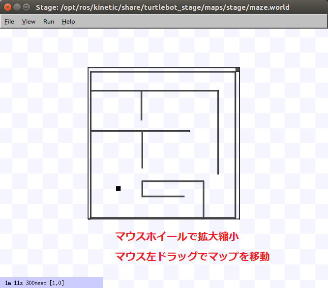
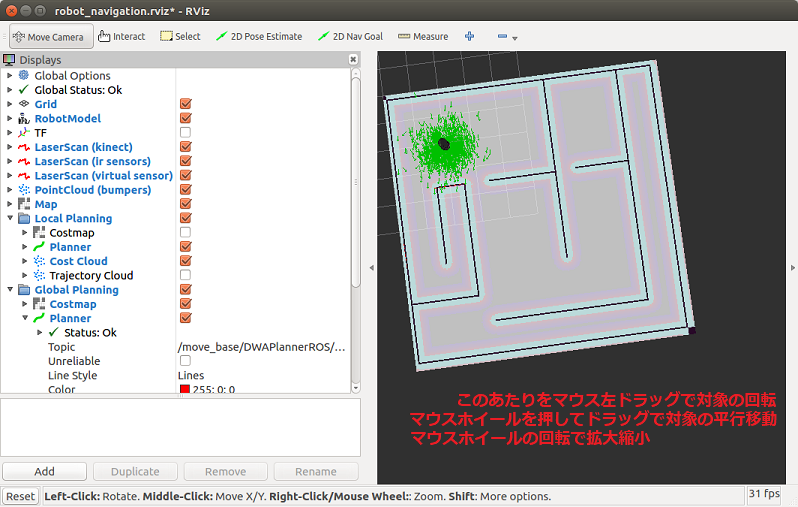
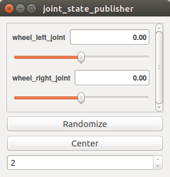
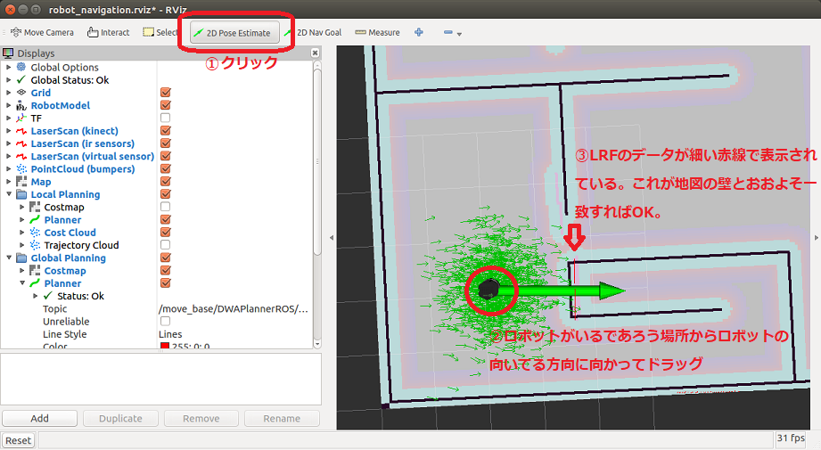
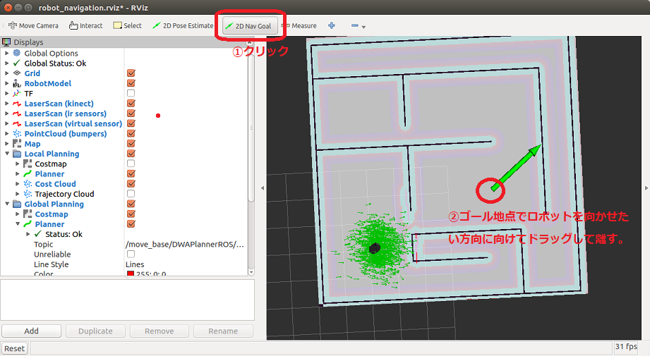
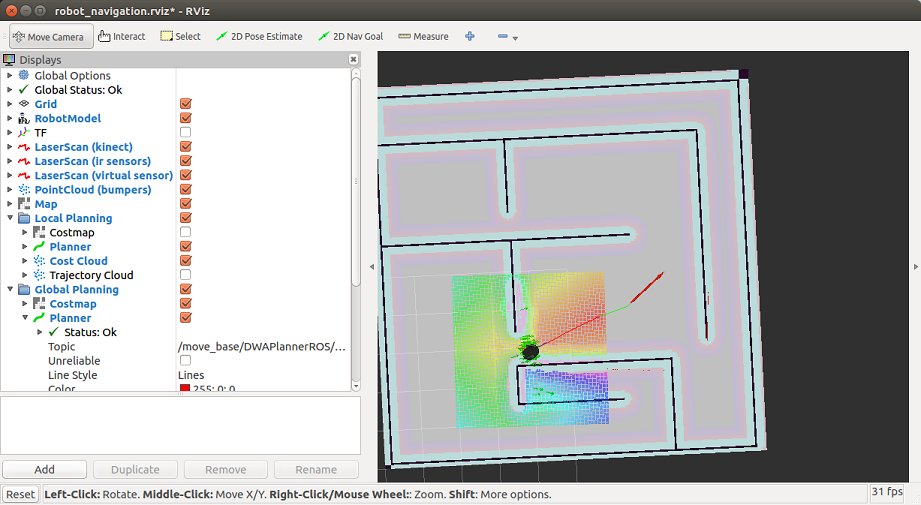

# Stage Simulator （１）

[stage_simulator/Home.md](Home.md)

---

## Navigation メタパッケージ

- 障害物回避や経路計画などを実行するシステム
  - 実機でもシミュレーションでも使えるし、必要。
- 参考 [ROS の navigation のページ](http://wiki.ros.org/navigation)

## 必要なソフトのインストール

- navigation メタパッケージ

```shell
sudo apt-get install ros-melodic-navigation
```

- レーザレンジファインダ（Laser Range Finder：LRF）関連
  - 2 次元水平面の距離センサ

```shell
sudo apt-get install ros-melodic-urg-node
sudo apt-get install ros-melodic-laser-pipeline (LRF のデータに対し距離による制限などを行うノード)
```

- gmapping (占有格子地図作成システム)
  - LRF で得られたデータを重ねあわせることでロボット周囲の環境の形状がおおよそ分かる。
  - これを 2 値画像（白黒の画像）で表現したものを**占有格子地図**と呼ぶ。

```shell
sudo apt-get install ros-melodic-slam-gmapping
sudo apt-get install ros-melodic-map-server
```

- JoyStick, キーボードコントローラ

```shell
sudo apt-get install ros-melodic-joy
sudo apt-get install ros-melodic-teleop-twist-keyboard
sudo apt-get install ros-melodic-teleop-twist-joy
```

## Stage のサンプルを実行する

- 参考 [ROS stage のページ](http://wiki.ros.org/stage)

- 必要なソフトのインストール

```shell
sudo apt-get install ros-melodic-navigation-stage
sudo apt-get install ros-melodic-stage
sudo apt-get install ros-melodic-stage-ros
```

- `Turtle Bot`(ルンバのようなロボット)の`Stage`用`Simulation`設定パッケージ

```shell
sudo apt-get install ros-melodic-turtlebot-stage
sudo apt-get update
sudo apt-get upgrade
```

- ターミナルを全て閉じて開き直し、以下のコマンドを実行。

```shell
roslaunch turtlebot_stage turtlebot_in_stage.launch
```

### 画面の説明

- `Stage`が生成したシミュレーションの世界



- `RViz`（**重要**）
  - `ROS`のシステムで頻繁に使用する可視化ソフト。
  - 今回のサンプルではあらかじめ取得されている地図上にロボットが置かれている様子が表示されている。



- `Joint State Publisher`
  - GUI 上でロボットの関節角を設定するソフト。特に使用しない。



## ロボットのナビゲーション

- ロボット用語としてのナビゲーションは、任意の位置にロボットを自律移動させることを指す。次の 2 つのステップから成る。

1. 自己位置推定
2. 障害物回避しながら目標位置への移動

### 自己位置推定

- あらかじめ取得された地図の形と、ロボット搭載の LRF から得られたデータを比較することでロボットが現在地図上のどこにいるかを推定する。
- `RViz`上で`2D Pose Estimate`ボタンをクリックし、地図上のロボットがいるであろう場所から向いている方向に向かって左ドラッグして離す。
- LRF のデータ（赤い細い線で示されている）が地図の壁とおおよそ一致すれば OK 。
- **注意**
  - このシミュレーションではもともとロボットの自己位置推定が完了した状態で始まっているので、推定の効果が分かりにくいかもしれない。
  - しかし、実際のロボットは電源投入時に地図のどこに置かれたかはわからないため、自己位置推定は必須である。



### ナビゲーションゴールの指定

- `RViz`上で`2D Nav Goal`ボタンをクリックし、ゴール地点でロボットを向かせたい方向に向けて左ドラッグして離す。



- 経路が計算され、ナビゲーションが始まる。ゴールに到着し、指定された方向を向くと終了する。



## 参考文献

- [How to Use Player/Stage](http://player-stage-manual.readthedocs.io/en/stable/)

---

[stage_simulator/Home.md](Home.md)
