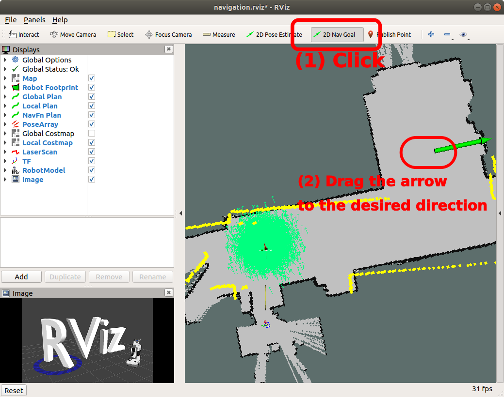

# Stage Simulator （１）

[stage_simulator/Home](Home.md)

---

## Navigation メタパッケージ

- 障害物回避や経路計画などを実行するシステム
  - 実機でもシミュレーションでも使えるし、必要。
- 参考 [ROS の navigation のページ](http://wiki.ros.org/navigation)

## 必要なソフトのインストール

- navigation メタパッケージ

```shell
$ sudo apt-get install ros-melodic-navigation
```

- レーザレンジファインダ（Laser Range Finder：LRF、2 次元水平面の距離センサ）関連
  - LRF のデータに対し距離による制限などを行うノード

```shell
$ sudo apt-get install ros-melodic-laser-pipeline
```

- gmapping (占有格子地図作成システム)
  - LRF で得られたデータを重ねあわせることでロボット周囲の環境の形状がおおよそ分かる。
  - これを 2 値画像（白黒の画像）で表現したものを**占有格子地図**と呼ぶ。

```shell
$ sudo apt-get install ros-melodic-slam-gmapping
$ sudo apt-get install ros-melodic-map-server
```

- ロボットを手動操作するノード群
  - JoyStick、キーボード、マウス等で速度指令を与えることができる。

```shell
$ sudo apt-get install ros-melodic-joy
$ sudo apt-get install ros-melodic-teleop-twist-keyboard
$ sudo apt-get install ros-melodic-teleop-twist-joy
$ sudo apt-get install ros-melodic-mouse-teleop
```

## Stage のサンプルを実行する

- 参考 [ROS stage のページ](http://wiki.ros.org/stage)

- 必要なソフトのインストール

```shell
$ sudo apt-get install ros-melodic-navigation-stage
$ sudo apt-get install ros-melodic-stage
$ sudo apt-get install ros-melodic-stage-ros
```

- `Stage`用`Simulation`のサンプル

```shell
$ cd
$ cd catkin_ws/src
$ git clone https://github.com/KMiyawaki/oit_navigation_microbot_01.git
# ~/catkin_ws/src/oit_navigation_microbot_01 がなければダウンロードされる。
Cloning into 'oit_navigation_microbot_01'...
remote: Enumerating objects: 59, done.
remote: Counting objects: 100% (59/59), done.
remote: Compressing objects: 100% (47/47), done.
remote: Total 102 (delta 18), reused 36 (delta 10), pack-reused 43
Receiving objects: 100% (102/102), 61.35 KiB | 309.00 KiB/s, done.
Resolving deltas: 100% (22/22), done.
# すでに ~/catkin_ws/src/oit_navigation_microbot_01 がある場合は以下のようなエラーが出るが問題はない。
fatal: destination path 'oit_navigation_microbot_01' already exists and is not an empty directory.
# この場合は最新版にアップデートしておく
$ cd oit_navigation_microbot_01
$ git pull origin master
From https://github.com/KMiyawaki/oit_navigation_microbot_01
 * branch            master     -> FETCH_HEAD
Already up to date.
$ cd
$ cd catkin_ws/src
$ git clone https://github.com/KMiyawaki/my_microbot_apps.git
# oit_navigation_microbot_01 と同様。
$ cd
$ cd catkin_ws
$ catkin_make
```

- ターミナルを全て閉じて開き直し、以下のコマンドを実行。

```shell
$ roscd my_microbot_apps/launch/simulation/
$ roslaunch navigation.launch use_teleop:=true
... logging to /home/oit/.ros/log/ebe20526-4944-11ea-a3d0-000c2924787d/roslaunch-ubuntu-16196.log
Checking log directory for disk usage. This may take awhile.
Press Ctrl-C to interrupt
Done checking log file disk usage. Usage is <1GB.

xacro: in-order processing became default in ROS Melodic. You can drop the option.
started roslaunch server http://ubuntu:34745/

SUMMARY
========
...
# メッセージが流れていくつか GUI のウィンドウが開く。
```

### 画面の説明

- `Stage`が生成したシミュレーションの世界


- `RViz`（**重要**）
  - `ROS`のシステムで頻繁に使用する可視化ソフト。
  - 今回のサンプルではあらかじめ取得されている地図上にロボットが置かれている様子が表示されている。


- `Mouse Teleop`
  - GUI でマウスによりロボットに速度を与えるソフト。


## ロボットのナビゲーション

- ロボット用語としてのナビゲーションは、任意の位置にロボットを自律移動させることを指す。次の 2 つのステップから成る。

1. 自己位置推定
2. 障害物回避しながら目標位置への移動

### 自己位置推定

- あらかじめ取得された地図の形と、ロボット搭載の LRF から得られたデータを比較することでロボットが現在地図上のどこにいるかを推定する。
- `RViz`上で`2D Pose Estimate`ボタンをクリックし、地図上のロボットがいるであろう場所から向いている方向に向かって左ドラッグして離す。


- LRF のデータ（黄色い線で示されている）が地図の壁とおおよそ一致すれば OK 。
- **注意**
  - いくつかのシミュレーションではもともとロボットの自己位置推定が完了した状態で始まるものもあり、その場合は推定の効果が分かりにくいかもしれない。
  - しかし、実際のロボットは電源投入時に地図のどこに置かれたかはわからないため、自己位置推定は必須である。


### ナビゲーションゴールの指定

- `RViz`上で`2D Nav Goal`ボタンをクリックし、ゴール地点でロボットを向かせたい方向に向けて左ドラッグして離す。



- 経路が計算され、ナビゲーションが始まる。ゴールに到着し、指定された方向を向くと終了する。


## 参考文献

- [How to Use Player/Stage](http://player-stage-manual.readthedocs.io/en/stable/)

---

[stage_simulator/Home](Home.md)
