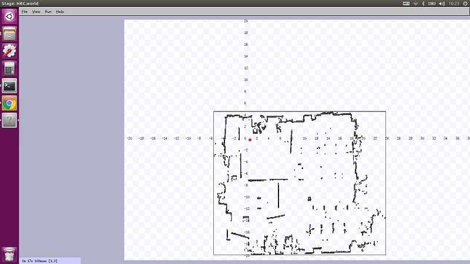
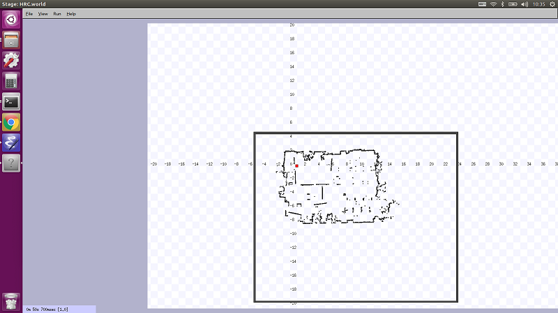

# Stage Simulator （２）

2次元平面上を動くロボットのシミュレーション

[stage_simulator/Home.md](Home.md)

---

## 独自の Simulation 環境を作成する

* （まだ作っていないなら）パッケージ作成

```shell
cd
cd catkin_ws/src/
catkin_create_pkg oit_navigation_test std_msgs rospy roscpp
```

* `launch`ファイルを格納するディレクトリを作成する

```shell
cd oit_navigation_test 
mkdir -p launch/simulation/includes
```

* 作成した`includes`ディレクトリに下記をダウンロード
* リンクを右クリックし「名前をつけてリンク先を保存」。
  * [device.inc](./stage_simulator/device.inc)
  * [map.inc](./stage_simulator/map.inc)

* `Stage`用の仮想環境を設定するファイルを格納するディレクトリを作成する

```shell
mkdir -p launch/simulation/worlds
```

* 作成した`worlds`ディレクトリに下記をダウンロード
  * [HRC.world](./stage_simulator/HRC.world)

* 地図を格納するディレクトリを作成する

```shell
mkdir maps
```

* 作成した`maps`ディレクトリに下記をダウンロード
  * [HRC.yaml](./stage_simulator/HRC.yaml)
  * [HRC.pgm](./stage_simulator/HRC.pgm)

### `Stage`「だけ」を実行する

* `Stage`は元々`ROS`とは無関係のシミュレータなので単体で起動も可能。

```shell
cd
cd catkin_ws/src/oit_navigation_test/launch/simulation/worlds
stage HRC.world
```

* 実行結果
  * 座標軸と目盛りが出ていない場合は、シミュレータのウィンドウ上を右ドラッグすると表示される。
* 明らかに縮尺がおかしいことを目盛（メートル単位）から確認しなさい。



* 画像に枠を付ける

```shell
cd 
cd catkin_ws/src/oit_navigation_test/maps
convert HRC.pgm -bordercolor "#000000" -border 5x5 HRC_border.png
```

* 枠をつけた画像を`Stage`で使う

```shell
cd
cd catkin_ws/src/oit_navigation_test/launch/simulation/worlds/
emacs HRC.world &
ファイル内の
HRC.pgm -> HRC_border.png に変更する
```

* 再び`Stage`を実行し縮尺が正されたことを確認する

```shell
cd
cd catkin_ws/src/oit_navigation_test/launch/simulation/worlds
stage HRC.world
```

* 実行結果
  * つまり、`Stage`は地図画像の白い画素を無視するので、作成した占有格子地図をで使う際は画像に黒い枠が必要。



## 参考文献

* [How to Use Player/Stage](http://player-stage-manual.readthedocs.io/en/stable/)

---

[stage_simulator/Home.md](Home.md)
