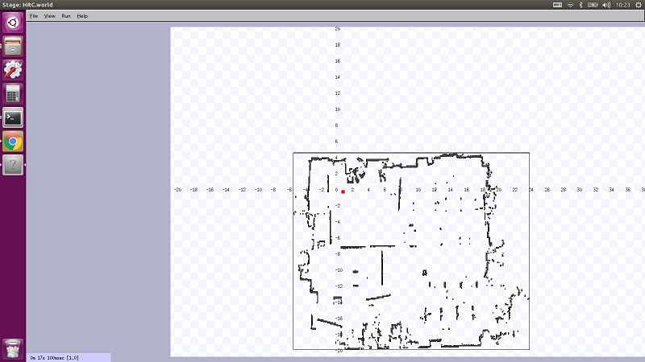
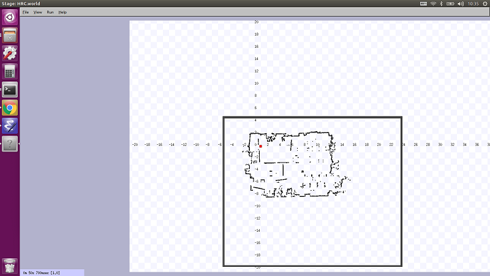

# Stage Simulator (2)

[stage_simulator/Home](Home.md)

---

## 独自の Simulation 環境を作成する

- （まだ作っていないなら）パッケージ作成

```shell
$ cd
$ cd catkin_ws/src/
$ catkin_create_pkg oit_navigation_test std_msgs rospy roscpp
Created file oit_navigation_test/package.xml
Created file oit_navigation_test/CMakeLists.txt
Created folder oit_navigation_test/include/oit_navigation_test
Created folder oit_navigation_test/src
Successfully created files in /home/oit/catkin_ws/src/oit_navigation_test. Please adjust the values in package.xml.
```

- `Stage`用の仮想環境を設定するファイルを格納するディレクトリを作成する

```shell
$ cd oit_navigation_test
$ mkdir -p maps/simulator_files
```

- 作成した`maps`ディレクトリに下記をダウンロード

  - リンクを右クリックし「名前をつけてリンク先を保存」。
  - [HRC.world](https://raw.githubusercontent.com/KMiyawaki/lectures/master/ros/stage_simulator/stage_simulator_02/HRC.world)
  - [HRC.yaml](https://raw.githubusercontent.com/KMiyawaki/lectures/master/ros/stage_simulator/stage_simulator_02/HRC.yaml)
  - [HRC.pgm](https://github.com/KMiyawaki/lectures/raw/master/ros/stage_simulator/stage_simulator/HRC.pgm)

- 作成した`simulator_files`ディレクトリに下記をダウンロード

  - リンクを右クリックし「名前をつけてリンク先を保存」。
  - [device.inc](https://raw.githubusercontent.com/KMiyawaki/lectures/master/ros/stage_simulator/stage_simulator_02/device.inc)
  - [map.inc](https://raw.githubusercontent.com/KMiyawaki/lectures/master/ros/stage_simulator/stage_simulator_02/map.inc)

- ダウンロードしたファイルの配置を確認する。

```shell
$ pwd
/home/oit/catkin_ws/src/oit_navigation_test
$ sudo apt install tree
パッケージリストを読み込んでいます... 完了
依存関係ツリーを作成しています
...
tree (1.7.0-5) を展開しています...
tree (1.7.0-5) を設定しています ...
man-db (2.8.3-2ubuntu0.1) のトリガを処理しています ...
$ tree .
.
├── CMakeLists.txt
├── include
│   └── oit_navigation_test
├── maps
│   ├── HRC.pgm
│   ├── HRC.world
│   ├── HRC.yaml
│   └── simulator_files
│       ├── device.inc
│       └── map.inc
├── package.xml
└── src
```

### `Stage`「だけ」を実行する

- `Stage`は元々`ROS`とは無関係のシミュレータなので単体で起動も可能。

```shell
$ cd
$ cd catkin_ws/src/oit_navigation_test/maps
$ stage HRC.world
Stage 4.3.0
 [Loading HRC.world][Include ./simulator_files/map.inc][Include ./simulator_files/device.inc][Image "./HRC.pgm"]
```

- 実行結果
  - 座標軸と目盛りが出ていない場合は、シミュレータのウィンドウ上を右ドラッグすると表示される。
- 明らかに縮尺がおかしいことを目盛（メートル単位）から確認しなさい。30m 四方の部屋となっている。
- 確認したら、`Stage`を起動したターミナル上で`Ctrl+C`を押し、終了させなさい。



- 画像に枠を付ける

```shell
$ cd
$ cd catkin_ws/src/oit_navigation_test/maps
$ convert HRC.pgm -bordercolor "#000000" -border 5x5 HRC_border.png
```

- 枠をつけた画像を`Stage`で使う

```shell
$ cd
$ cd catkin_ws/src/oit_navigation_test/maps
$ emacs HRC.world &
# ファイル内の
# HRC.pgm -> HRC_border.png に変更する
```

- 再び`Stage`を実行し縮尺が正されたことを確認する

```shell
$ cd
$ cd catkin_ws/src/oit_navigation_test/maps
$ stage HRC.world
```

- 実行結果



- つまり、`Stage`は地図画像のグレーの画素を無視するので、作成した占有格子地図をで使う際は画像に黒い枠が必要。

## 参考文献

- [How to Use Player/Stage](http://player-stage-manual.readthedocs.io/en/stable/)

---

[stage_simulator/Home](Home.md)
