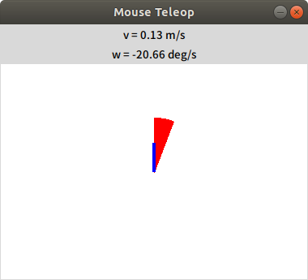
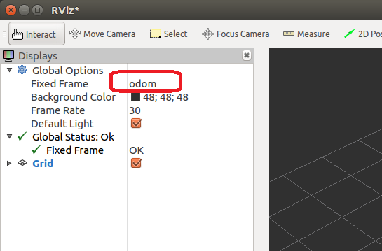
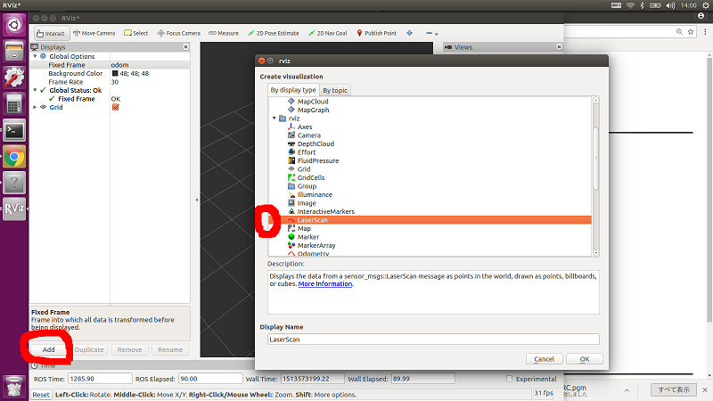
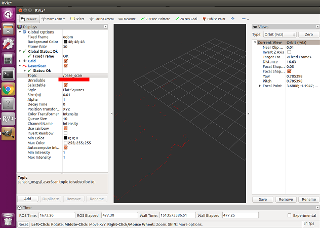
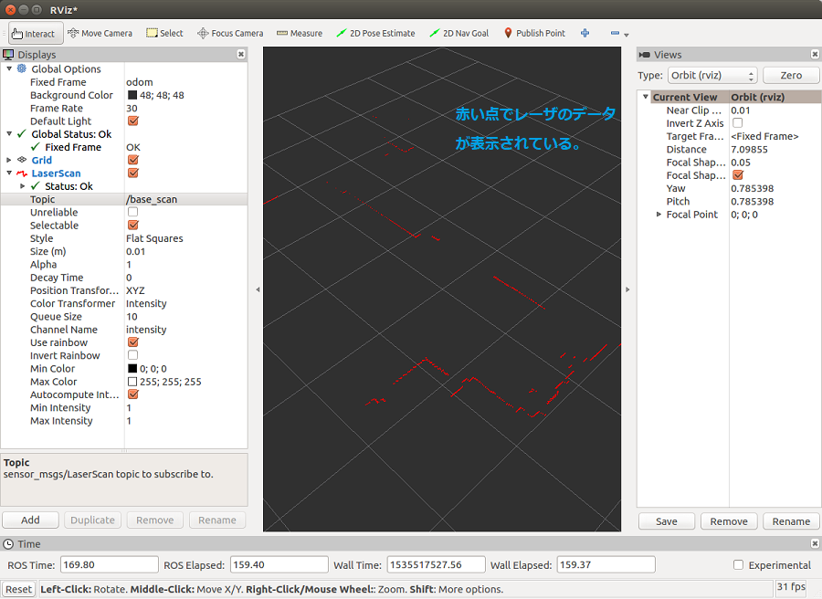

# Stage Simulator と ROS（１）

[stage_simulator/Home](Home.md)

---

## ROS のノードとして Stage を起動する

- 全てのターミナルを閉じる。
- `Stage`用の`launch`ファイルを保存するディレクトリを作成する。
  - [`launch`に関する説明](../roslaunch.md)

```shell
$ roscd oit_navigation_test
$ mkdir -p launch/simulation
```

- 下記ファイルをダウンロード（右クリック->「リンク先を保存」）し`catkin_ws/src/oit_navigation_test/launch/simulation/`に保存。
  - [stage.launch](https://raw.githubusercontent.com/KMiyawaki/lectures/master/ros/stage_simulator/stage_simulator_and_ros/stage.launch)
- 次のコマンドで`stage.launch`を実行

```shell
$ roscd oit_navigation_test/launch/simulation
$ roslaunch stage.launch
```

- GUI のシミュレーション画面が起動するはず。
- 別ターミナルで`rostopic list`コマンドを実行してみる。

```shell
$ rostopic list
/base_pose_ground_truth
/base_scan # 仮想的なレーザレンジセンサのデータ
/clock
/cmd_vel # ロボットに対する速度指令
/odom    # 誤差を含むロボットの現在地
/rosout
/rosout_agg
/tf
```

## コマンドでロボットを動かす

- 下記コマンドを入力するが、`Tab`キーを活用するので説明を聞くこと。
- コマンドを実行するとロボットが前進し、いつかは壁にぶつかって停止する。
  - `Ctrl+C`でコマンドの実行を停止する。

```shell
$ rostopic pub /cmd_vel geometry_msgs/Twist "linear:
 x: 0.3
 y: 0.0
 z: 0.0
angular:
 x: 0.0
 y: 0.0
 z: 0.0"  -r 10
```

## キーボードでロボットを動かす

- 下記コマンドを入力し、入力したウィンドウでキーを使ってロボットを移動させる。
- `i`：前進、`j`：左旋回、`l`：右旋回、`,`：後退。

```shell
$ rosrun teleop_twist_keyboard teleop_twist_keyboard.py
```

## マウスでロボットを動かす

- 次のコマンドで Mouse Teleop というタイトルのウィンドウが開く。

```shell
$ rosrun  mouse_teleop mouse_teleop.py mouse_vel:=cmd_vel
```

- Mouse Teleop ウィンドウ上でマウスをドラッグすると前進・旋回速度をロボットに与えられる。



- Mouse Teleop はウィンドウの「☓」マークをクリックしないと終了できないので、注意。

## ジョイパッドでロボットを動かす

- ジョイパッドを使ってロボットを移動させる。

```shell
$ roscd oit_navigation_test
$ mkdir config
$ mkdir -p launch/includes
```

- `config`ディレクトリに下記を保存

  - [my_elecom.yaml](https://raw.githubusercontent.com/KMiyawaki/lectures/master/ros/stage_simulator/stage_simulator_and_ros/my_elecom.yaml)

- `lanch/includes`ディレクトリに下記を保存

  - [teleop_joy.launch](https://raw.githubusercontent.com/KMiyawaki/lectures/master/ros/stage_simulator/stage_simulator_and_ros/teleop_joy.launch)

- `teleop_joy.launch`を実行
  - PC にジョイパッドを接続してから下記コマンドを入力。

```shell
$ roscd catkin_ws/src/oit_navigation_test/launch/includes/
$ roslaunch teleop_joy.launch
```

- ジョイパッドの押しボタンのどれかがブレーキ解除になっている。
- ブレーキ解除ボタンを押しながら方向スティックを倒すと動く。

## `Rviz`で Simulation の様子を可視化する

- `RViz`の起動方法
- **ROS マスターが起動していない状態なら**`roscore`でマスターを起動する。
  - 既に何らかの`ROS`ノードが動いている場合、どこかで`ROS`マスターが起動しているはずなので再び`roscore`を実行する必要はない。
- 次のコマンドを実行すると起動する。

```shell
$ rviz
```

- 左の方、`Displays`にある`Fixed Frame`を「`odom`」にする。



- `Add`ボタンをクリックして`By display type`から`LaserScan`を選択する。



- `Topic`名を`/base_scan`にする（前述した`rostopic list`の結果を思い出すこと）



- 赤い点でレーザのデータが表示されているのが分かる。



## 問題

- マウスやジョイスティック、キーボード等でロボットを動かし、レーザのデータがどのように変化するかを観察しなさい。

---

[stage_simulator/Home](Home.md)
