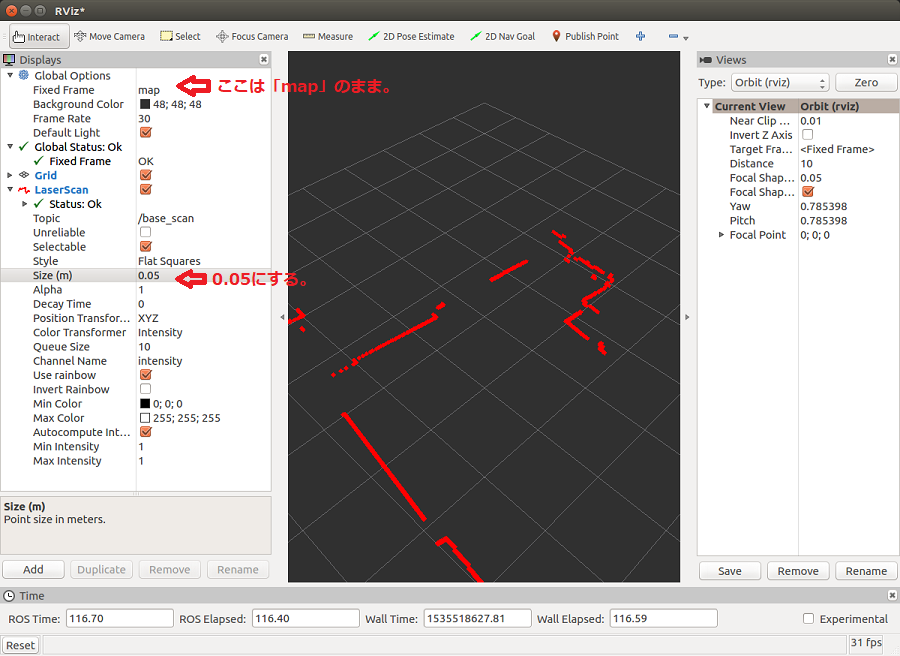
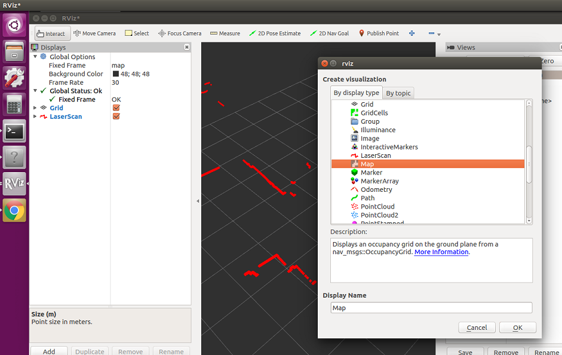
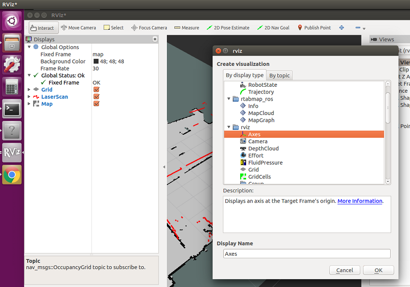
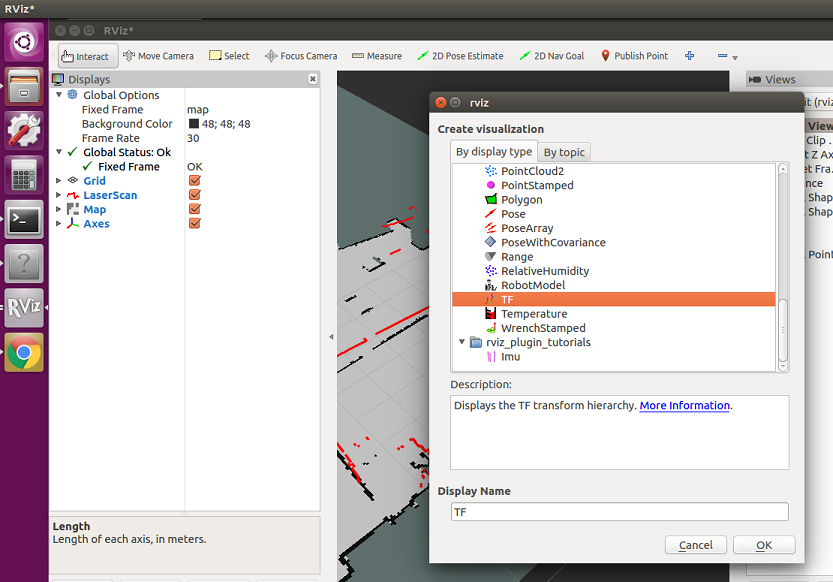
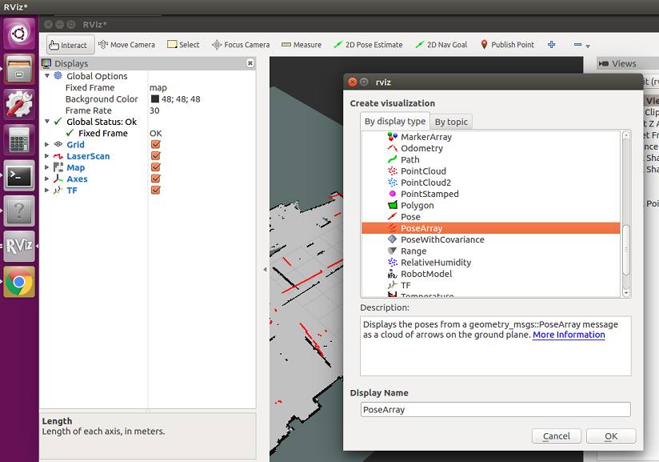
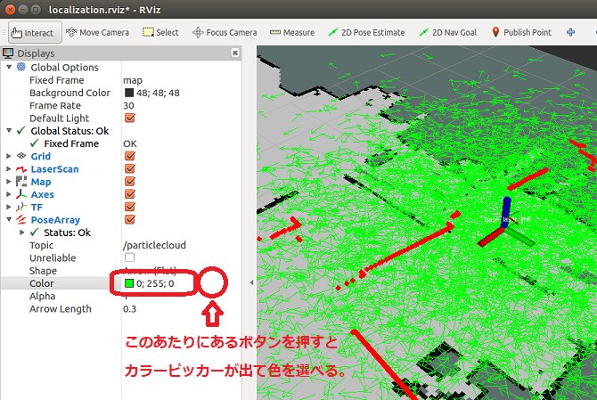

# Stage Simulator と ROS（２）

[stage_simulator/Home](Home.md)

---

## 自己位置推定

- [amcl](http://wiki.ros.org/amcl)を使う。
- 全てのターミナルと RViz のウィンドウを閉じ、新たにターミナルを開く。
- 下記ファイルを`oit_navigation_test/launch/includes`にダウンロード。
  - [amcl.launch](https://raw.githubusercontent.com/KMiyawaki/lectures/master/ros/stage_simulator/stage_simulator_and_ros/amcl.launch)
- 下記ファイルを`oit_navigation_test/launch/simulation`にダウンロード。
  - [localization.launch](https://raw.githubusercontent.com/KMiyawaki/lectures/master/ros/stage_simulator/stage_simulator_and_ros/localization.launch)
- 実行

```shell
$ roscd oit_navigation_test/launch/simulation
$ roslaunch localization.launch
# 最初は RViz に何も見えていないはず
```

## RViz にデータを表示する

- `/base_scan`を可視化する。
  - やり方は[Stage Simulator と ROS（１）](stage_simulator_and_ros_01.md)
  - ただし、`Fixed Frame`を変更する必要は**ない**。また、点が小さく見えにくいので`Size`を`0.05m`程度にする。



- `Add`ボタンをクリックして`by display type`から`Map`を選択。`topic`を`/map`にする。



- `Add`ボタンをクリックして`by display type`から`Axes`を選択。`Length`を`0.5`にする。



- `Add`ボタンをクリックして`by display type`から`TF`を選択。



- `Add`ボタンをクリックして`by display type`から`PoseArray`を選択。`topic`を`/particlecloud`にする。



- `/particlecloud`トピックの色を緑にする。



## RViz の可視化設定を保存する

- 設定の保存場所を作る。

```shell
$ roscd oit_navigation_test/config
$ mkdir rviz  # ここに rviz の設定を保存する
```

- `RViz`のメニューで`File`->`Save Config As`をクリックし、先ほど作成した`config/rviz`ディレクトリに`localization.rviz`として保存する。
- 一旦`RViz`を終了させる。

## 保存された`RViz`の可視化設定が自動的にロードされるように`launch`を変える

- `localization.launch`を編集する。

```shell
$ roscd oit_navigation_test/launch/simulation
$ emacs localization.launch
```

- 内容は次の通り。

```xml
<launch>
  <!-- Check simulation world and amcl_map for localization. They should be same. -->
  <arg name="oit_navigation_dir" value="$(find oit_navigation_test)" />
  <arg name="simulation_world" default="$(arg oit_navigation_dir)/maps/HRC.world"/>

  <arg name="map_name" default="$(arg oit_navigation_dir)/maps/HRC.yaml"/>
  <!-- 追記 -->
  <arg name="rviz_conf" value="$(arg oit_navigation_dir)/config/rviz/localization.rviz" />
  <!-- 追記ここまで -->
  <include file="$(arg oit_navigation_dir)/launch/simulation/stage.launch">
    <arg name="world" value="$(arg simulation_world)"/>
  </include>
  <node name="mouse_teleop" pkg="mouse_teleop" type="mouse_teleop.py">
    <remap from="/mouse_vel" to="/cmd_vel"/>
  </node>
  <!-- 修正 -->
  <node name="rviz" pkg="rviz" type="rviz" required="true" args="-d $(arg rviz_conf)" />
  <!-- 修正ここまで -->
  <node name="map_server" pkg="map_server" type="map_server" args="$(arg map_name)" respawn="false" />

  <include file="$(arg oit_navigation_dir)/launch/includes/amcl.launch"/>
</launch>
```

- 実行

```shell
$ roscd oit_navigation_test/launch/simulation
$ roslaunch localization.launch
```

---

## 問題

- 現状ではナビゲーションはできないが、自己位置推定はできる。
- `RViz`上のロボットの位置が可能な限り正しい位置になるように自己位置推定させなさい。

---

[stage_simulator/Home](Home.md)
