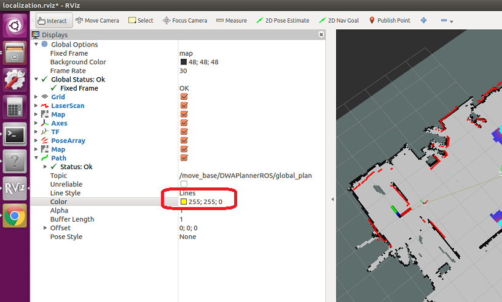

# `Stage Simulator`と`ROS navigation`

[stage_simulator/Home](Home.md)

---

## 目的地にナビゲーションする

- [move_base](http://wiki.ros.org/move_base)（`navigation`に関するサービスを提供するノード）の設定ファイルを作成する。

```shell
$ roscd oit_navigation_test/launch/includes
$ mkdir move_base
```

- `move_base`ディレクトリに下記のファイルをダウンロードする。
  - [costmap_common.yaml](https://raw.githubusercontent.com/KMiyawaki/lectures/master/ros/stage_simulator/stage_simulator_and_ros_navigation/costmap_common.yaml)
  - [costmap_global.yaml](https://raw.githubusercontent.com/KMiyawaki/lectures/master/ros/stage_simulator/stage_simulator_and_ros_navigation/costmap_global.yaml)
  - [costmap_local.yaml](https://raw.githubusercontent.com/KMiyawaki/lectures/master/ros/stage_simulator/stage_simulator_and_ros_navigation/costmap_local.yaml)
  - [move_base.launch](https://raw.githubusercontent.com/KMiyawaki/lectures/master/ros/stage_simulator/stage_simulator_and_ros_navigation/move_base.launch)
  - [move_base.yaml](https://raw.githubusercontent.com/KMiyawaki/lectures/master/ros/stage_simulator/stage_simulator_and_ros_navigation/move_base.yaml)
  - [planner_global.yaml](https://raw.githubusercontent.com/KMiyawaki/lectures/master/ros/stage_simulator/stage_simulator_and_ros_navigation/planner_global.yaml)
  - [planner_local.yaml](https://raw.githubusercontent.com/KMiyawaki/lectures/master/ros/stage_simulator/stage_simulator_and_ros_navigation/planner_local.yaml)
- `launch/simulation`ディレクトリに下記のファイルをダウンロードする。
  - [navigation.launch](https://raw.githubusercontent.com/KMiyawaki/lectures/master/ros/stage_simulator/stage_simulator_and_ros_navigation/navigation.launch)
- `navigation.launch`を実行する。

```shell
cd
cd catkin_ws/src/oit_navigation_test/launch/simulation
roslaunch navigation.launch
```

- RViz 上で「`2D Pose Estimate`」した後に「`2D Nav Goal`」を指定してやればロボットが移動する。
  - あまり遠いところに`Goal`を置くと、経路生成に失敗する。

## 可視化設定を変える

- RViz 上の`Add`ボタンで`Map`を追加し、`topic`を`/move_base/local_costmap/costmap`に、`color scheme`を`costmap`にする。


- RViz 上の`Add`ボタンで`Path`を追加し、`topic`を`/move_base/DWAPlannerROS/global_plan`に、`color`を黄色にする。




- 同じ要領で`Path`を追加し、`topic`を`/move_base/DWAPlannerROS/local_plan`に、`color`を赤にする。
- 同じ要領で`Path`を追加し、`topic`を`/move_base/NavfnROS/plan`に、`color`を青にする。
- `Add`ボタンで`Polygon`を追加し、`topic`を`/move_base/local_costmap/footprint`に、`color`を紫にする。
- RViz のメニューから`Save Config As`で`config/rviz`に`navigation.rviz`として保存する。
- RViz を終了させる。
- `launch/simulation/navigation.launch`を編集する。

```shell
$ roscd oit_navigation_test/launch/simulation
$ emacs navigation.launch
```

- 「`localization.rviz`」->「`navigation.rviz`」に変更。
- 再度`navigation.launch`を実行する。

```shell
$ roscd oit_navigation_test/launch/simulation
$ roslaunch navigation.launch
```

- `RViz`上の`2D Nav Goal`ボタンでロボットを目的地に移動させると、`move_base`が算出した経路計画が表示される。

---

[stage_simulator/Home](Home.md)
