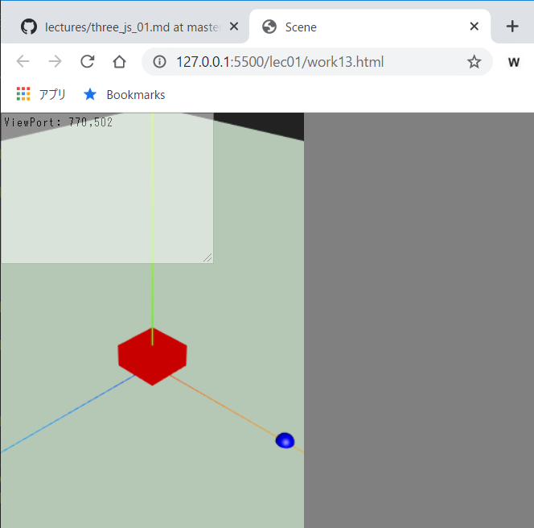
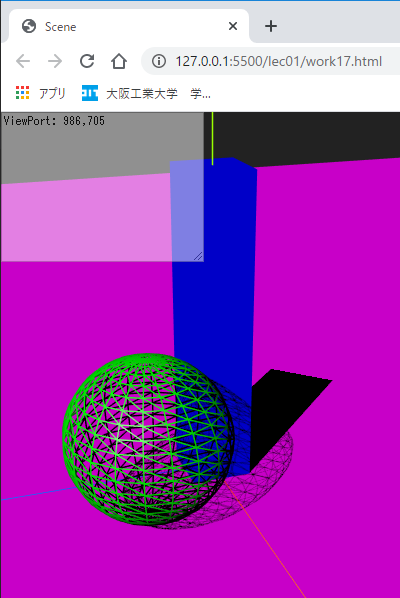
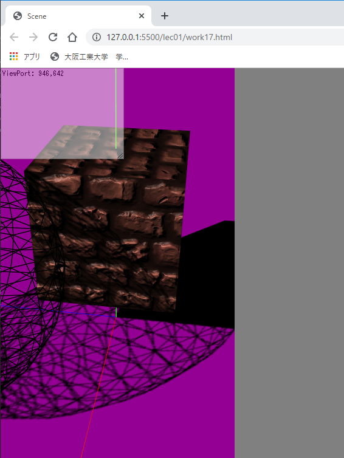

# Three.js(lec01)

[three_js/Home](./Home.md)

---

## 演習

### base10.html のコピー

Visual Studio Code 上で`ThreeJS-master/lec01/base10.html`をクリックし、`Ctrl`キーを押しながら`C`キーを押して、離す。続けて`Ctrl`キーを押しながら`V`キーを押すと、ファイルがコピーされる。


右クリックで「名前を変更」を選択する。


ファイル名を`work11.html`とし、`Enter`キーを押して確定する。


以降の演習でも各レクチャーの`base**.html`ファイルを同様の手順でコピーし必要なコードを足すこと。

## work11 JavaScript の基本

[前項](three_js_prep_02.md)で説明した内容を確認する。実行結果の表示は主に`taDebugText`を使うが、JavaScript に慣れている場合は`console.log()`と Chrome ブラウザの JavaScript デバッガを使っても構わない。

- `work11.html`のコメントを参照し、下記のコードを追記して実行結果を確認しなさい。
- `taDebugText`は`<textarea id="debugText">`の HTML 要素を保持している。もし実行結果が見にくい場合は`rows="45" cols="35"`のように表示される行数・文字数を変更して構わない。
- ただし、`<textarea id="debugText">`があまりにも大きいと、3DCG のビューが見えにくくなるので、必要に応じて数値を調節すること。

### 変数、定数、配列、連想配列

```java
/* ↓↓↓work11～work12 の追記場所↓↓↓ */
const NUM = 4;
const C_STRING = "Hello:";
for (let i = 0; i < NUM; i++) {
  taDebugText.value += C_STRING + i + "\n";
}
let array = [3, 2, 1, 2, 3];
taDebugText.value += "array.length:" + array.length + "\n";
for (let v of array) {
  taDebugText.value += "v:" + v + "\n";
}
taDebugText.value += "array.indexOf(2):" + array.indexOf(2) + "\n";
taDebugText.value += "array.lastIndexOf(2):" + array.lastIndexOf(2) + "\n";
taDebugText.value += "array.indexOf(100):" + array.indexOf(100) + "\n";
array.splice(2, 1);
array.push(99);
array.splice(1, 0, 55);
for (let v of array) {
  taDebugText.value += "v:" + v + "\n";
}
let dict = { x: 85, y: 12, z: 33 };
taDebugText.value += "dict.x:" + dict.x + "\n";
dict.y -= 8.5;
taDebugText.value += "dict.y:" + dict.y + "\n";
taDebugText.value += "dict.w ?:" + dict.w + "\n";
for (let k in dict) {
  taDebugText.value += k + ":" + dict[k] + "\n";
}
dict["p"] = 128;
dict.q = 255;
delete dict.z;
taDebugText.value += "-------\n";
for (let k in dict) {
  taDebugText.value += k + ":" + dict[k] + "\n";
}
/* ↑↑↑work11～work12 の追記場所↑↑↑ */
```

- 実行結果
- `<textarea id="debugText" rows="45" cols="30" class="debugText">Debug output</textarea>`のように`rows`を修正している。


### if文、関数

- 先ほどの追記は削除し、下記を上書きして実行結果を確認しなさい。

```java
/* ↓↓↓work11～work12 の追記場所↓↓↓ */
let x = 8;
if (x > 5 && x < 10) {
  taDebugText.value += "x > 5 && x < 10 は true\n";
} else {
  taDebugText.value += "x > 5 && x < 10 は false\n";
}
if (x % 2 == 0) {
  taDebugText.value += "xは偶数";
} else {
  taDebugText.value += "xは奇数";
}
function myAdd(arg1, arg2) {
  let ans = arg1 + arg2;
  return ans;
}
const mySub = function (arg1, arg2) {
  return arg1 - arg2;
};
taDebugText.value += "myAdd(5, 2):" + myAdd(5, 2) + "\n";
taDebugText.value += "mySub(6, 10):" + mySub(6, 10) + "\n";
function makeArray(arg1, arg2, arg3) {
  return [arg1, arg2, arg3];
}
function makeDict(key1, key2, value1, value2) {
  const result = {};
  result[key1] = value1;
  result[key2] = value2;
  return result;
}
array = makeArray(3, 4, 2);
taDebugText.value += "array.length:" + array.length + "\n";
for (let v of array) {
  taDebugText.value += "v:" + v + "\n";
}
dict = makeDict("u", "v", 25, 30);
for (let k in dict) {
  taDebugText.value += k + ":" + dict[k] + "\n";
}
/* ↑↑↑work11～work12 の追記場所↑↑↑ */
```

- 実行結果
- `<textarea id="debugText" rows="45" cols="30" class="debugText">Debug output</textarea>`のように`rows`を修正している。


## コードの整形

プログラムに適度なインデント（字下げ）があると非常に読みやすくなる。Visual Studio Code にはプログラム全体を自動でインデントする機能がある。

- `Ctrl`キーと`Shift`キーと`P`キーを同時に押し、拡張機能のコマンド入力ボックスを呼び出す。
- `format`と入力すると、「ドキュメントのフォーマット」という項目が出るので実行する。


## work12 JavaScript の基本（クラスの定義）

- `ThreeJS-master/lec01/base10.html`を`ThreeJS-master/lec01/work12.html`というファイル名でコピーしなさい。
- `work12.html`のコメントを参照し、下記のコードを追記して実行結果を確認しなさい。

```java
/* ↓↓↓work11～work12 の追記場所↓↓↓ */
class Person {
  constructor(name, age, height, weight) {
    this.name = name;
    this.age = age;
    this.height = height;
    this.weight = weight;
  }

  getDesc() {
    let desc = this.name + ":" + this.age + "才、身長：" + this.height + "、体重：" + this.weight;
    desc += "、BMI:" + this.getBMI().toFixed(2); // toFixed で小数部分の表示桁数を変えられる。
    return desc;
  }

  getBMI() {
    return this.weight / Math.pow(this.height, 2);
  }
}
const p1 = new Person("太郎", 19, 1.6, 56);
taDebugText.value += p1.getDesc();
/* ↑↑↑work11～work12 の追記場所↑↑↑ */
```

- 実行結果


## work13 CG 物体の移動

ここから、Three.js を使った 3DCG のプログラムに入る。すべての実行結果はマウス操作（Android 端末の場合はピンチや指先をスクリーンに触れてスライドさせる）によりカメラの位置を適切にコントロールした結果の画像である。**実行結果の確認時は自分でカメラ位置を調節すること。**

Three.js において`THREE.Mesh`クラスは三次元物体の形状や材質を保持している。その位置や姿勢は`position`や`rotation`の値を変更することでコントロールできる。

- `ThreeJS-master/lec01/base10.html`を`ThreeJS-master/lec01/work13.html`というファイル名でコピーしなさい。
- `work13.html`のコメントを参照し、下記のコードを追記して実行結果を確認しなさい。

```javascript
/* ↓↓↓work13 の追記場所↓↓↓ */
sphere.position.set(10, 0, 0);  // 物体の位置（ position ）に x, y, z の値をセットするコード。
//sphere.position.x = 10; // 軸ごとの指定もできる。
//sphere.position.y = 0;
/* ↑↑↑work13 の追記場所↑↑↑ */
```

- 実行結果
  - 球体の影がおかしくなることがあるが、問題はない。なおカメラを移動させないと球が見えない場合がある。
  - x, y, z それぞれの座標を変更し、どのような位置に移動するかを確認しなさい。
  - 赤、緑、青の軸はそれぞれ、赤： x 軸、緑： y 軸、青： z 軸を表している。



## work14 物体の回転

- `ThreeJS-master/lec01/base10.html`を`ThreeJS-master/lec01/work14.html`というファイル名でコピーしなさい。
- `work14.html`のコメントを参照し、下記のコードを追記して実行結果を確認しなさい。

```javascript
/* ↓↓↓work14 の追記場所↓↓↓ */
// 物体のローカル座標軸を表示できる。
cube.add(new THREE.AxesHelper(5));
// 回転はすべてオブジェクトローカル座標系で行われる。単位はラジアンなので、360度単位からラジアンに変換した値を渡す。
cube.rotation.set(THREE.Math.degToRad(45), THREE.Math.degToRad(45), 0); // 物体の姿勢（ rotation ）に x, y, z の値をセットするコード。
/* ↑↑↑work14 の追記場所↑↑↑ */
```

- 実行結果
  - x, y, z それぞれの値を変更し、どのような姿勢に変化するかを確認しなさい。
  - 赤、緑、青の軸はそれぞれ、赤： x 軸、緑： y 軸、青： z 軸を表している。


## work15 カメラ

- `ThreeJS-master/lec01/base10.html`を`ThreeJS-master/lec01/work15.html`というファイル名でコピーしなさい。

カメラも他の物体と同じように位置や姿勢を持っている。位置は`position`の値を変更すれば良い。`work15.html`の最初の方、下記プログラムで初期位置を 5,5,5 にしていることが分かる。

```java
/* THREE.js の初期化 */
const [scene, camera, renderer, clock, axes] = mylib2020.initThreeInElement(divGlView);
camera.position.set(5, 5, 5);
```

姿勢についてはカメラの場合は「どの物体をレンズ中心にとらえるか」を`lookAt`メソッドにより指定する。

- `work15.html`のコメントを参照し、下記のコードを追記して実行結果を確認しなさい。追記は 2 箇所に渡っている。
- 追記(1)

```javascript
/* ↓↓↓work14～work15 の追記場所↓↓↓ */
camera.position.set(-5, 5, 0);
sphere.position.set(0, 3, 5);
/* ↑↑↑work14～work15 の追記場所↑↑↑ */
```

- 追記(2)
  - `lookAt`メソッドは描画更新処理の中で呼び出さないと効果はない。

```javascript
/* ↓↓↓work15 の追記場所↓↓↓ */
camera.lookAt(sphere.position);
/* ↑↑↑work15 の追記場所↑↑↑ */
```

- 実行結果
  - 球体が中心に見えるようにカメラの向きが変わっていることが分かる。
  - 球体（変数`sphere`）の`position`を変更して結果を確認しなさい。


## work16 光源

- `ThreeJS-master/lec01/base10.html`を`ThreeJS-master/lec01/work16.html`というファイル名でコピーしなさい。

光源も他の物体と同じように位置や姿勢を持っている。位置は`position`の値を変更すれば良い。光源の種類の一例を示す。

- 平行光源：[`THREE.DirectionalLight`](https://threejs.org/docs/#api/en/lights/DirectionalLight)
- スポットライト：[`THREE.SpotLight`](https://threejs.org/docs/#api/en/lights/SpotLight)
- 点光源：[`THREE.PointLight`](https://threejs.org/docs/#api/en/lights/PointLight)

ライトの場合、種類によってはどの位置に向けて光を照射するかを指定することで向きを変えることができる。`work16.html`の次の箇所で平行光源を生成し、初期位置を 5,5,5 にして、座標 0,0,0 に向けて光を放っていることが分かる。

```java
/* 平行光源の生成 */
/* ↓↓↓work16 の修正場所↓↓↓ */
const directionalLight = new THREE.DirectionalLight(0xFFFFFF, 1.0); /* 色は白、強さは 1.0 */
directionalLight.castShadow = true; /* 他の物体に影を落とす */
directionalLight.position.set(5, 5, 5); /* 座標(5,5,5)から */
directionalLight.target.position.set(0, 0, 0); /* 座標(0,0,0)に照射 */
scene.add(directionalLight); /* ライト本体と */
scene.add(directionalLight.target); /* 照射ターゲットもシーンに追加する必要がある */
/* ↑↑↑work16 の修正場所↑↑↑ */
```

- まずは次のようにして光源の色や強さを変更してみること。赤く薄暗いレンダリング結果になるはずである。

```java
const directionalLight = new THREE.DirectionalLight(0xFF0000, 0.5);
```

Three.js では色を指定する際に 16 進数を使う。RGB それぞれの輝度を 256 段階（00〜FF：小文字でも良い）で指定している。したがって、0xFF0000 は赤の輝度が最大、緑、青は最低ということである。  
`THREE.DirectionalLight`の第二引数は光の強さである。1 以上も指定できる。

- 色や強さを変えてみて、結果を確認すること。


- 次に work16 の修正場所を次のように書き換え、スポットライトを試しなさい。

```java
/* ↓↓↓work16 の修正場所↓↓↓ */
const spotLight = new THREE.SpotLight(0xFFFFFF, 1); /* 色は白、強さは 1.0 */
spotLight.angle = THREE.Math.degToRad(45); /* 光源位置から画角90度の円錐状に光を発する */
spotLight.penumbra = 0; /* 半影をどの程度生じさせるか。 */
spotLight.castShadow = true; /* 他の物体に影を落とす */
spotLight.position.set(10, 1, 10); /* 座標(10,1,10)から */
spotLight.target.position.set(0, 0, 0); /* 座標(0,0,0)に照射 */
scene.add(spotLight); /* ライト本体と */
scene.add(spotLight.target); /* 照射ターゲットもシーンに追加する必要がある */
/* ↑↑↑work16 の修正場所↑↑↑ */
```

- 実行結果
  - 次の各パラメータの値を変えてみて、結果を確認しなさい。
    - `const spotLight = new THREE.SpotLight(0xffffff, 1);`
    - `spotLight.angle = THREE.Math.degToRad(45);`
    - `spotLight.penumbra = 0;`
  - 次の各パラメータの値を変えてみて、結果を確認しなさい。
    - `spotLight.position.set(0, 10, 0);`
    - `spotLight.target.position.set(10, 0, 0);`


### SpotLight のサンプル

Three.js 公式ページの[SpotLight のサンプル](https://threejs.org/examples/#webgl_lights_spotlight)では様々なパラメータを試すことができる。公式ページのサンプルでパラメータを調整し、自分のプログラムに反映させるのも一つの方法である。  
[公式ページ](https://threejs.org/)には`THREE.SpotLight`の他にもパラメータ調整用のページを持ったクラスもあるので、試してみると良い。

## work17 材質と形状

- `ThreeJS-master/lec01/base10.html`を`ThreeJS-master/lec01/work17.html`というファイル名でコピーしなさい。
- 次の箇所を修正し、結果を確認しなさい。修正は 3 箇所に渡っている。

- `plane`の`THREE.MeshPhongMaterial`において`color`を`0xFF00FF`に変更する。

```java
/* ↓↓↓work17 の修正場所↓↓↓ */
const plane = new THREE.Mesh(new THREE.PlaneGeometry(100, 100), new THREE.MeshPhongMaterial({ color: 0xFF00FF }));
/* ↑↑↑work17 の修正場所↑↑↑ */
```

- `sphere`の`THREE.MeshPhongMaterial`において`wireframe`を`true`に変更する。

```java
/* ↓↓↓work17 の修正場所↓↓↓ */
const sphere = new THREE.Mesh(new THREE.SphereGeometry(2.5, 20, 20), new THREE.MeshPhongMaterial({ color: 0x00FF00, wireframe: true }));
/* ↑↑↑work17 の修正場所↑↑↑ */
```

- `cube`に与える`THREE.MeshPhongMaterial`の`color`を`0x0000FF`に変更する。

```java
/* ↓↓↓work17 の追記・修正場所↓↓↓ */
const cubeGeometry = new THREE.BoxGeometry(2, 20, 2); /* Geometry の生成を分けて書くこともできる */
const cubeMaterial = new THREE.MeshPhongMaterial({color: 0x0000FF}); /* Material の生成を分けて書くこともできる */
const cube = new THREE.Mesh(cubeGeometry, cubeMaterial);
/* ↑↑↑work17 の追記・修正場所↑↑↑ */
```

- 実行結果



三次元物体の情報を保持する[`THREE.Mesh`](https://threejs.org/docs/#api/en/objects/Mesh)クラスはコンストラクタに 2 つの引数を取る。第一引数は形状を表す`geometry`、第二引数は材質を表す`material`である。

`geometry`には自分が生成したい形状に対応したクラスのインスタンスを与える。形状を表すクラスの一例を以下に示す。

- 平面：[`THREE.PlaneGeometry`](https://threejs.org/docs/#api/en/geometries/PlaneGeometry)
- 球体：[`THREE.SphereGeometry`](https://threejs.org/docs/#api/en/geometries/SphereGeometry)
- 直方体：[`THREE.BoxGeometry`](https://threejs.org/docs/#api/en/geometries/BoxGeometry)
- 円柱：[`THREE.CylinderGeometry`](https://threejs.org/docs/#api/en/geometries/CylinderGeometry)
- 円錐：[`THREE.ConeGeometry`](https://threejs.org/docs/#api/en/geometries/ConeGeometry)
- トーラス：[`THREE.TorusGeometry`](https://threejs.org/docs/#api/en/geometries/TorusGeometry)

`material`にも様々な種類があるが、本演習では、ハイライトが可能な[`THREE.MeshPhongMaterial`](https://threejs.org/docs/#api/en/materials/MeshPhongMaterial)を用いる。
[`THREE.MeshPhongMaterial`](https://threejs.org/docs/#api/en/materials/MeshPhongMaterial)のコンストラクタは一つの引数`parameters`を取るが、これは連想配列である（**「{」と「:（コロン）」に注目**）。

連想配列のキーバリューペアを使い、様々な材質の設定ができる。代表的な設定を以下に示す。

- `color`：色。16 進数で指定する。
- `wireframe`：ワイヤーフレーム表示するかどうかを`true`、`false`で指定する。
- `shading`：シェーディング方法を決定する。`THREE.FlatShading`、`THREE.SmoothShading`などが選択できる。デフォルトは`THREE.SmoothShading`。
- `emissive`：材質が発する色。ただし、材質自身がライトのように周囲を照らすわけではない。この属性を設定した材質はシーンにライトが無くても色を発することができる。
- `specular`：ハイライトの色。
- `shininess`：ハイライトの明るさを 0 ～ 100 で指定する。デフォルトは 30 。大きいほど明るく鋭いハイライトになる。
- `transparent`：透過させるかどうかを`true`、`false`で指定する。
- `opacity`：透過させる度合を 0 ～ 1 で指定する。少ないほど透明度が高い。

[`THREE.MeshPhongMaterial`](https://threejs.org/docs/#api/en/materials/MeshPhongMaterial)で様々な材質の設定を試せる。

### テクスチャ

- `cubeGeometry`および`cubeMaterial`のインスタンス生成部分を次のように書き換えなさい。`cubeGeometry`のサイズを元に戻していることと`cube`の位置も変更していることに注意。

```java
const cubeGeometry = new THREE.BoxGeometry(3, 3, 3); /* Geometry の生成を分けて書くこともできる */
const loader = new THREE.TextureLoader(); /* テクスチャをロードするための道具 */
const mapTexture = loader.load("../assets/downloads/ReflectingTheLava.png"); /* 指定されたURLからテクスチャをロード */
const cubeMaterial = new THREE.MeshPhongMaterial({ map: mapTexture }); /* map:テクスチャマッピング用画像を指定 */
const cube = new THREE.Mesh(cubeGeometry, cubeMaterial);
cube.position.set(0, 3, 0);
```

- 実行結果


Three.js でテクスチャを扱う場合`THREE.TextureLoader`の`load`メソッドを使って指定された URL から画像データをロードする。ロードされたテクスチャのインスタンスは`THREE.MeshPhongMaterial`のパラメータにキー名`map`としてセットする。

- さらに次のように追記・修正してバンプマッピングを施しなさい。

```java
const loader = new THREE.TextureLoader(); /* テクスチャをロードするための道具 */
const mapTexture = loader.load("../assets/downloads/ReflectingTheLava.png");
const bumpTexture = loader.load("../assets/downloads/RockWall_orFloor_height.png"); /* バンプマップ用テクスチャ */
const cubeMaterial = new THREE.MeshPhongMaterial({ map: mapTexture, bumpMap: bumpTexture, bumpScale: 0.2 }); /* bumpMap:バンプテクスチャ、bumpScale:バンプマップの深さ */
```

- 実行結果
  - `bumpScale`の値を変えて結果を確認しなさい。



- 補足

テクスチャをロードするとき、時間がかかることもある。一般的な WEB ページを読込む際に画像データが徐々に表示されることと同じである。従って実際には「テクスチャ画像が完全に読込まれたら材質や物体を生成する」とプログラムすることが正しいが、本演習では省略している。  
[`THREE.TextureLoader`](https://threejs.org/docs/#api/en/loaders/TextureLoader)の`onLoad callback`の部分を参照のこと。

## work18 物体のコピー

- `ThreeJS-master/lec01/base10.html`を`ThreeJS-master/lec01/work18.html`というファイル名でコピーしなさい。

全く同じ形状、材質を持つ物体をシーン内に複数配置したいとき、`Geometry`（形状の情報）や`THREE.MeshPhongMaterial`（材質の情報）のインスタンスを何個も作成するのはメモリの無駄遣いであり、やってはいけない。`THREE.Mesh`のインスタンスだけを複数生成すればよい。

- 次の箇所を修正し、結果を確認しなさい。`const cube`が`scene`に`add`されていないことに注意。

```javascript
/* ↓↓↓work18 の追記・修正場所↓↓↓ */
for (let i = 0; i < 5; i++) { // 5 個の立方体を生成する。
  const tmp = new THREE.Mesh(cubeGeometry, cubeMaterial);
  tmp.castShadow = true; /* 他の物体に影を落とす */
  tmp.receiveShadow = true; /* 他の物体から影が落ちる */
  tmp.position.set(i * -4, 3, i * 4); // 各立方体の座標はどのようになるか？
  scene.add(tmp);
}
/* ↑↑↑work18 の追記・修正場所↑↑↑ */
```

- 実行結果
  - `for`の繰り返し回数や立方体の座標計算部分の値を変えて結果を確認しなさい。


---

[three_js/Home](./Home.md)
