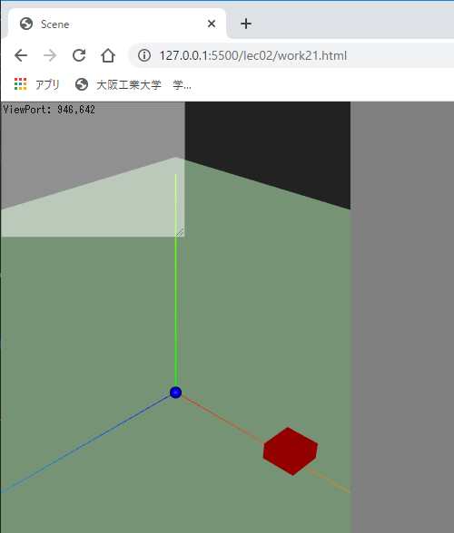
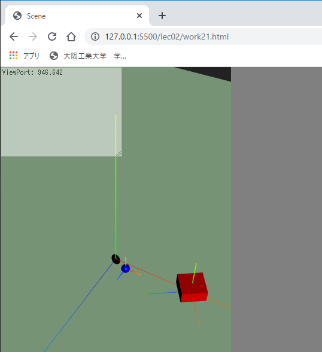
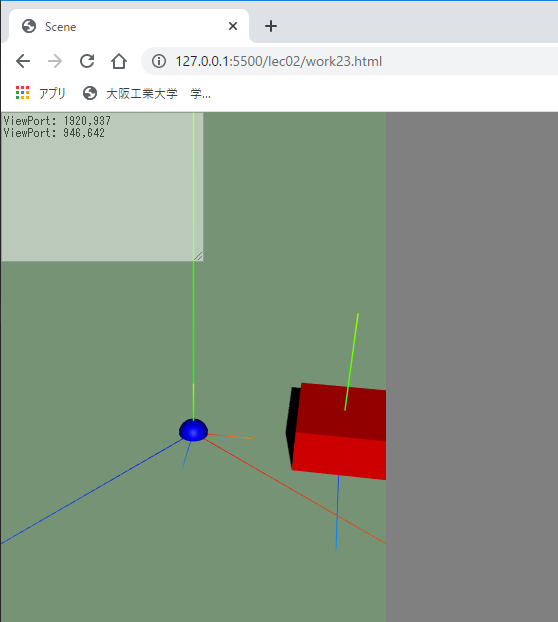
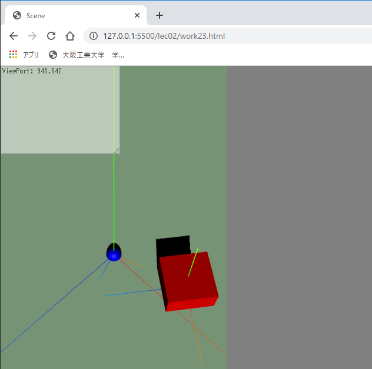
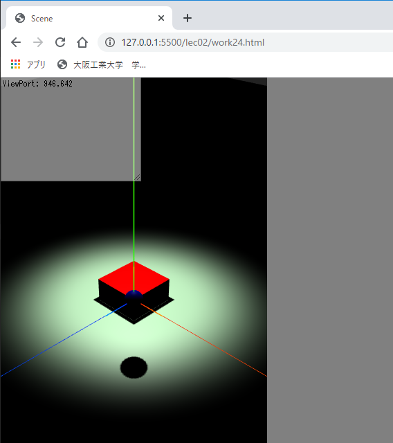
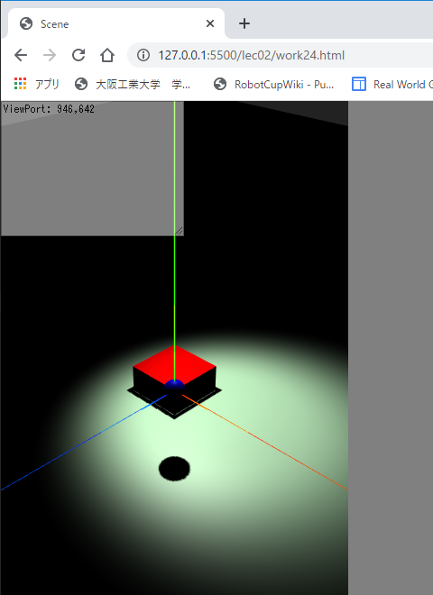
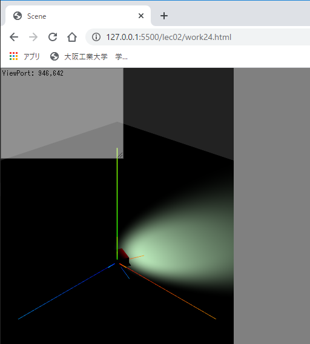

# Three.js(lec02)

[three_js/Home](./Home.md)

---

## 演習

### base20.html のコピー

[前項](./three_js_01.md)と同じように雛形となるファイルをコピーして演習を進める。  
雛形は`ThreeJS-master/lec02/base20.html`である。このファイルを`ThreeJS-master/lec02/work21.html`のようにコピーする。

以降、主にアニメーションに関する演習を行う。ここでは位置や姿勢の値を直接計算する非常に単純なアニメーションを扱う。  
なお、`ThreeJS-master/lec02/base20.html`は`ThreeJS-master/lec01/base10.html`とほとんど同じであるが、以下の部分で物体のローカル座標軸を表示するようにしている。

```javascript
/* 球体の生成 */
const sphere =
...
sphere.add(new THREE.AxesHelper(2)); /* 物体のローカル座標軸を表示する */
scene.add(sphere);
...
/* 立方体の生成 */
const cubeGeometry =
...
cube.add(new THREE.AxesHelper(5)); /* 物体のローカル座標軸を表示する */
scene.add(cube);
```

また、`AUTO_SCROLL_DEBUG`を`true`にしている。
これにより`taDebugText.value`に文字列を追加すると、追加した文字列が表示されるように自動的に`<textarea id="debugText">`がスクロールする。

```javascript
/* デバッグ用の出力 */
const AUTO_SCROLL_DEBUG = true; // taDebugText を常に最新の行までスクロールさせるかどうか。
```

## work21 物体の等速運動（ position ）

- `ThreeJS-master/lec02/base20.html`を`ThreeJS-master/lec02/work21.html`というファイル名でコピーしなさい。

物体をアニメーションさせる場合、画面の描画更新処理内に位置や姿勢の変化をプログラムする必要がある。`work21.html`の下記の場所である。

```javascript
/* アニメーションのための描画更新処理 */
function renderFrame() {
  const deltaTime = clock.getDelta(); /* 前フレームからの経過時間。物体の移動に使う。 */
  /* ↓↓↓work21～work24 の追記場所↓↓↓ */

  /* ↑↑↑work21～work24 の追記場所↑↑↑ */
...
}
```

ここで、前フレームからの経過時間`const deltaTime`を使い、例えば`const cube`を x 軸に沿って秒速 2m（注）で移動させるには次のように記述する。

- （注）実際は単位は無い。three.js の CG 世界の長さ 1 を 1km と解釈するか 1cm と解釈するかは開発者依存である。ここでは分かりやすいように単位をメートルとする。

```javascript
/* アニメーションのための描画更新処理 */
function renderFrame() {
  const deltaTime = clock.getDelta(); /* 前フレームからの経過時間。物体の移動に使う。 */
  /* ↓↓↓work21～work24 の追記場所↓↓↓ */
  cube.position.x += (2 * deltaTime);
  /* ↑↑↑work21～work24 の追記場所↑↑↑ */
...
}
```

- 実行結果
  - 立方体が X 軸に沿って移動するはずである。
  - 移動させる軸（複数でも良い。つまり斜めの向き）、スピードを変えて確認しなさい。
  - スピードを負の数にすれば移動方向は逆になる。



## work22 物体の等速運動（ rotation ）

- `ThreeJS-master/lec02/base20.html`を`ThreeJS-master/lec02/work22.html`というファイル名でコピーしなさい。

位置の変化は`position`の値を変更していくことでプログラムできた。
姿勢については専用のメソッド[rotateX, rotateY, rotateZ](https://threejs.org/docs/#api/en/core/Object3D.rotateX)、を使う。
これらのメソッドは Three.js で生成するほとんどの物体が利用でき、引数に与えた角度だけ物体を回転させられる。

引数の単位は「ラジアン」である（π radian = 180 度）が、便利な単位の変換関数`THREE.Math.degToRad(度)`（「度」->「ラジアン」への変換）と`THREE.Math.radToDeg(ラジアン)`（「ラジアン」->「度」への変換）があるので、それらを使用すれば何の問題もない。

- `work22.html`のコメントを参照し、下記のコードを追記して実行結果を確認しなさい。

```javascript
/* ↓↓↓work21～work24 の追記場所↓↓↓ */
cube.position.x += 2 * deltaTime;
cube.rotateY(THREE.Math.degToRad(60) * deltaTime); // 秒速60度で Y 軸中心に回転させる。
/* ↑↑↑work21～work24 の追記場所↑↑↑ */
```

- 実行結果
  - 立方体が X 軸に沿って回転しながら移動するはずである。上（Y 軸正方向）から見ると反時計回りに回転しているのが分かる。
  - 回転させる軸（複数でも良い）、スピード（`rotateY`メソッドの引数の大きさ）を変えて確認しなさい。
  - スピードを負の数にすれば回転方向は逆になる。



### 回転に関する補足

Three.js に関する WEB 資料や参考書では、姿勢の変更も`position`と似たようなコードで`rotation.y += ***`のように書いてあるものが多い。  
CG の表示だけならそれでもほとんど問題はないが、本演習の付録で紹介する[物理エンジンと組み合わせた際](./three_js_app_A_01.md#workA1(4)-GSAP)に不具合が生じるため、メソッドを使って姿勢を変化させている。

## work23 物体の等速運動（物体の親子関係生成によるワールド座標系での回転）

- `ThreeJS-master/lec02/base20.html`を`ThreeJS-master/lec02/work23.html`というファイル名でコピーしなさい。

`work22`では物体の`rotateY`メソッドを使用することで物体を回転させた。
このとき、物体のローカル座標軸を中心に回転していることに注目してほしい。  
例えば、太陽系の CG を表現するようなシーンで地球が太陽の周囲を公転するシーンを想定する。このとき、太陽をワールド座標の中心に据えて地球は太陽を中心に回転させたい、と考えるのが自然である。  
しかし、`work22`の方法では地球を自転させることはできても公転させる場合に`position`に対して面倒な計算が必要となる。

- `work23.html`のコメントを参照し、下記のコードを追記して実行結果を確認しなさい。

```javascript
/* ↓↓↓work23～work24 の追記場所↓↓↓ */
sphere.position.set(0, 0, 0); /* 球体をワールドの中心に据える */
cube.position.set(5, 0, 0); /* 立方体の場所を変更 */
scene.remove(cube); /* 立方体をシーンから削除し... */
sphere.add(cube); /* 球体とまとめて動かせるようにする */
/* ↑↑↑work23～work24 の追記場所↑↑↑ */
/* アニメーションのための描画更新処理 */
function renderFrame() {
  const deltaTime = clock.getDelta(); /* 前フレームからの経過時間。物体の移動に使う。 */
  /* ↓↓↓work21～work24 の追記場所↓↓↓ */
  sphere.rotateY(deltaTime * THREE.Math.degToRad(30)); /* 球体を回転させれば、立方体もまとめて動く */
  /* ↑↑↑work21～work24 の追記場所↑↑↑ */
...
}
```

- 実行結果
  - 立方体と球体共に Y 軸中心に回転するはずである。
  - 回転させる軸（複数でも良い）、スピードを変えて確認しなさい。



もともとの目的であった「ワールド座標系での回転」を直接的に実現しているわけではない。ここでは座標 0,0,0 に配置した`sphere`（球体）と座標 5,0,0 に配置した`cube`（立方体）を一つの物体としてまとめている。ただし、回転や移動の中心は`sphere`（球体）にしたい。このように複数物体をまとめる際に、基準となる物体を「親」、親に従属して移動する物体を「子」と呼ぶことが多い。  
Three.js では親子関係の構築を`add`メソッドで行う。以下のコードで、もともと`scene`の直接の子であった`cube`を`sphere`の子としている。

```javascript
scene.remove(cube); /* 立方体をシーンから削除し... */
sphere.add(cube); /* 球体とまとめて動かせるようにする */
```

### 公転と自転を同時に行う

- `work23.html`のコメントを参照し、下記のコードを追記して実行結果を確認しなさい。

```javascript
function renderFrame() {
  const deltaTime = clock.getDelta(); /* 前フレームからの経過時間。物体の移動に使う。 */
  /* ↓↓↓work21～work24 の追記場所↓↓↓ */
  sphere.rotateY(deltaTime * THREE.Math.degToRad(30)); /* 球体を回転させれば、立方体もまとめて動く */
  cube.rotateY(deltaTime * -THREE.Math.degToRad(90)); /* 自転 */
  /* ↑↑↑work21～work24 の追記場所↑↑↑ */
```

- 実行結果
  - 立方体は球体を中心に回転しながら自身のローカル Y 座標軸周りに回転するはずである。



## work24 スポットライトをアニメーションさせる

- `ThreeJS-master/lec02/base20.html`を`ThreeJS-master/lec02/work24.html`というファイル名でコピーしなさい。

これまでの課題で物体の位置や回転を変化させる方法を習得した。これを利用し`THREE.SpotLight`の照射方向を変えるアニメーションをプログラミングする。  
[前項](./three_js_01.md)の光源の部分で見たように光源の照射方向はシーンに追加した`target`の位置でコントロールできる。したがって、`target`の位置を時間の経過とともに変えてやればよい。

- `work24.html`のコメントを参照し、下記のコードを追記して実行結果を確認しなさい。
- なお、***！下記コードをペーストしただけでは動作しない！***。省略している部分を[前項](./three_js_01.md)とコメントを参考に埋めること。

```java
/* ↓↓↓work24 の修正場所↓↓↓ */
const spotLight = /* ...省略... */  /* 色は白、強さは 1.0 のスポットライトを生成する */
spotLight.penumbra = 0.6; /* 半影をどの程度生じさせるか。 */
spotLight.castShadow = true; /* 他の物体に影を落とす */
spotLight. /* 省略 */ ; /* 光源の位置を座標(0, 10, 0)とする */
spotLight. /* 省略 */ ; /* 照射方向は座標(0, 0, 0)とする */
scene.add(spotLight); /* ライト本体と */
scene.add(spotLight.target); /* 照射ターゲットもシーンに追加する必要がある */
/* ↑↑↑work24 の修正場所↑↑↑ */
```

- 実行結果
  - 半影を生じるスポットライトが真上から照射されるはずである。



- `work24.html`のコメントを参照し、下記のコードを追記して実行結果を確認しなさい。

```javascript
function renderFrame() {
  const deltaTime = clock.getDelta(); /* 前フレームからの経過時間。物体の移動に使う。 */
  /* ↓↓↓work21～work24 の追記場所↓↓↓ */
  spotLight.target.position.x += 1 * deltaTime;
  /* ↑↑↑work21～work24 の追記場所↑↑↑ */
```

- 実行結果
  - スポットライトの照射先がゆっくりと X 軸に沿って移動するはずである。



### スポットライトを回転させる

work23 と同じ要領で`spotLight.target`を何等かの物体の子供としてやり、親物体を回転させればよい。

- `work24.html`のコメントを参照し、下記のコードを追記して実行結果を確認しなさい。追記・修正箇所は 2 か所に渡っている。
- ***省略箇所はこれまでの内容から自力で考えること。***

```javascript
/* ↓↓↓work23～work24 の追記場所↓↓↓ */
spotLight.target.position.set(10, 0, 0);
scene.remove(spotLight.target); /* spotLight.target をシーンから削除し... */
cube.add(spotLight.target); /* 立方体とまとめて動かせるようにする */
/* ↑↑↑work23～work24 の追記場所↑↑↑ */
/* アニメーションのための描画更新処理 */
function renderFrame() {
  const deltaTime = clock.getDelta(); /* 前フレームからの経過時間。物体の移動に使う。 */
  /* ↓↓↓work21～work24 の追記場所↓↓↓ */
  /* cube を秒速30度で Y 軸中心に回転させる。省略 */
  /* ↑↑↑work21～work24 の追記場所↑↑↑ */
...
```

- 実行結果
  - スポットライトの照射先が立方体とともに Y 軸中心に回転するはずである。



---

[three_js/Home](./Home.md)
