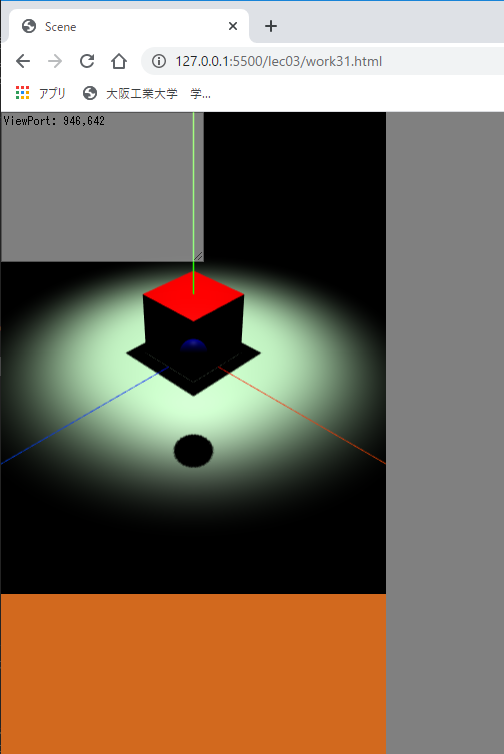
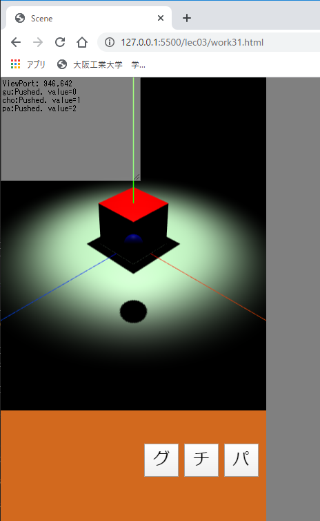
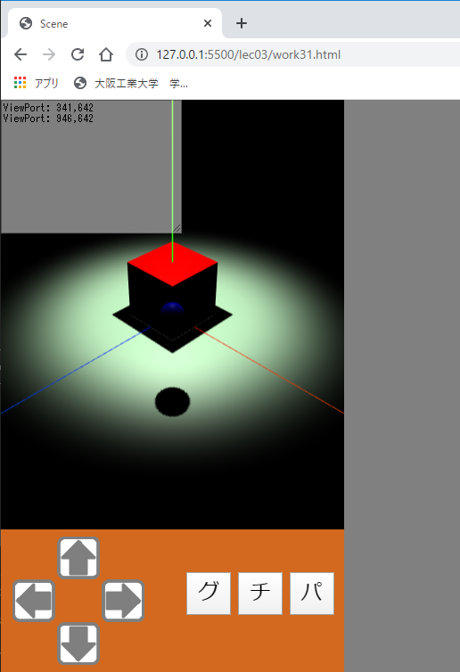
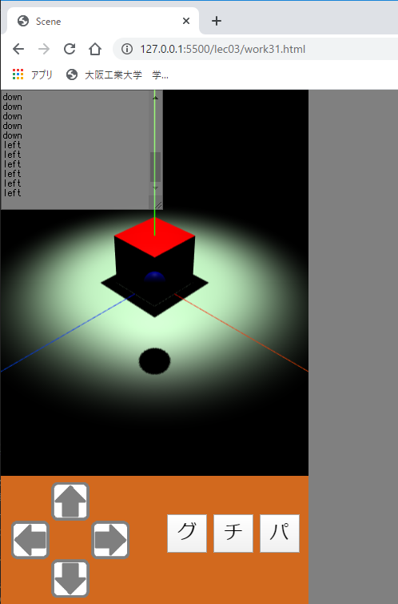
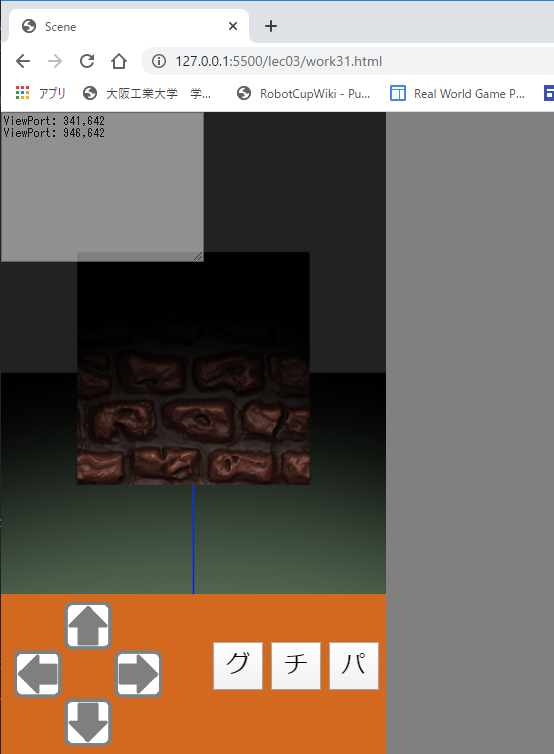
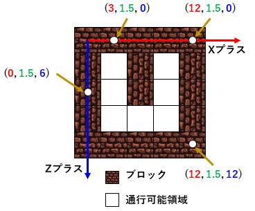
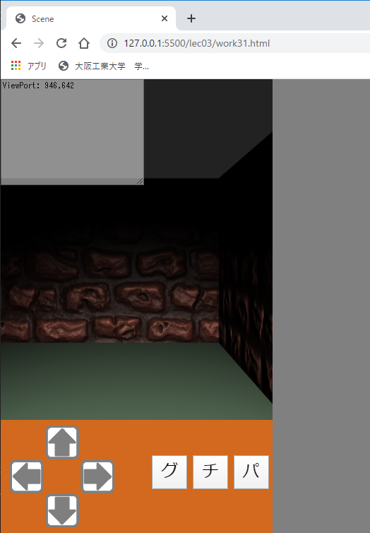

# Three.js(lec03)

[three_js/Home](./Home.md)

---

## 演習

### base30.html のコピー

[これまで](./three_js_01.md)と同じように雛形となるファイルをコピーして演習を進める。  
雛形は`ThreeJS-master/lec03/base30.html`である。このファイルを`ThreeJS-master/lec03/work31.html`のようにコピーして進める。

以降、迷路ゲームを題材に主にユーザ入力に関する演習を行う。  
なお、`ThreeJS-master/lec03/base30.html`と`ThreeJS-master/lec01/base10.html`の違いは以下に示す通りである。

- 迷路のデータ等が入った`myMaze.js`を HTML 冒頭で読込んでいる。

```html
<script type="text/javascript" src="../js/myMaze.js"></script>
```

- `THREE.OrbitControls`に関する部分を削除している。したがって、**これまでと同じやり方でマウスによる 3D のビューを操作することはできない**。

```javascript
/* 削除 */
/* マウスコントローラの追加 */
/* THREE.js 本体には含まれていないことに注意 */
// const orbitControls = new THREE.OrbitControls(camera, renderer.domElement);
// orbitControls.update();
/* 削除 */
...
/* アニメーションのための描画更新処理 */
function renderFrame() {
    const deltaTime = clock.getDelta(); /* 前フレームからの経過時間。物体の移動に使う。 */
    /* 削除  orbitControls.update(deltaTime); 削除 */
```

- 光源はスポットライトに変更している。カメラや物体、光源の位置調整は下記部分で行っているので、座標を確認しておくこと。

```javascript
/* カメラ等の位置調整 */
camera.position.set(15, 15, 15);
camera.lookAt(0, 0, 0);
cube.position.y = 1.5;
spotLight.position.set(0, 10, 0); /* 座標(0,10,0)から */
spotLight.target.position.set(0, 0, 0); /* 座標(0,0,0)に照射 */
```

- `AUTO_SCROLL_DEBUG`を`true`にしている。これにより`taDebugText.value`に文字列を追加すると、追加した文字列が表示されるように自動的に`<textarea id="debugText">`がスクロールする。

```javascript
/* デバッグ用の出力 */
const AUTO_SCROLL_DEBUG = true; // taDebugText を常に最新の行までスクロールさせるかどうか。
```

## work31 入力用 UI（ユーザインタフェース）を作る

- `ThreeJS-master/lec03/base30.html`を`ThreeJS-master/lec03/work31.html`というファイル名でコピーしなさい。

今回は、Android 端末のタッチで 3D ビューの操作が可能な UI を WEB ページ上に作成する。1 人称視点の迷路ゲームを想定し、前後・回転移動が可能な十字キーとコマンド入力用のプッシュボタンを作成する。迷路を移動中はランダムなタイミングで敵と遭遇し、戦闘は簡略化のためじゃんけんで行う。  
なお、このページには work は一つしかない。全ての追記・修正は`work31.html`に対して行う。
本演習では、UI のボタンなどのコンポーネントは HTML に記述し、イベント処理を JavaScript で記述する。

## UI 用のエリアを作る

- `work31.html`のコメントを参照し、下記のコードを追記・修正して実行結果を確認しなさい。今回の編集場所は HTML 内である。
- `<div id="glView" style="position: relative;height: 75%;">`の`height`属性の数値を`75%`にする。
- `<div id="controller" ...>~</div>`の部分が追記されている。

```html
<!-- ↓↓↓work31の追記・修正場所↓↓↓ -->
<div id="glView" style="position: relative;height: 75%;">
  <!--textarea id="debugText" rows="8" cols="20" class="debugText" style="display: none;">Debug output</textarea> デバッグ用表示を無くしたいときはこちらを有効にする。-->
  <textarea id="debugText" rows="12" cols="30" class="debugText">Debug output</textarea>
</div>
<div id="controller" style="position: relative;height: 25%;background-color:chocolate"></div>
<!-- ↑↑↑work31の追記・修正場所↑↑↑ -->
```

- 実行結果
  - 3D のビューが画面全体の縦 75％に縮小し、代わりに茶色の UI 用エリアができているはずである。



`background-color:chocolate`の部分は[好きな色](http://www.netyasun.com/home/color.html)や画像表示に変更しても構わない。画像を表示するなら次のようになる。スタイルの`background-image`に与える URL は`work31.html`からの相対パスである。URL であることを示すために`url()`で囲むことに注意すること。`background-size`で元画像をどの程度縮小してタイル表示するかを指定している。

```html
<div id="controller" style="position: relative;height: 25%;background-image:url(../assets/downloads/DesolatedHut.png);background-size: 20%;"></div>
```

背景には好きな画像を使ってよい（著作権に注意）。

## プッシュボタンを作る

`<div id="controller">`の子として`button`要素を記述してボタンを作る。ボタンには画像や文字を表示できるが、今回はじゃんけんゲームを想定し 3 つのボタンにテキストを表示する。

```html
<div id="controller" style="position: relative;height: 25%;background-color:chocolate">
  <button id="gu" type="button" class="pushButton" style="width: 13%;top: 30%; right: 33%;" value="0">
    グ
  </button>
  <button id="cho" type="button" class="pushButton" style="width: 13%;top: 30%; right: 18%;" value="1">
    チ
  </button>
  <button id="pa" type=" button" class="pushButton" style="width: 13%;top: 30%; right: 3%;" value="2">
    パ
  </button>
</div>
```

- 実行結果


なお、ボタンに画像を表示したい場合は以下のようにする。じゃんけんマークのアイコンなどを採用すればそれらしくなる。

```html
<button id="gu" type="button" class="pushButton" style="width: 13%;top: 30%; right: 29%;" value="0">
  
</button>
```

### プッシュボタンのイベントを処理する

前項で作成したボタンに対するイベント処理は JavaScript で行う。コメントを参照し以下のように追記しなさい。

```javascript
/* ↓↓↓work31のプッシュボタンや十字キーに関する追記・修正場所↓↓↓ */
function onPushButtonClicked() {
  taDebugText.value += this.id + ":Pushed. value=" + this.value + "\n";
}
let elems = document.getElementsByClassName("pushButton"); // class 属性に pushButton が指定してある HTML 要素を取得し、配列 elems に格納する。
for (let e of elems) {
  e.addEventListener("click", onPushButtonClicked);
}
/* ↑↑↑work31のプッシュボタンや十字キーに関する追記・修正場所↑↑↑ */
```

このコードは各プッシュボタンが押された際のイベント処理を`onPushButtonClicked`で行うということを意味している。このようにイベント処理を行う関数を「イベントハンドラ」と呼ぶこともある。  
特に分かりにくいのはイベントハンドラ`onPushButtonClicked`における`this`の意味である。  
これは、`onPushButtonClicked`を呼び出したもの、つまり**押されたボタンの HTML 要素**を意味している。そのため、`this.id`や`this.value`によって HTML で記述した`id`や`value`属性の値を取得できる。

- 実行結果
  - ボタンを押すと`gu:Pushed. value=0`などと表示されるはずである。



## 仮想的なジョイスティックを作る

一昔前のジョイパッドに備わっていたデジタルな十字方向指定キーをスクリーン上に作成する。ゲームのキャラクターを前後左右に動かすための UI である。デジタルな十字キーなのである方向キーが ON か OFF かといった判定しかしない。つまり現代的なアナログジョイスティックとは異なり、キャラクターの移動速度を無段階に操作することはできない。

このような仮想ジョイスティック（オンスクリーンジョイスティックとも言う）を作る場合、前項で作成したプッシュボタンを 4 つ並べても機能しない。なぜなら、Android 端末で指をスライドさせてプッシュボタンを触ってもイベントは発生しないからである。click イベントはボタン領域内から指を完全に離した状態から、押して離して初めて機能する。

ここでは HTML で十字キーの 4 つの領域を作成し、各領域内に指が触れているか（PC の場合はマウスボタンが押されたままか）否かを判定することで仮想ジョイスティックを実現する。

### 十字キーの UI を表示する

- `<div id="controller"`の子要素に次のように 4 つの`<div>`を追加して十字キーの UI を表示しなさい。

```html
<div id="controller" style="position: relative;height: 25%;background-color: chocolate;">
  <div id="up" class="arrowButton" style="top: 5%; left: 16%; background-image:url(../assets/gray_arrow.png);">
  </div>
  <div id="down" class="arrowButton" style="top: 65%; left: 16%; background-image:url(../assets/gray_arrow.png); transform: rotate(180deg)">
  </div>
  <div id="left" class="arrowButton" style="top: 35%; left: 3%; background-image:url(../assets/gray_arrow.png); transform: rotate(-90deg)">
  </div>
  <div id="right" class="arrowButton" style="top: 35%; left: 29%; background-image:url(../assets/gray_arrow.png); transform: rotate(90deg)">
  </div>
  <!-- ここからは前項で実装したプッシュボタンのコード -->
  <button id="gu" type="button" class="pushButton" style="width: 13%;top: 30%; right: 33%;" value="0">
    グ
    <!-- 前項で実装したプッシュボタンのコード。省略 -->
  </button>
</div>
<!-- ↑↑↑work31の追記・修正場所↑↑↑ -->
```

- 実行結果
  - 次のように灰色のボタン領域が表示されるはずである。



十字キーの画像は好きなものを使って構わない。ここでは HTML 内の編集で完結させるために、`<div ... style="...background-image:url(../assets/gray_arrow.png);`と`div`要素の属性として背景画像を指定しているが、`css/common.css`内の`arrowButton`スタイルを編集すれば逐一 HTML に書かなくとも済む。  
十字キーボタン領域の`transform: rotate(90deg)`は要素を回転させるスタイル記述である。これにより一つの画像を用意すれば 4 方向のボタンが作成できる。

- 作成した十字キーを機能させるために以下のコードを JavaScript プログラムに追記しなさい。

```javascript
/* ↓↓↓work31のプッシュボタンや十字キーに関する追記・修正場所↓↓↓ */
/* 前項までに実装したプッシュボタンのコード */
function onPushButtonClicked() {
  taDebugText.value += this.id + ":Pushed. value=" + this.value + "\n";
}
let elems = document.getElementsByClassName("pushButton"); // class 属性に pushButton が指定してある HTML 要素を取得する。
for (let e of elems) {
  e.addEventListener("click", onPushButtonClicked);
}
/* 以降が今回の追記 */
elems = document.getElementsByClassName("arrowButton"); // class 属性に arrowButton が指定された HTML 要素を全て取得し、配列に格納する。
const arrows = {}; // div の id と十字キーボタンクラスをペアとする辞書
for (let e of elems) {
  arrows[e.id] = new mylib2020.ArrowButton(e, "url(../assets/red_arrow.png)");
  /* 十字キーボタンを生成する。第一引数はボタン領域となる HTML の div 要素、第二引数は押したときの画像 */
}
/* ↑↑↑work31のプッシュボタンや十字キーに関する追記・修正場所↑↑↑ */
```

- 実行結果画像は省略する。灰色のボタン領域をマウスで押している間は赤くなるはずである。Android 端末においては指をスライドさせて領域に侵入させると赤くなり、指が領域から外れると元に戻る。

十字キーボタンの実装は`js/myThree2020.js`に`ArrowButton`クラスとしてあらかじめ記述してあるので参照して欲しい。

### 十字キーの ON/OFF 状態を判別する

- 次の JavaScript コードを追記しなさい。

```javascript
/* アニメーションのための描画更新処理 */
/* ↓↓↓work31の追記・修正場所↓↓↓ */
function renderFrame() {
  const deltaTime = clock.getDelta(); /* 前フレームからの経過時間。物体の移動に使う。 */
  if (arrows["up"].isPressed()) {
    taDebugText.value += "up\n";
  }
  if (arrows["down"].isPressed()) {
    taDebugText.value += "down\n";
  }
  if (arrows["left"].isPressed()) {
    taDebugText.value += "left\n";
  }
  if (arrows["right"].isPressed()) {
    taDebugText.value += "right\n";
  }
  /* ↑↑↑work31の追記・修正場所↑↑↑ */
```

- 実行結果
  - 次のようにどの十字キーに触れているかが表示されるはずである。



## 一人称視点を実現する

本項の目標である、一人称視点で迷路を移動するアプリを実装する。ヘッドライトを頭に付け、カメラを構えて迷路を探索する人物を想像してほしい。`sphere`（球体）がその人物の頭部である。  
具体的にはカメラとスポットライトを`sphere`の子供とし、仮想ジョイスティックで`sphere`を移動させるように実装する。上下キーが前進・後退、左右キーが回転である。  
なお、ここで、前進・後退とはそれぞれ操作対象のローカル z 軸のプラス・マイナス方向を指す。また左右の回転とはローカル Y 軸中心の回転である。

- 次のようにカメラとスポットライトの位置を変更し、親子関係を構築しなさい。

```java
/* カメラ等の位置調整 */
/* ↓↓↓work31の追記・修正場所↓↓↓ */
cube.position.set(0, 1.5, 9); /* 最初にカメラに映るようにしているだけ */
sphere.position.set(0, 1.7, 0); /* ジョイスティックによる操作対象 */
sphere.castShadow = false; /* 影を消す */
camera.position.set(0, 0, 0); /* sphere からの相対位置 */
camera.lookAt(0, 0, 1);
spotLight.position.set(0, 0.3, -0.5); /* sphere からの相対位置 */
spotLight.target.position.set(0, -2, 2); /* sphere からの相対位置 */
/* 親子関係の構築 */
scene.remove(camera);
scene.remove(spotLight);
scene.remove(spotLight.target);
sphere.add(camera);
sphere.add(spotLight);
sphere.add(spotLight.target);
/* ↑↑↑work31の追記・修正場所↑↑↑ */
```

上記コードで親子関係を構築した際に、子供の座標は親からの相対位置となることに注意して欲しい。イメージとしては身長 1.7m の人物（`sphere`の Y 座標）が頭にカメラとスポットライト（1.7+0.3=地上から 2.0m の高さにある）をつけているようなものである。
`spotLight`の z 座標がマイナス 0.5（sphere の後方にある）であるのはスポットライトのローカル座標原点は真っ暗なためである。少し操作対象の後ろからライトを照らすと上手く行く。
カメラとスポットライトはともに z 軸プラス方向を向いている。`camera.lookAt(0, 0, 1);`と`spotLight.target.position.set(0, -1, 2);`がその向きをコントロールしている。

- 次に以下の部分を追記修正し、仮想ジョイスティックで`sphere`を動かせるようにしなさい。

```javascript
/* ↓↓↓work31の追記・修正場所↓↓↓ */
const LINEAR = 3; // 3m/sec
const ANGULAR = THREE.Math.degToRad(60); // 60deg/sec

function renderFrame() {
  const deltaTime = clock.getDelta(); /* 前フレームからの経過時間。物体の移動に使う。 */
  if (arrows["up"].isPressed()) {
    taDebugText.value += "up\n";
    sphere.translateOnAxis(mylib2020.FORWARD, LINEAR * deltaTime);
  }
  if (arrows["down"].isPressed()) {
    taDebugText.value += "down\n";
    sphere.translateOnAxis(mylib2020.BACK, LINEAR * deltaTime);
  }
  if (arrows["left"].isPressed()) {
    taDebugText.value += "left\n";
    sphere.rotateY(ANGULAR * deltaTime);
  }
  if (arrows["right"].isPressed()) {
    taDebugText.value += "right\n";
    sphere.rotateY(-ANGULAR * deltaTime);
  }
  /* ↑↑↑work31の追記・修正場所↑↑↑ */
```

- 実行結果画像は省略する。仮想ジョイスティックで 3D ビュー内を移動できるはずである。

JavaScript コード中の`translateOnAxis(mylib2020.FORWARD, LINEAR * deltaTime);`は物体をローカル座標系のある方向に沿って移動させるメソッドである。第一引数は移動させる方向ベクトル、第二引数は距離を与えている。  
ここで、`mylib2020.FORWARD`と`mylib2020.BACK`は`js/myThree2020.js`においてそれぞれ 0,0,1（z 軸方向の単位ベクトル）と 0,0,-1（z 軸マイナス方向の単位ベクトル）として定義している。

これまでの物体移動アニメーションでは`position`の値を変更していたが、今回はそれでは上手く行かない。  
何故なら、`position`はワールド座標での位置（正確には親物体の座標系における位置）を示しているからである。実装したいのは自分が向いている方向に対し前進や後退を行うことである。つまり、自分のローカル座標系での移動を実現する必要がある。それが`translateOnAxis`である。

## 迷路を作る

あらかじめ定義された配列データに基づき 3D ビューに立方体を並べて迷路を作る。迷路を構成する全ての立方体を逐一プログラムするのは手間なので、配列データを与えれば全て生成されるようにするのが自然である。迷路を構成するブロックの基本的な生成方法はこれまで使ってきた`THREE.Mesh`の`cube`を作成したときと同じである。その形状情報は変数`cubeGeometry`に、材質情報は`cubeMaterial`に格納されている。
`cubeGeometry`と`cubeMaterial`から必要なだけ`THREE.Mesh`を生成し並べてやればよい。赤いブロックでは雰囲気が出ないので、テクスチャ/バンプマッピングを施す。

- `cubeGeometry`と`cubeMaterial`を生成している以下の場所を追記・修正しなさい。

```java
/* 立方体の生成 */
const cubeGeometry = new THREE.BoxGeometry(3, 3, 3); /* Geometry の生成を分けて書くこともできる */
/* ↓↓↓work31の追記・修正場所↓↓↓ */
const loader = new THREE.TextureLoader(); /* テクスチャをロードするための道具 */
const mapTexture = loader.load("../assets/downloads/ReflectingTheLava.png"); /* 指定されたURLからテクスチャをロード */
const bumpTexture = loader.load("../assets/downloads/RockWall_orFloor_height.png"); /* バンプマップ用テクスチャ */
const cubeMaterial = new THREE.MeshPhongMaterial({ map: mapTexture, bumpMap: bumpTexture, bumpScale: 0.2}); /* bumpMap:バンプテクスチャ、bumpScale:バンプマップの深さ */
/* ↑↑↑work31の追記・修正場所↑↑↑ */
```

- 実行結果
  - 仮想ジョイスティックでブロックを様々な角度から眺めて確認すること。



### 迷路のデータを用意し、ブロックを並べる

迷路を上（Y 軸プラス方向）から眺めたイメージを次に示す。ブロックの大きさは 3m 四方である。



上図の 5x5 ブロックの迷路は 1 をブロック、0 を通行可能領域とする整数配列で次のように記述できる。

```java
const MyMazeTestData = [
    1, 1, 1, 1, 1,
    1, 0, 1, 0, 1,
    1, 0, 1, 0, 1,
    1, 0, 0, 0, 1,
    1, 1, 1, 1, 1
];
```

このテスト用データの定数`MyMazeTestData`は`js/myMaze.js`内に定義されている。このデータと 2 重 for 文を使い、迷路を構築する。

- 以下のコードを追記し、迷路を出現させなさい。

```javascript
/* カメラ等の位置調整 */
/* ↓↓↓work31の追記・修正場所↓↓↓ */
...
sphere.add(spotLight);
sphere.add(spotLight.target);
/* 以降追記 */
sphere.position.set(3, 1.7, 3); /* 通行可能領域に自分を移動させている */
scene.remove(cube); /* cube はもう必要ない */
const blocks = []; /* 迷路を構成するブロックを衝突判定のために保存する必要がある（後述） */
const WIDTH = 5; /* 迷路データの幅 */
const HEIGHT = 5;  /* 迷路データの高さ */
let index = 0;
for (let z = 0; z < HEIGHT; z++) {
  for (let x = 0; x < WIDTH; x++) {
    let cellType = MyMazeTestData[index];
    if (cellType == 1) {
      const tmp = new THREE.Mesh(cubeGeometry, cubeMaterial);  /* ブロックを生成 */
      tmp.position.set(x * 3, 1.5, z * 3);  /* 場所を設定 */
      scene.add(tmp); /* シーンに追加 */
      blocks.push(tmp); /* 配列に追加 */
    }
    index++;
  }
}
/* ↑↑↑work31の追記・修正場所↑↑↑ */
```

- 実行結果
  - 十字キーで移動させ、想定通りの迷路の形になっているか確認しなさい。壁との衝突判定はないので、壁に向かって進むとそのまま突き抜ける。



なお、迷路の作成は今回は`work31.html`内に直接記述したが、同等の処理を`js/myMaze.js`に記述している。複数の迷路を切り替えるなどする場合は参考になるかもしれない。

### 衝突判定を行う

Three.js は 3 次元グラフィクスのライブラリであり、複雑な衝突判定などを可能とする物理エンジンを含んではいない。ここでは進行方向だけを考慮した単純な衝突判定をあらかじめ実装してあるので使用する。

- 以下のようにコードを修正し、迷路のブロックを突き抜けないようにしなさい。

```javascript
function renderFrame() {
  const deltaTime = clock.getDelta(); /* 前フレームからの経過時間。物体の移動に使う。 */
  if (arrows["up"].isPressed()) {
    taDebugText.value += "up\n";
    /* 修正 */
    if (mylib2020.checkCollision(sphere, blocks, mylib2020.FORWARD) == false) {
      sphere.translateOnAxis(mylib2020.FORWARD, LINEAR * deltaTime);
    }
    /* 修正 */
  }
  if (arrows["down"].isPressed()) {
    taDebugText.value += "down\n";
    /* 修正 */
    if (mylib2020.checkCollision(sphere, blocks, mylib2020.BACK) == false) {
      sphere.translateOnAxis(mylib2020.BACK, LINEAR * deltaTime);
    }
    /* 修正 */
  }
```

`mylib2020.checkCollision`関数は第一引数に衝突判定の中心となる物体を、第二引数に判定の対象となる物体全てが入った配列を、第三引数に衝突判定するローカル座標系の方向ベクトルを与え、衝突する物体があれば`true`を返却する。関数の詳細は`js/myThree2020.js`にあるので、参照してほしい。

以上で一人称視点の迷路探索アプリが完成する。完成後は次のようにパラメータを変更し、どうなるかを確認すること。

- 迷路のもととなる配列を変える。`MyMazeTestData`を直接編集しても良いし、自分で配列を作ってもよい。幅と高さに注意すること。
- スポットライトのターゲットや高さ、カメラの位置、移動速度などを変えてみる。上記で書いてもらったスポットライトのパラメータは雰囲気を出すためにやや下向けにしている。もっと良いパラメータがあるかもしれないので、試行錯誤して欲しい。光の色などを変えることも考えられる。
- 迷路のテクスチャを変える。バンプテクスチャまで提供されている素材はなかなかないかもしれないが、例えば SF 風迷路など、好きなテクスチャを試してみること。

---

[three_js/Home](./Home.md)
