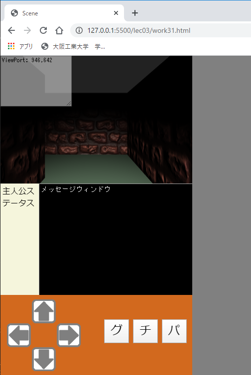
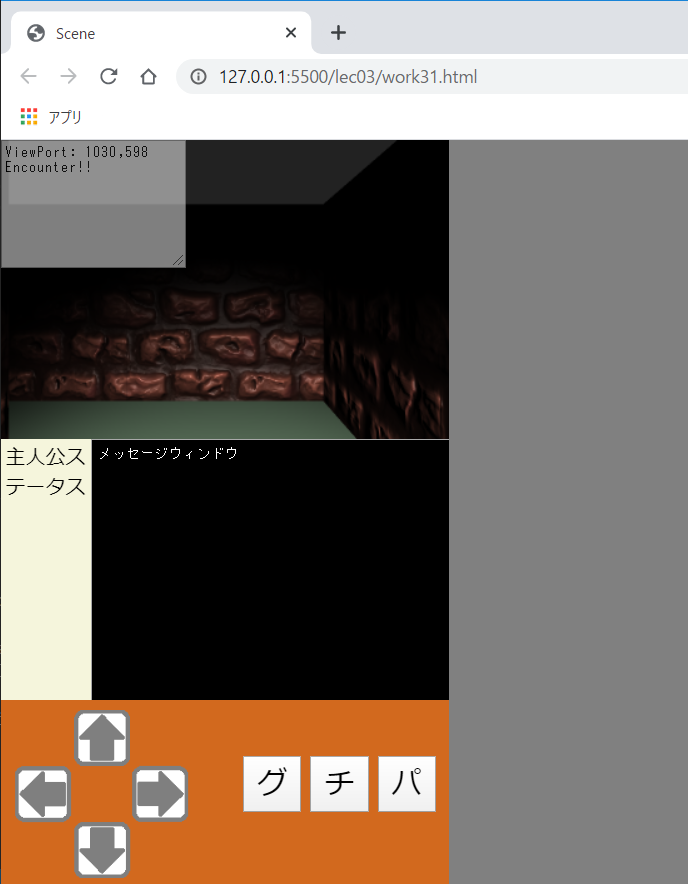

# Three.js(lec03-2)

[three_js/Home](./Home.md)

---

## 演習

このページでは[前回](./three_js_03_01.md)に続き`ThreeJS-master/lec03/work31.html`に変更を加えて行く。  
前回作成した迷路探索アプリに敵キャラクターを導入しゲームらしくする。ここでは簡略化のため敵との戦闘はじゃんけん形式にするが、各自でよりゲームらしくなるよう改良して欲しい。

## 画面レイアウトを変える

敵キャラクターとの戦闘時は戦闘に関するメッセージを表示したい。また主人公のステータスなども表示したい。  
これらのために HTML を修正し、新たな領域を作成する。
これまで同様、背景画像や色などを自由にカスタマイズして構わない。

```html
<div id="screen" class="screen">
  <!-- ↓↓↓work31の追記・修正場所↓↓↓ -->
  <!-- ↓↓↓ height:40% にする -->
  <div id="glView" style="position: relative;height: 40%;">
    <!--textarea id="debugText" rows="8" cols="20" class="debugText" style="display: none;">Debug output</textarea> デバッグ用表示を無くしたいときはこちらを有効にする。-->
    <!-- ↓↓↓ rows="8" cols="20" にする -->
    <textarea id="debugText" rows="8" cols="20" class="debugText">Debug output</textarea>
  </div>
  <!-- ↓↓↓ 追記 -->
  <div id="info" style="position: relative;height: 35%;background-color:coral;">
    <div id="status" class="status" style="width: 20%;">主人公ステータス</div>
    <textarea id="message" class="message" style="left: 20%;width: 78%">メッセージウィンドウ</textarea>
  </div>
  <!-- ↑↑↑ 追記 -->
</div>
```

- 実行結果



## 敵とランダムに遭遇する

乱数を使い、一定の確率で敵と遭遇するように実装する。JavaScript での乱数は以下の関数で生成できる。

```javascript
Math.random(); /* 0以上、1未満の範囲で浮動小数点の擬似乱数を返す。 */
```

- `work31.html`に次の修正を加え、移動時に 1 パーセントの確率で敵と遭遇させなさい。
- なお、動作確認用の文字列出力を一部コメントアウトしている。

```javascript
const ENCOUNTER = 0.01; // 追記
function renderFrame() {
  const deltaTime = clock.getDelta(); /* 前フレームからの経過時間。物体の移動に使う。 */
  const ran = Math.random(); // 追記
  let enc = false; // 追記
  if (arrows["up"].isPressed()) {
    // taDebugText.value += "up\n";
    if (mylib2020.checkCollision(sphere, blocks, mylib2020.FORWARD) == false) {
      sphere.translateOnAxis(mylib2020.FORWARD, LINEAR * deltaTime);
      enc = ran < ENCOUNTER; // 追記
    }
  }
  if (arrows["down"].isPressed()) {
    // taDebugText.value += "down\n";
    if (mylib2020.checkCollision(sphere, blocks, mylib2020.BACK) == false) {
      sphere.translateOnAxis(mylib2020.BACK, LINEAR * deltaTime);
      enc = ran < ENCOUNTER; // 追記
    }
  }
  if (arrows["left"].isPressed()) {
    // taDebugText.value += "left\n";
    sphere.rotateY(ANGULAR * deltaTime);
  }
  if (arrows["right"].isPressed()) {
    // taDebugText.value += "right\n";
    sphere.rotateY(-ANGULAR * deltaTime);
  }
  // 追記
  if (enc) {
    taDebugText.value += "Encounter!!\n";
  }
  /* ↑↑↑work31の追記・修正場所↑↑↑ */
```

- 実行結果
- しばらく移動すると時折「Encounter!」の文字が出る。
- 「Encounter!」が出にくい場合は`const ENCOUNTER`の値を増やす。



### 敵との遭遇時に戦闘シーンに入る

敵との遭遇後は敵キャラクタのグラフィクスを表示し、メッセージウィンドウに文字を出力する。今回はプッシュボタンを押すとじゃんけんを行い戦闘が終了するものとする。  
ここで重要なのは、戦闘中は仮想ジョイスティックによる迷路の移動をできないようにするということである。つまり、現在が戦闘中なのか迷路の移動中なのかというシーン管理をする必要がある。  
今回は単純なフラグによる条件分岐でこれを実現する。  
RPG のキャラクターを表現するクラスは`js/MyGameCharacter.js`に定義してある。このクラスのインスタンスを格納する変数`monster`を定義し、さらにこれが`null`かどうかをフラグとして使う。

- 変数`monster`と戦闘への勝利数を管理する`winCount`、`<div id="status">`の HTML 要素を保持する`divStatus`を以下の箇所に定義しなさい。

```javascript
/* ↓↓↓work31のプッシュボタンや十字キーに関する追記・修正場所↓↓↓ */
let monster = null; // 追記
let winCount = 0; // 追記
const divStatus = document.getElementById("status"); // 追記
```

- また、メッセージウィンドウの HTML 要素を保持する`taMessage`を次のように定義しなさい。

```javascript
/* アニメーションのための描画更新処理 */
/* ↓↓↓work31の追記・修正場所↓↓↓ */
const LINEAR = 3;
const ANGULAR = THREE.Math.degToRad(60);
const ENCOUNTER = 0.01;
const taMessage = document.getElementById("message"); // 追記
function renderFrame() {
    ...
```

次以降の修正はプログラムの構造を良く理解し、注意深く行うこと。実現したいことは、次の通りである。

- 変数`monster`が`null`のときは、戦闘中ではないので仮想ジョイスティックによる迷路の移動ができる。
- 変数`monster`が`null`でないときは、迷路内を移動させない。
- 敵と遭遇した際は変数`monster`に敵キャラクタのインスタンスを格納する。
- 以下の点を追記・修正しなさい。

```javascript
if (monster == null) { // 追記
  /* 迷路の移動に関する処理 */
  if (arrows['up'].isPressed()) {
    // taDebugText.value += "up\n";
    if (mylib2020.checkCollision(sphere, blocks, mylib2020.FORWARD) == false) {
      sphere.translateOnAxis(mylib2020.FORWARD, LINEAR * deltaTime);
      enc = ran < ENCOUNTER;
    }
  }
  /* 省略 */
  if (arrows['right'].isPressed()) {
    // taDebugText.value += "right\n";
    sphere.rotateY(-ANGULAR * deltaTime);
  }
} // 追記
if (enc) {
  taDebugText.value += 'Encounter!!\n';
  taMessage.value = '敵と遭遇した\n'; // 追記
  monster = new MyGameCharacter('モンスター', '../assets/downloads/red-dragon-1549047184nu3.png'); // 追記
  monster.show(divGlView); // 追記
}
```

この段階で動作確認しても構わないが、敵と遭遇したあとは迷路の移動も何もできなくなるはずである（ブラウザを再読み込みすれば元に戻る）。敵と戦い倒す処理が必要となる。  
敵と遭遇後も迷路の移動ができるようなら何か間違っている。

### 敵を倒す

今回はプッシュボタンでじゃんけんを行う。負けならゲームオーバーとして、再読み込みを促すメッセージを出す。
勝利数はカウントしておき、ステータスウィンドウに表示する。

敵と戦闘中かどうかは変数`monster`が`null`かどうかで判断できる。したがって、プッシュボタンを押したとき、`monster`が`null`でないならば戦闘の処理（今回はじゃんけん）を行えばよい。

- プッシュボタンのイベントハンドラに以下のコードを追記しなさい。

```javascript
/* ↓↓↓work31のプッシュボタンや十字キーに関する追記・修正場所↓↓↓ */
let monster = null;
let winCount = 0;
const divStatus = document.getElementById("status");
function onPushButtonClicked() {
    taDebugText.value += this.id + ":Pushed. value=" + this.value + "\n";
    const hands = ["グー", "チョキ", "パー"];
    if (monster) { // 戦闘中
        let monsterHand = Math.floor(Math.random() * 3); // 0, 1, 2 をランダムに生成
        let yourHand = parseInt(this.value); // 押されたボタンの value 属性を整数に変換
        let win = false;
        taMessage.value += "モンスターは" + hands[monsterHand] + "を出した!\n";
        taMessage.value += "主人公は" + hands[yourHand] + "を出した!\n";
        if(win){
          monster.remove(divGlView);
          monster = null;
          taMessage.value += "モンスターを倒した!!\n";
          winCount++;
          divStatus.innerHTML = "<b>主人公</b><br/>";
          divStatus.innerHTML += "勝利数:" + winCount;
        }else{
          taMessage.value += "主人公は敗れ去った・・・再読み込みしてください。\n";
        }
        taDebugText.value += "monster:" + monsterHand + "\n";
        taDebugText.value += "you:" + yourHand + "\n";
    }
}
```

コードを見れば分かるように、主人公がどのような手を出しても敗北して再読み込みが促される。逆に`win`を`true`にすればどんな手を出しても勝利し、何が起こるかテストできる。  
各自で正しいじゃんけんのアルゴリズムを実装し、ゲームとして成立させて欲しい。

### 発展課題とヒント

よりゲームらしく敵との戦闘はよくある RPG 風のターン制にするなどが考えられる。

- `js/myGameCharacter.js`にある`MyGameCharacter`は道具（`MyGameItem`）を使って、`MyGameCharacter`同士での戦闘を表現できるメソッドを実装している。
- 各自で改良してもよいし、参考にして新しいクラスを実装してもよい。

考えることはたくさんあるが、以下のようなテーマは検討しやすいかもしれない。

- 歩いている様子を表現できないか検討してみる（移動時に`sphere`の Y 座標を周期的に振動させる）。
  - 付録の[GSAP の項](./three_js_app_A_01.md#GSAP-(GreenSock-Animation-Platform))も参照のこと。
- ステータスやメッセージ表示部分、コントローラの背景、ボタンのアイコンなどにもっと画像を使うなど、デザインを改良する。
- 敵キャラクタを増やす。どの敵に会うかはランダムに決定する。

---

[three_js/Home](./Home.md)
