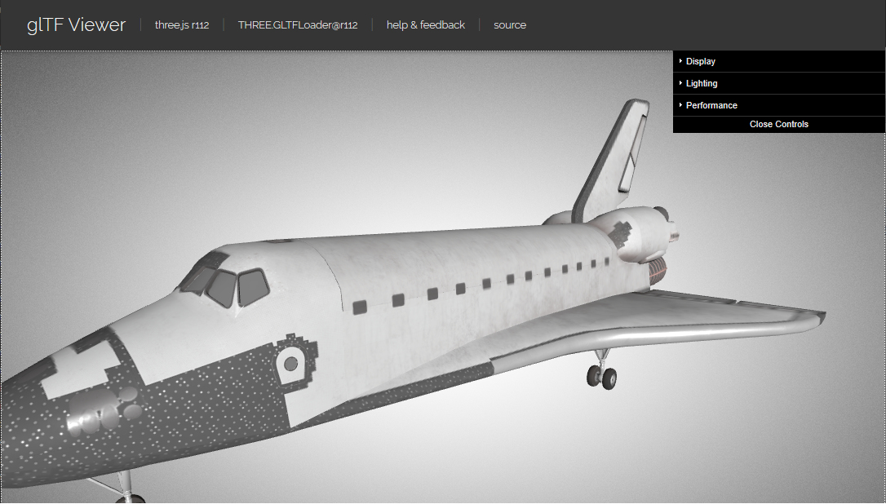
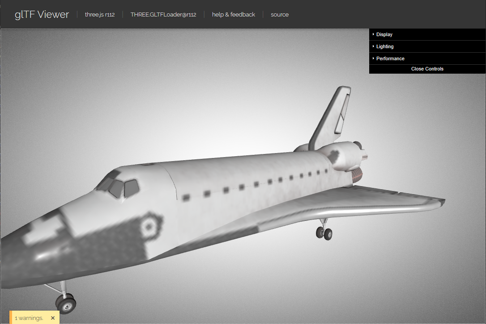

# Three.js(付録2)

[three_js/Home](./Home.md)

---

## Microsoft 3D ライブラリの活用

付録 1 で拡張子 gltf のモデルデータを利用した。
ここでは Windows 10 で手軽に利用可能な「[3D ビューアー](https://www.microsoft.com/ja-jp/p/3d-viewer/9nblggh42ths?activetab=pivot:overviewtab)」を通じてダウンロード可能な 3D モデルを Three.js から利用してみる。

最も大きな問題は 3D ビューアーから得られるモデルは高品質であるがファイルサイズが数十メガバイトと大容量な点である。

### 3D ビューアーからモデルをダウンロードする

### ファイルサイズ削減の流れ

- glb ファイルから頂点データとテクスチャデータを分離する。
- テクスチャ画像を縮小する。
- 分離したデータを再度 glb に統合する。

### Node.js と gltf-pipeline のインストール

10.x 系でないと無理。

#### Win10

- latest-v10.x を入れる。
- [node-v10.19.0-x64.msi](https://nodejs.org/dist/latest-v10.x/node-v10.19.0-x64.msi)
- コマンドプロンプトを開く。

```shell
% node --version
v10.19.0
% npm install -g gltf-pipeline
C:\Users\{user name}\AppData\Roaming\npm\gltf-pipeline -> C:\Users\{user name}\AppData\Roaming\npm\node_modules\gltf-pipeline\bin\gltf-pipeline.js
+ gltf-pipeline@2.1.8
added 38 packages from 20 contributors in 15.622s
```

#### Ubuntu 18.04

```shell
$ curl -sL https://deb.nodesource.com/setup_10.x | sudo -E bash -
$ sudo apt install nodejs
$ node --version
v10.19.0
$ sudo npm install -g gltf-pipeline
```

## 頂点データの圧縮とテクスチャのリサイズ

```shell
% gltf-pipeline -i ship.glb -o ship.gltf -st
Total: 187.482ms
% dir
 ドライブ C のボリューム ラベルは Windows です
 ボリューム シリアル番号は 5047-8BE3 です

 C:\Users\{user name}\Downloads\tmp のディレクトリ

2020/03/09  12:18    <DIR>          .
2020/03/09  12:18    <DIR>          ..
2020/03/09  12:18           614,396 ship.bin  # 分離された頂点データのファイル。
2020/03/09  07:11        22,455,324 ship.glb  # 元ファイル。約 22M
2020/03/09  12:18             4,589 ship.gltf # 分離されたメタデータのファイル。
2020/03/09  12:18         4,646,803 ship0.png # 分離されたテクスチャファイル。約 4MB
2020/03/09  12:18         4,866,303 ship1.png # 分離されたテクスチャファイル。
2020/03/09  12:18         7,330,534 ship2.png # 分離されたテクスチャファイル。
2020/03/09  12:18         4,994,937 ship3.png # 分離されたテクスチャファイル。
               7 個のファイル          44,912,886 バイト
               2 個のディレクトリ  282,917,355,520 バイトの空き領域
```

テクスチャ画像（上記の場合は拡張子 png の4つのファイル）のサイズを縮小する。以下の点に十分注意すること。

- 縮小画像は、元画像のアスペクト比（縦横比）と全く同じにすること。
- 縮小画像の縦横画素数は 2 のべき乗とすること。
- 縮小画像の形式およびファイル名は元画像と全く同じとすること。
- 元画像を縮小画像で上書きすること。

以上を守れば、どのような方法で画像を縮小しても構わない。ツールの例としては[Ralpha Image Resizer](https://www.vector.co.jp/soft/winnt/art/se487522.html?ds)がある。

テクスチャを 256 画素四方に縮小するとファイルサイズは次のようになる。

```shell
% dir
 ドライブ C のボリューム ラベルは Windows です
 ボリューム シリアル番号は 5047-8BE3 です

 C:\Users\{user name}\Downloads\tmp のディレクトリ

2020/03/09  12:59    <DIR>          .
2020/03/09  12:59    <DIR>          ..
2020/03/09  12:18           614,396 ship.bin
2020/03/09  07:11        22,455,324 ship.glb
2020/03/09  12:18             4,589 ship.gltf
2020/03/09  12:59           110,718 ship0.png  # 縮小されたテクスチャ画像。
2020/03/09  12:59           132,436 ship1.png  # 縮小されたテクスチャ画像。
2020/03/09  12:59           152,760 ship2.png  # 縮小されたテクスチャ画像。
2020/03/09  12:59           163,674 ship3.png  # 縮小されたテクスチャ画像。
               7 個のファイル          23,633,897 バイト
               2 個のディレクトリ  284,728,340,480 バイトの空き領域
```

最後に、分離したテクスチャと頂点データを再度まとめなおす。

```shell
% gltf-pipeline -i ship.gltf -b
Total: 72.432ms
% dir |findstr glb
2020/03/09  13:18         1,176,872 ship-processed.glb
2020/03/09  07:11        22,455,324 ship.glb
```

`~/models/ship.glb`が対象のモデルとして。

```shell
$ cd ~/models
$ gltf-pipeline -i ship.glb -o ship.gltf -st
Total: 520.531ms
$  ls -lh
合計 43M
-rw-r--r-- 1 user user 600K  3月  9 08:44 ship.bin # 分離された頂点データのファイル。
-rwxrw-rw- 1 user user  22M  3月  9 07:11 ship.glb # 元ファイル。
-rw-r--r-- 1 user user 4.5K  3月  9 08:44 ship.gltf # 分離されたメタデータのファイル。
-rw-r--r-- 1 user user 4.5M  3月  9 08:44 ship0.png # 分離されたテクスチャファイル。
-rw-r--r-- 1 user user 4.7M  3月  9 08:44 ship1.png # 分離されたテクスチャファイル。
-rw-r--r-- 1 user user 7.0M  3月  9 08:44 ship2.png # 分離されたテクスチャファイル。
-rw-r--r-- 1 user user 4.8M  3月  9 08:44 ship3.png # 分離されたテクスチャファイル。
$ mogrify -resize 256x *.png # 解像度 256x256に 縮小する。解像度は 2 のべき乗にすること。
$ ls -lh
合計 23M
-rw-r--r-- 1 oit oit 600K  3月  9 08:44 ship.bin
-rwxrw-rw- 1 oit oit  22M  3月  9 07:11 ship.glb
-rw-r--r-- 1 oit oit 4.5K  3月  9 08:44 ship.gltf
-rw-r--r-- 1 oit oit  96K  3月  9 08:48 ship0.png # テクスチャのファイルサイズが激減する。
-rw-r--r-- 1 oit oit 104K  3月  9 08:48 ship1.png
-rw-r--r-- 1 oit oit 104K  3月  9 08:48 ship2.png
-rw-r--r-- 1 oit oit 107K  3月  9 08:48 ship3.png
$ gltf-pipeline -i ship.gltf -b -d
Total: 1011.394ms
$ ls -lh|grep glb
-rw-r--r-- 1 oit oit 506K  3月  9 08:51 ship-processed.glb # 完成した glb ファイル。これを使う。
-rwxrw-rw- 1 oit oit  22M  3月  9 07:11 ship.glb # もとの glb ファイル。
```

ファイルサイズが 40 分の 1 以下になっていることが分かる。

### サイズ削減後の glb ファイルの見栄えを確認する

ブラウザで[](https://gltf-viewer.donmccurdy.com/)を開き、完成した glb ファイルをドラッグ＆ドロップする。
オリジナルモデルとサイズ削減後モデルの比較は次の通りである。

- オリジナル



- サイズ削減後



オリジナルに比べると当然テクスチャ解像度低下による劣化があるが、本演習の用途ではこれで十分である。
また 1 ファイルで数十メガバイトものモデルデータをユーザにダウンロードさせるのはかなりのストレスになるので避けるのが妥当である。

---

[three_js/Home](./Home.md)
