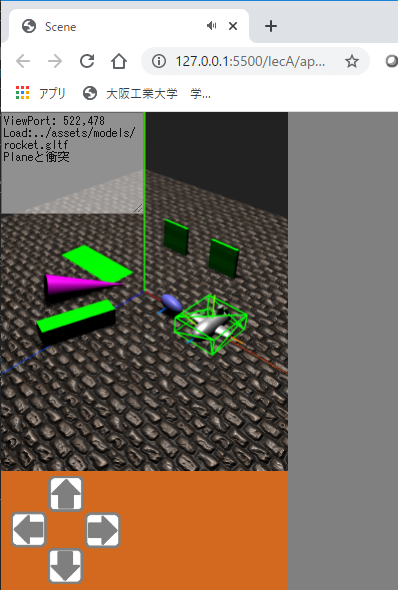

# Three.js(付録 A)

[three_js/Home](./Home.md)

- - -

付録では、これまで触れなかったテーマについて説明する。アプリ作成に活用してほしい。  
付録 A の項目は以下の通りである。

- 物理エンジン。
- TweenMax アニメーション。
- サウンド。
- CG モデルデータ glTF。

全ての要素が入ったデモの HTML は`ThreeJS-master/lecA/appendixA0.html`にある。

**このデモは音が出る。端末のボリュームに注意すること。**

実行すると「 Click to Play 」と表示されたボタンが出るので、クリックすると下図のように移動する薄い直方体などのいくつかの物体と小型ロケットを含む 3D シーンが表示されるはずである。  
ロケットは仮想ジョイスティックによって移動でき、何かに衝突すると音が出る。



## 各テーマの概要

### 物理エンジン

物理エンジンは物体が重力の影響を受けたときや、何かに衝突して反発したときなどの物理的な振る舞いをシミュレートする。
フレーム間の経過時間を与えると、物理法則にしたがった位置や姿勢を計算することができる。  
本演習では、 JavaScript で使用可能な物理エンジンのうち[Ammo](https://github.com/kripken/ammo.js/)を紹介する。
Ammo からいくつかの機能を選びラップしたクラスを用意しているので、それを利用して CG 物体に物理的な振る舞いをさせる。

Ammo は「 Avoided Making My Own js physics engine by compiling bullet from C++ 」の略で、 C++ で書かれた物理エンジン[Bullet](https://pybullet.org/wordpress/)を Javascript で利用可能としたライブラリである。
Ammo を利用することで、デモ HTML のように物体を重力で落下させたり、衝突判定を行ったりすることができる。

### TweenMax

[TweenMax](https://greensock.com/tweenmax/)は JavaScript で利用可能なアニメーションのライブラリである。 Three.js 等の 3次元 CG に限らず、WEBページ作成に広く利用できる。

これまでの演習では例えば`THREE.Mesh`の`position.x`などをフレームの経過時間に応じて少しずつ変化させることで CG 物体の移動アニメーションを実現してきた。
しかしこれでは多数の物体のアニメーションをプログラムするのが非常に手間である。  
TweenMax は JavaScript オブジェクト（連想配列）の、あるキーの値に対し「指定した秒数で一定の値になるまで変化させる」といった指定が簡単にプログラムできる。

### サウンド

Three.js では[THREE.Audio](https://threejs.org/docs/#api/en/audio/Audio)、[THREE.AudioLoader](https://threejs.org/docs/#api/en/loaders/AudioLoader)、[THREE.AudioListener](https://threejs.org/docs/#api/en/audio/AudioListener)によってサウンドを扱うことができる。

`THREE.Audio`は音声データを保持し、音を鳴らす、止めるといった制御を行う。
`THREE.AudioLoader`は URL から音声データを読込むことができる。
`THREE.AudioListener`は 3 次元空間内のどの場所で`THREE.Audio`の音を聞くかを指定する。  
つまり、音の発生源とそれを聞く位置を指定して、距離に応じたボリュームコントロールも可能である。
本項ではそこまでは触れず、音声ファイルの読み込みと指定した音量での再生／停止操作を扱う。

JavaScript でのサウンドの取り扱いで注意することは、ユーザに画面クリックなどの動作をさせないとサウンドを再生できないという点である。
これは WEB ページを開いた際に自動的にサウンド再生されるのを防ぐためである。
サウンドや動画の自動再生はユーザの予期しないものであり、端末の電力消耗や通信料の増加につながる。
従ってユーザがWEBページと何等かのインタラクションを起こさない限りはサウンド再生できない。  
`ThreeJS-master/lecA/appendixA0.html`のデモで最初にボタンを表示させているのはそのためである。デモのようにプッシュボタンをユーザに押させれば再生可能である。

### CG モデルデータ glTF

[glTF](https://www.khronos.org/gltf/)は 3DCG モデルデータのフォーマットの一つである。
特に WEB 上での CG に利用するフォーマットとして注目を集めている。

glTF には大きく分けてテキスト形式（拡張子`.gltf`）とバイナリ形式（拡張子`.glb`）がある。テキスト形式のものは[JSON](https://www.json.org/json-ja.html)（ JavaScript Object Notation ）で記述されている。  
デモ HTML で操作可能なロケットの glTF データは`ThreeJS-master/assets/models/rocket.gltf`にあり、Three.js の[THREE.GLTFLoader](https://threejs.org/docs/#examples/en/loaders/GLTFLoader)でモデルをロードして表示している。

## 各テーマごとの実装例

雛形となる HTML は`ThreeJS-master/lecA/baseA0.html`に用意している。これまでの演習同様にこの雛形をコピーし、少しずつ上記機能を追加する。

### workA1 物理エンジン

Ammo の機能をラップした以下のクラスを用いる。全て`ThreeJS-master/js/myAmmo2020.js`に定義してある。

- [mylib2020.AmmoManager](https://kmiyawaki.github.io/lectures/three_js/mylib2020/mylib2020.AmmoManager.html)  
  物理エンジンに対する重力の設定や、物理計算対象となる物体の管理、物理計算の実行などを行う。
- [mylib2020.AmmoCollisionBuilder](https://kmiyawaki.github.io/lectures/three_js/mylib2020/mylib2020.AmmoCollisionBuilder.html)  
  Threee.js の CG 物体に対し、衝突範囲や重さといった物理属性を設定する。
- `ThreeJS-master/lecA/baseA0.html`を`ThreeJS-master/lecA/workA1.html`というファイル名でコピーしなさい。
- `ThreeJS-master/lecA/workA1.html`のコメントを参照し、以下のように追記しなさい。

```javascript
/* ↓↓↓workA1 の追記場所↓↓↓ */
const box = new THREE.Mesh(new THREE.BoxGeometry(1, 1, 1), new THREE.MeshPhongMaterial({ color: 0x00FF00 }));
box.scale.set(4, 1, 1);
box.position.set(0, 0.5, 0);
scene.add(box);
/* ↑↑↑workA1 の追記場所↑↑↑ */
```

追記内容は物理計算とは関係無い、 Three.js の基本的な CG 物体の生成コードである。
細長い直方体を生成し、シーンに追加している。
実行すると上空から落ちてきた楕円の球は直方体をすり抜けるはずである。

このように、 CG 物体と物理計算の世界はプログラムで対応付けない限り一切相互作用を及ぼさないことをまず理解してほしい。

- 上記のコードを次のように書き換えなさい。

```javascript
/* ↓↓↓workA1 の追記場所↓↓↓ */
const box = new THREE.Mesh(new THREE.BoxGeometry(1, 1, 1), new THREE.MeshPhongMaterial({ color: 0x00FF00 }));
box.scale.set(4, 1, 1);
box.position.set(0, 0.5, 0);
/* 直方体に衝突検出範囲を設定し、物理的属性を追加する
 mass: 重さ（0 にすると、他の物体が衝突しても動かない）
 movable: ユーザプログラム側で移動させる可能性がある場合、true にする。 */
ammo.collisionBuilder.addPrimitiveRigidBody(box, { mass: 0, movable: true });
/* 直方体を物理計算対象としてシーンに追加する */
ammo.registerObject(box);
/* ↑↑↑workA1 の追記場所↑↑↑ */
```

実行すると上空から落ちてきた楕円の球は直方体に衝突し動きが変わるはずである。

#### 演習用クラスによる Ammo プログラム作成手順

`ThreeJS-master/lecA/workA1.html`の以下の部分が Ammo の初期化を行っている。

```javascript
/* ammo.js の初期化 */
Ammo();
const ammo = new mylib2020.AmmoManager(scene);
```

物理計算を行う場合はこのコードを最初の方に呼び出すこと。
特段の事情が無い限りは`workA1.html`のように Three.js の初期化直後に実行すると良い。  
[mylib2020.AmmoManager](https://kmiyawaki.github.io/lectures/three_js/mylib2020/mylib2020.AmmoManager.html)がコンストラクタの引数として Three.js のシーン（例では scene という変数）を必要とするからである。  
`const ammo`は[mylib2020.AmmoManager](https://kmiyawaki.github.io/lectures/three_js/mylib2020/mylib2020.AmmoManager.html)のインスタンスを格納し、この変数を通じて種々の機能を呼び出すことができる。
変数名は変更してもよいが、本演習では`const ammo`という変数名で進める。

Ammo において衝突検出や重力による落下など物理計算の対象の一つが剛体（ Rigid Body ）という形状が変化しない物体である。  
剛体を生成するには、まず、 CG 物体に衝突検出範囲を設定する。
この衝突検出範囲の形状は CG 物体とは無関係で、見た目と違っていても構わない（その場合 CG 物体は物理的観点からは不自然な動きをする）。
次に、その衝突検出範囲の形状を持つ剛体を、重さ、摩擦、反発力、速度の減衰といったパラメータを与えつつ生成する。  
最後に、生成した剛体を Ammo の物理計算対象に追加する。

以上の手順は追加したコードの下記の箇所にそれぞれ該当している。

- `ammo.collisionBuilder.addPrimitiveRigidBody(box, { mass: 0, movable: true });`で、衝突検出範囲設定と、剛体生成の両方を行っている。  

ここで、`ammo.collisionBuilder`は[mylib2020.AmmoCollisionBuilder](https://kmiyawaki.github.io/lectures/three_js/mylib2020/mylib2020.AmmoCollisionBuilder.html)クラスのインスタンスである。
`mylib2020.AmmoCollisionBuilder`には Three.js の基本的な形状に対して同じ大きさの衝突検出範囲を設定して剛体生成を行う[addPrimitiveRigidBody](https://kmiyawaki.github.io/lectures/three_js/mylib2020/mylib2020.AmmoCollisionBuilder.html#addPrimitiveRigidBody)メソッドを用意してある。
全ての形状と全く同じ衝突検出範囲を設定できるわけではなく、いくつか制限があるので、[メソッドの説明](https://kmiyawaki.github.io/lectures/three_js/mylib2020/mylib2020.AmmoCollisionBuilder.html#addPrimitiveRigidBody)を良く読んで使用して欲しい。
また剛体生成のためのパラメータについても列挙してある。

- `ammo.registerObject(box);`で剛体生成済みの CG 物体（`workA1.html`の場合は`THREE.Mesh`のインスタンスである`box`）を Ammo の物理計算対象に追加している。

`mylib2020.AmmoManager`の[registerObject](https://kmiyawaki.github.io/lectures/three_js/mylib2020/mylib2020.AmmoManager.html#registerObject)メソッドは物体を Ammo の物理計算対象に置くとともに、 Three.js のシーンへの CG の追加も同時に行うようにしてある。

- - -

[three_js/Home](./Home.md)
