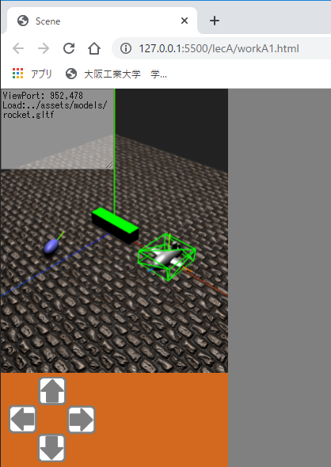
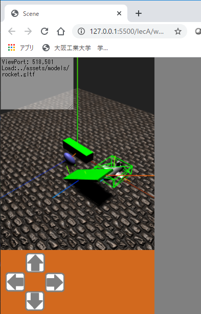
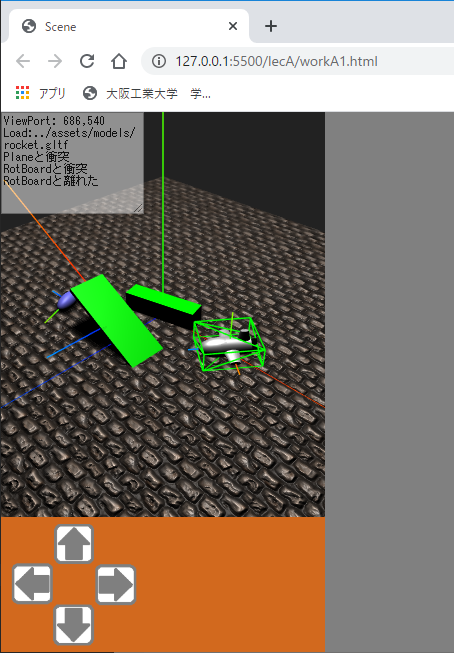

# Three.js(付録 A)

[three_js/Home](./Home.md)

- - -

付録では、これまで触れなかったテーマについて説明する。アプリ作成に活用してほしい。  
付録 A の項目は以下の通りである。

- 物理エンジン。
- TweenMax アニメーション。
- サウンド。
- CG モデルデータ glTF。

全ての要素が入ったデモの HTML は`ThreeJS-master/lecA/appendixA0.html`にある。

**このデモは音が出る。端末のボリュームに注意すること。**

実行すると「 Click to Play 」と表示されたボタンが出るので、クリックすると下図のように移動する薄い直方体などのいくつかの物体と小型ロケットを含む 3D シーンが表示されるはずである。  
ロケットは仮想ジョイスティックによって移動でき、何かに衝突すると音が出る。


## 各テーマの概要

### 物理エンジン

物理エンジンは物体が重力の影響を受けたときや、何かに衝突して反発したときなどの物理的な振る舞いをシミュレートする。
フレーム間の経過時間を与えると、物理法則にしたがった位置や姿勢を計算することができる。  
本演習では、 JavaScript で使用可能な物理エンジンのうち[Ammo](https://github.com/kripken/ammo.js/)を紹介する。
Ammo からいくつかの機能を選びラップしたクラスを用意しているので、それを利用して CG 物体に物理的な振る舞いをさせる。

Ammo は「 Avoided Making My Own js physics engine by compiling bullet from C++ 」の略で、 C++ で書かれた物理エンジン[Bullet](https://pybullet.org/wordpress/)を Javascript で利用可能としたライブラリである。
Ammo を利用することで、デモ HTML のように物体を重力で落下させたり、衝突判定を行ったりすることができる。

Ammo のスクリプトファイルは次のように外部サイトから読み込むことができる。

```html
<!-- 物理エンジン Ammo -->
<script src="https://cdn.jsdelivr.net/gh/kripken/ammo.js@aab297a4164779c3a9d8dc8d9da26958de3cb778/builds/ammo.js"></script>
```

### CG モデルデータ glTF

[glTF](https://www.khronos.org/gltf/)は 3DCG モデルデータのフォーマットの一つである。
特に WEB 上での CG に利用するフォーマットとして注目を集めている。

glTF には大きく分けてテキスト形式（拡張子`.gltf`）とバイナリ形式（拡張子`.glb`）がある。テキスト形式のものは[JSON](https://www.json.org/json-ja.html)（ JavaScript Object Notation ）で記述されている。  
デモ HTML で操作可能なロケットの glTF データは`ThreeJS-master/assets/models/rocket.gltf`にあり、Three.js の[THREE.GLTFLoader](https://threejs.org/docs/#examples/en/loaders/GLTFLoader)でモデルをロードして表示している。

`GLTFLoader`のスクリプトファイルは次のように外部サイトから読み込むことができる。

```html
<!-- GLTF モデルロードに必要 -->
<script src="https://cdn.jsdelivr.net/gh/mrdoob/three.js@r114/examples/js/loaders/GLTFLoader.js"></script>
```

### GSAP (GreenSock Animation Platform)

[GSAP](https://greensock.com/3)（旧：[TweenMax](https://greensock.com/tweenmax/)）は JavaScript で利用可能なアニメーションのライブラリである。
Three.js 等の 3次元 CG に限らず、WEBページ作成に広く利用できる。

これまでの演習では例えば`THREE.Mesh`の`position.x`などをフレームの経過時間に応じて少しずつ変化させることで CG 物体の移動アニメーションを実現してきた。
しかしこれでは多数の物体のアニメーションをプログラムするのが非常に手間である。  
GSAP は JavaScript オブジェクト（連想配列）の、あるプロパティの値に対し「指定した秒数で一定の値になるまで変化させる」といった処理が簡単にプログラムできる。

なお、情報を探す場合は旧名称「 TweenMax 」でも検索した方が良い。

GSAP のスクリプトファイルは次のように外部サイトから読み込むことができる。

```html
<!-- アニメーションライブラリ GSAP: GreenSock Animation Platform -->
<script src="https://cdnjs.cloudflare.com/ajax/libs/gsap/3.2.4/gsap.min.js"></script>
```

### サウンド

Three.js では[THREE.Audio](https://threejs.org/docs/#api/en/audio/Audio)、[THREE.AudioLoader](https://threejs.org/docs/#api/en/loaders/AudioLoader)、[THREE.AudioListener](https://threejs.org/docs/#api/en/audio/AudioListener)によってサウンドを扱うことができる。

`THREE.Audio`は音声データを保持し、音を鳴らす、止めるといった制御を行う。
`THREE.AudioLoader`は URL から音声データを読込むことができる。
`THREE.AudioListener`は 3 次元空間内のどの場所で`THREE.Audio`の音を聞くかを指定する。  
つまり、音の発生源とそれを聞く位置を指定して、距離に応じたボリュームコントロールも可能である。
本項ではそこまでは触れず、音声ファイルの読み込みと指定した音量での再生／停止操作を扱う。

JavaScript でのサウンドの取り扱いで注意することは、ユーザに画面クリックなどの動作をさせないとサウンドを再生できないという点である。
これは WEB ページを開いた際に自動的にサウンド再生されるのを防ぐためである。
サウンドや動画の自動再生はユーザの予期しないものであり、端末の電力消耗や通信料の増加につながる。
従ってユーザがWEBページと何等かのインタラクションを起こさない限りはサウンド再生できない。  
`ThreeJS-master/lecA/appendixA0.html`のデモで最初にボタンを表示させているのはそのためである。デモのようにプッシュボタンをユーザに押させれば再生可能である。

## 各テーマごとの実装例

雛形となる HTML は`ThreeJS-master/lecA/baseA0.html`に用意している。これまでの演習同様にこの雛形をコピーし、少しずつ上記機能を追加する。

### workA1(1) 物理エンジン

- `ThreeJS-master/lecA/baseA0.html`を`ThreeJS-master/lecA/workA1.html`というファイル名でコピーしなさい。

この演習では Ammo の機能をラップした以下のクラスを用いる。

- [mylib2020.AmmoManager](https://kmiyawaki.github.io/lectures/three_js/mylib2020/mylib2020.AmmoManager.html)  
  物理エンジンに対する重力の設定や、物理計算対象となる物体の管理、物理計算の実行などを行う。
- [mylib2020.AmmoCollisionBuilder](https://kmiyawaki.github.io/lectures/three_js/mylib2020/mylib2020.AmmoCollisionBuilder.html)  
  Threee.js の CG 物体に対し、衝突範囲や重さといった物理属性を設定する。

これらは全て`ThreeJS-master/js/myAmmo2020.js`に定義してあり、冒頭の下記部分で読込んでいる。

```html
<script src="../js/myAmmo2020.js"></script>
```

- `ThreeJS-master/lecA/workA1.html`のコメントを参照し、以下のように追記しなさい。

```javascript
/* ↓↓↓workA1(1) の追記場所↓↓↓ */
const box = new THREE.Mesh(new THREE.BoxGeometry(1, 1, 1), new THREE.MeshPhongMaterial({ color: 0x00FF00 }));
box.scale.set(4, 1, 1);
box.position.set(0, 0.5, 0);
scene.add(box);
/* ↑↑↑workA1(1) の追記場所↑↑↑ */
```

追記内容は物理計算とは関係無い、 Three.js の基本的な CG 物体の生成コードである。
細長い直方体を生成し、シーンに追加している。
実行すると上空から落ちてきた楕円の球は直方体をすり抜けるはずである。

このように、 CG 物体と物理計算の世界はプログラムで対応付けない限り一切相互作用を及ぼさないことをまず理解してほしい。

- 上記のコードを次のように書き換えなさい。

```javascript
/* ↓↓↓workA1(1) の追記場所↓↓↓ */
const box = new THREE.Mesh(new THREE.BoxGeometry(1, 1, 1), new THREE.MeshPhongMaterial({ color: 0x00FF00 }));
box.name = "Box"; // 衝突検出時に分かりやすいように名前を付ける。
box.scale.set(4, 1, 1);
box.position.set(0, 0.5, 0);
/* 直方体に衝突検出範囲を設定し、物理的属性を追加する
 mass: 重さ（0 にすると、他の物体が衝突しても動かない）
 restitution: 反発
 movable: ユーザプログラム側で移動させる可能性がある場合、true にする。 */
ammo.collisionBuilder.addPrimitiveRigidBody(box, { mass: 0, restitution:0.5, movable: true });
/* 直方体を物理計算対象としてシーンに追加する */
ammo.registerObject(box);
/* ↑↑↑workA1(1) の追記場所↑↑↑ */
```

実行すると上空から落ちてきた楕円の球は直方体に衝突し動きが変わるはずである。

#### 演習用クラスによる Ammo プログラム作成手順

`ThreeJS-master/lecA/workA1.html`の以下の部分が Ammo の初期化を行っている。

```javascript
/* ammo.js の初期化 */
Ammo();
const ammo = new mylib2020.AmmoManager(scene);
```

物理計算を行う場合はこのコードを最初の方に呼び出すこと。
特段の事情が無い限りは`workA1.html`のように Three.js の初期化直後に実行すると良い。  
[mylib2020.AmmoManager](https://kmiyawaki.github.io/lectures/three_js/mylib2020/mylib2020.AmmoManager.html)がコンストラクタの引数として Three.js のシーン（例では scene という変数）を必要とするからである。  
`const ammo`は[mylib2020.AmmoManager](https://kmiyawaki.github.io/lectures/three_js/mylib2020/mylib2020.AmmoManager.html)のインスタンスを格納し、この変数を通じて種々の機能を呼び出すことができる。
変数名は変更してもよいが、本演習では`const ammo`という変数名で進める。

Ammo において衝突検出や重力による落下など物理計算の対象の一つが剛体（ Rigid Body ）という形状が変化しない物体である。  
剛体を生成するには、まず CG 物体に衝突検出範囲を設定する。
この衝突検出範囲の形状は CG 物体とは無関係で、見た目と違っていても構わない（その場合 CG 物体は物理的観点からは不自然な動きをする）。
次に、その衝突検出範囲の形状を持つ剛体を、重さ、摩擦、反発力、速度の減衰といったパラメータを与えつつ生成する。  
最後に、生成した剛体を Ammo の物理計算対象に追加する。

以上の手順は追加したコードの下記の箇所にそれぞれ該当している。

- `ammo.collisionBuilder.addPrimitiveRigidBody(box, { mass: 0, movable: true });`で、衝突検出範囲設定と、剛体生成の両方を行っている。  

ここで、`ammo.collisionBuilder`は[mylib2020.AmmoCollisionBuilder](https://kmiyawaki.github.io/lectures/three_js/mylib2020/mylib2020.AmmoCollisionBuilder.html)クラスのインスタンスである。
`mylib2020.AmmoCollisionBuilder`には Three.js の基本的な形状に対し、同じ大きさの衝突検出範囲を設定して剛体生成を行う[addPrimitiveRigidBody](https://kmiyawaki.github.io/lectures/three_js/mylib2020/mylib2020.AmmoCollisionBuilder.html#addPrimitiveRigidBody)メソッドを用意してある。
全ての形状と全く同じ衝突検出範囲を設定できるわけではなく、いくつか制限があるので、[メソッドの説明](https://kmiyawaki.github.io/lectures/three_js/mylib2020/mylib2020.AmmoCollisionBuilder.html#addPrimitiveRigidBody)を良く読んで使用して欲しい。
また剛体生成のためのパラメータについても列挙してある。

- `ammo.registerObject(box);`で剛体生成済みの CG 物体（`workA1.html`の場合は`THREE.Mesh`のインスタンスである`box`）を Ammo の物理計算対象に追加している。

`mylib2020.AmmoManager`の[registerObject](https://kmiyawaki.github.io/lectures/three_js/mylib2020/mylib2020.AmmoManager.html#registerObject)メソッドは物体を Ammo の物理計算対象に置くとともに、 Three.js のシーンへの CG の追加も同時に行うようにしてある。

コードの次の部分は物体に名前を付けている。

```javascript
box.name = "Box"; // 衝突検出時に分かりやすいように名前を付ける。
```

変数`box`は`THREE.Mesh`クラスのインスタンスであるが、 Three.js が提供するクラスはほぼすべてに`name`というプロパティを持っている。
本演習では`name`をデバッグメッセージの表示用途にも使う。

### workA1(2) glTF モデルのロード

- `workA1.html`に対し、コメントを参照して以下を追記しなさい。

```javascript
/* ↓↓↓workA1(2) の追記場所↓↓↓ */
/* GLTF モデルデータをロードする。 THREE.GLTFLoader は Three.js 本体には含まれていないことに注意 */
let rocket = null;
const modelUrl = "../assets/models/rocket.gltf";
new THREE.GLTFLoader().load(modelUrl, // この関数は非同期的に実行される。
    function (gltf) { // モデルロードに成功
        rocket = gltf.scene;
        rocket.name = "Rocket";
        rocket.position.set(5, 3, 0);
        /* ロケットを囲むように衝突検出範囲を設定し、物理的属性を追加する。
         showCollision: 衝突検出範囲を可視化するか否か。
         scale: 衝突検出範囲の拡大縮小率。
         movable: ユーザプログラム側で移動させる可能性がある場合、true にする。
         mass: 重さ（0 にすると、他の物体が衝突しても動かない）
         friction: 摩擦
         restitution: 反発
         freezeRotationX/Y/Z: 指定した軸中心の回転をさせないようにする。
         angularDamping: 回転速度の減衰。デフォルトは 0（摩擦の影響だけで回転速度が減速する）。
        */
        ammo.collisionBuilder.addBoundingBoxRigidBody(rocket, {
            showCollision: true, scale: new THREE.Vector3(1, 0.7, 1),
            movable: true, mass: 100, friction: 0.9, restitution: 0.1, freezeRotationX: true, freezeRotationZ: true, angularDamping: 0.8
        });
        /* addBoundingSphereRigidBody など、他の衝突判定形状も試してみよう。
         scale や offset 、addBoundingCylinderRigidBody の場合は axis も変更してみよう。*/
        //ammo.collisionBuilder.addBoundingSphereRigidBody(rocket, { showCollision: true, scale: new THREE.Vector3(0.6, 1, 1), movable: true, mass: 100, friction: 0.1, freezeRotationX: true, freezeRotationZ: true, angularDamping: 0.8 });
        //ammo.collisionBuilder.addBoundingCylinderRigidBody(rocket, { showCollision: true, axis: "z", scale: new THREE.Vector3(0.4, 0.4, 1), offset: new THREE.Vector3(0, 0.5, 0), movable: true, mass: 100, friction: 0.9, restitution: 0.1, freezeRotationX: true, freezeRotationZ: true, angularDamping: 0.8 });
        /* ロケットを物理計算対象としてシーンに追加する */
        ammo.registerObject(rocket);
        rocket.add(new THREE.AxesHelper(2)); // ローカル座標軸を表示。
        taDebugText.value += "Load:" + modelUrl + "\n";
    }, null, function (error) {
        taDebugText.value += "Failed to load:" + modelUrl + "\n";
    }
);
/* ↑↑↑workA1(2) の追記場所↑↑↑ */
```

実行すると、図のようにロケットのモデルが表示される。



ロケットの CG を取り囲む緑の枠はロケットに設定された衝突検出範囲である。  
glTF モデルデータは[THREE.GLTFLoader](https://threejs.org/docs/#examples/en/loaders/GLTFLoader)クラスの`load`メソッドによって行う。画像等をロードするときと記述が似ている。  
第 1 引数はモデルの URL である。
第 2 引数以降はやや分かりにくいが、[無名関数](./three_js_prep_02.md#関数定義)である。  
第 2 引数にロード成功時に実行する関数、第 3 引数にロード進行中に実行する関数（`workA1.html`では何もしないため`null`）、第 4 引数にはロード失敗時に実行する関数を指定している。

モデルのロードに成功したら、モデルを囲うように次のコードで衝突検出範囲設定と剛体生成を行っている。

```javascript
ammo.collisionBuilder.addBoundingBoxRigidBody(rocket, {
    showCollision: true, scale: new THREE.Vector3(1, 0.7, 1),
    movable: true, mass: 100, friction: 0.9, restitution: 0.1, freezeRotationX: true, freezeRotationZ: true, angularDamping: 0.8
});
```

`mylib2020.AmmoCollisionBuilder`には、ロードした CG モデルに衝突検出範囲設定と剛体生成を行うメソッドをいくつか用意している。  
[addBoundingBoxRigidBody](https://kmiyawaki.github.io/lectures/three_js/mylib2020/mylib2020.AmmoCollisionBuilder.html#addBoundingBoxRigidBody)は直方体の範囲設定を行う。

[addPrimitiveRigidBody](https://kmiyawaki.github.io/lectures/three_js/mylib2020/mylib2020.AmmoCollisionBuilder.html#addPrimitiveRigidBody)と異なるパラメータは主に`showCollision, scale, offset`である。  
`showCollision`はデバッグ用に衝突検出範囲を可視化する。不要になったら`false`にすると良い。  
`scale, offset`は衝突検出範囲を拡大・縮小したり中心位置からずらしたりする。
例えば CG モデルに対し、他の物体からの当たり判定を甘くしたいので検出範囲を縮小する、といったことが考えられる。

類似のメソッドとしては球状の範囲設定をする、[addBoundingSphereRigidBody](https://kmiyawaki.github.io/lectures/three_js/mylib2020/mylib2020.AmmoCollisionBuilder.html#addBoundingSphereRigidBody)、円柱の範囲設定をする、[addBoundingCylinderRigidBody](https://kmiyawaki.github.io/lectures/three_js/mylib2020/mylib2020.AmmoCollisionBuilder.html#addBoundingCylinderRigidBody)がある。

各メソッドともに上記で追記したコードのコメントとして記述してあるので、`addBoundingBoxRigidBody`のコードをコメントアウトし、他のメソッドを使って結果を確認すること。

### workA1(3) モデルを動かす

- 以下のようにコードを追記・修正しなさい。

```javascript
/* ↓↓↓workA1(3) の追記・修正場所↓↓↓ */
const LINEAR = 3.0; // 直進速度 3.0m/sec
const ANGULAR = THREE.Math.degToRad(60); // 回転速度 60deg/sec
if (ammo.has(rocket)) { // rocket が物理エンジンの管理下にあるかどうか。
    // movable を true に設定したものは userData.linearVelocity 、 userData.angularVelocity に速度を設定すると移動させられるように myAmmo2020.js で実装してある。
    rocket.userData.linearVelocity = 0;
    rocket.userData.angularVelocity = 0;
    if (arrows["up"].isPressed()) {
        rocket.userData.linearVelocity = LINEAR;
    }
    if (arrows["down"].isPressed()) {
        rocket.userData.linearVelocity = -LINEAR;
    }
    if (arrows["left"].isPressed()) {
        rocket.userData.angularVelocity = ANGULAR;
    }
    if (arrows["right"].isPressed()) {
        rocket.userData.angularVelocity = -ANGULAR;
    }
    /* ↑↑↑workA1(3) の追記・修正場所↑↑↑ */

    /* ↓↓↓workA1(6) の追記・修正場所 [その 2] ↓↓↓ */
```

実行例は省略する。
仮想ジョイスティックでロケットが動き、直方体や球体をロケットで押せるはずである。  
その際、ロケット本体ではなく、緑色で表示されている直方体と衝突検出が行われていることも分かる。

コードの以下の部分でロケットの速度を設定している。

```javascript
rocket.userData.linearVelocity = LINEAR; // 直進速度
rocket.userData.angularVelocity = ANGULAR; // 回転速度
```

glTF モデルのロードは非同期的に実行されるため、上記速度の設定はロケットが物理エンジンの管理下になるまで実行しないようにしている。
その判定は下記のコードである。

```javascript
if (ammo.has(rocket)) { // rocket が物理エンジンの管理下にあるかどうか。
```

`mylib2020.AmmoManager`の[has](https://kmiyawaki.github.io/lectures/three_js/mylib2020/mylib2020.AmmoManager.html#has)メソッドを使うと、判定ができる。

次に、`userData`であるが、これは Three.js が扱うほぼ全てのクラスが持つプロパティで、連想配列である。  
したがって、好きなキー・バリューペアを挿入することができる。
ここに`linearVelocity, angularVelocity`のキー名で保存された数値は`AmmoManager`の[update](https://kmiyawaki.github.io/lectures/three_js/mylib2020/mylib2020.AmmoManager.html#update)メソッドで読み取られ、経過時間に応じて物体を移動させた上で物理計算を行うように実装してある。
ただし、剛体生成時のパラメータとして`movable`を`true`にしておく必要がある。

もちろん、この機構が作成するアプリに沿わなければ自分自身で物体移動の仕組みを実装しても構わない。
その場合は別のキーバリューペアを使えばよい。あるいは、`ThreeJS-master/js/myAmmo2020.js`にある`AmmoManager`の`update`を改造しても良い。

この例のように`userData`を活用することで、アプリに必要なデータを自由に Three.js の CG 物体に付与できる。  
なお、演習用に用意したクラス`mylib2020.AmmoManager`、`mylib2020.AmmoCollisionBuilder`は以下のキーを使用している。

- `userData.movable`: 物体の位置を Ammo の物理計算だけではなく、ユーザプログラムによっても移動させるか否か。
- `userData.linearVelocity, userData.angularVelocity`: 物体の移動速度。`movable`が`true`の物体のみ、ここに設定した速度で移動する。
- `userData.rigidBody`: CG 物体に付与された剛体。
- `userData.collisionShape, userData.collisionShapeOrg`: CG 物体に付与された衝突検出範囲を表す形状。
- `userData.collision`: 物体同士の衝突判定の結果を格納している、[mylib2020.AmmoCollisionManager](https://kmiyawaki.github.io/lectures/three_js/mylib2020/mylib2020.AmmoCollisionManager.html)のインスタンス。

ロケットを動かせるようになったら、ロケットの重さ（`mass`）が 100 のときと 1 とき両方で球体を押してみよう。
1 の方が押しにくくなっているはずである。

```javascript
ammo.collisionBuilder.addBoundingBoxRigidBody(rocket, {
    showCollision: true, scale: new THREE.Vector3(1, 0.7, 1),
    movable: true, mass: 1 /* mass を 1 にする */, friction: 0.9, restitution: 0.1, freezeRotationX: true, freezeRotationZ: true, angularDamping: 0.8
});
```

### workA1(4) GSAP

- `workA1.html`に対し、コメントを参照して以下を追記しなさい。

```javascript
/* ↓↓↓workA1(4) の追記場所↓↓↓ */
box.userData.rotY; // 変化する値の保存場所。
gsap.fromTo(box.userData, // 変化する値を保存している JavaScript オブジェクト。
    5, // 5 秒で開始値から終了値まで変化させる。
    { rotY: THREE.Math.degToRad(0) }, // 開始値。 box.userData.rotY を 0 度からスタートさせる。
    {
        rotY: THREE.Math.degToRad(180), // 最終値。 box.userData.rotY を 180 度まで変化させる。
        repeat: -1, // repeat: 繰り返し回数指定。-1 で無限ループ。
        yoyo: true,  // yoyo: true にすると、開始値->終了値->開始値... のように値を往復させられる。
        onUpdate: function () { box.setRotationFromEuler(new THREE.Euler(0, box.userData.rotY, 0)); } // 値更新時に実行したい処理
    });
/* ↑↑↑workA1(4) の追記場所↑↑↑ */
```

上記の例は、 GSAP のメソッドのうち[`gsap.fromTo()`](https://greensock.com/docs/v3/GSAP/gsap.fromTo())を使っている。
`fromTo`の名前が示す通り、 JavaScript オブジェクトのあるキーの値を開始値から終了値まで変化させられる。
上記例では、`box.userData.rotY`を 0 から 180 度まで変化させて、直方体の回転角度として使用している。
第 1 引数は変化させたい値を持つ JavaScript オブジェクトを指定する。
第 2 引数は変化させたいプロパティ名と、その開始値である。  
第 3 引数は変化させたいプロパティ名と、その終了値、およびアニメーションの回数等を指定する。
例のように指定すると、開始値から終了値まで 5 秒で変化し、また 5 秒かけて開始値に戻るということを無限に繰り返す。  
第 3 引数の`onUpdate:`には`gsap.fromTo`が`box.userData.rotY`を変化させた際に実行したい処理を記述している。
`box.userData.rotY`をそのまま Y 軸の回転角度として設定しているだけである。  
なお、**box.rotation.y を直接変化させると期待通りの結果にならない可能性が高い。**  
Y 軸だけではなく特に回転については`rotation`の値を直接変えず、例のように[`setRotationFromEuler`](https://threejs.org/docs/#api/en/core/Object3D.setRotationFromEuler)を使う方が良い。
もしくは`box.rotation`（[`THREE.Euler`](https://threejs.org/docs/#api/en/math/Euler)クラスのインスタンス）が持つ[`set`](https://threejs.org/docs/#api/en/math/Euler.set)メソッドでも良い。
Three.js のガイドブックやWEB情報では`rotation.y`等を直接増減させている例があるが、 Ammo と組み合わせた場合に不自然な結果となる。

`ThreeJS-master/lecA/appendixA0.html`のデモでは、 GSAP を使い物体の位置・姿勢だけではなく[透明度も変化させている](https://github.com/KMiyawaki/ThreeJS/blob/master/lecA/appendixA0.html#L222)。

GSAP には他に[`gsap.to()`](https://greensock.com/docs/v3/GSAP/gsap.to())、[`gsap.from()`](https://greensock.com/docs/v3/GSAP/gsap.from())がある。

### workA1(5) 親子関係のある物体

- `workA1.html`に対し、コメントを参照して以下を追記しなさい。

```javascript
/* ↓↓↓workA1(5) の追記場所↓↓↓ */
/* 回転板の作成（親子関係のある物体） */
const board = new THREE.Mesh(new THREE.BoxGeometry(1, 1, 1), new THREE.MeshPhongMaterial({ color: 0x00FF00 }));
board.name = "Board";
board.add(new THREE.AxesHelper(2));  // ローカル座標軸を表示。
board.scale.set(5, 0.2, 2);
board.castShadow = true; /* 他の物体に影を落とす */
board.receiveShadow = true; /* 他の物体から影が落ちる */
const shaft = new THREE.Object3D();
shaft.name = "RotBoard";
shaft.add(new THREE.AxesHelper(1));  // ローカル座標軸を表示。
shaft.add(board);
board.position.set(2.5, 0, 0); // 板（ board ）の中心を shaft の中心から少しずらす。
shaft.rotateZ(THREE.Math.degToRad(5));
shaft.position.set(2, -0.1, 3);
/* 親子関係のある物体に衝突検出範囲を設定し、物理的属性を追加する 。
 mass: 重さ（0 にすると、他の物体が衝突しても動かない）
 friction: 摩擦
 restitution: 反発
 movable: ユーザプログラム側で移動させる可能性がある場合、true にする。 */
ammo.collisionBuilder.addCompoundRigidBody(shaft, { mass: 0, restitution: 0.5, movable: true });
/* 回転板を物理計算対象としてシーンに追加する */
ammo.registerObject(shaft);
/* GSAP によるアニメーション設定
 repeat: 繰り返し回数指定。-1 で無限ループ。
 yoyo: true にすると、現在値->指定した値->現在値... のように値を往復させられる。 */
shaft.userData.rotZ; // 変化する値の保存場所。
gsap.fromTo(shaft.userData, 3, { rotZ: THREE.Math.degToRad(5) },
    {
        rotZ: THREE.Math.degToRad(180), // box.userData.rotZ の値を 5<->180 の範囲で往復させる。
        repeat: -1,
        yoyo: true,
        onUpdate: function () {
            shaft.setRotationFromEuler(new THREE.Euler(0, 0, shaft.userData.rotZ)); // 値更新時に実行したい処理
        }
    });
/* ↑↑↑workA1(5) の追記場所↑↑↑ */
```

実行すると次のように回転する板が出るはずである。



`mylib2020.AmmoCollisionBuilder`の[addCompoundRigidBody](https://kmiyawaki.github.io/lectures/three_js/mylib2020/mylib2020.AmmoCollisionBuilder.html#addCompoundRigidBody)メソッドを使うと、親子関係のある物体に剛体生成を行うことができる。
親自身や、その子が Three.js の基本形状である場合、同じ大きさの衝突検出範囲を設定して剛体生成する。
得られる効果は workA1(1) とほぼ同じである。

上記のプログラムで親子関係を作っている理由は、変数`const board`に格納される薄い板を、板の端を軸として回転させたかったからである。

Three.js では`THREE.BoxGeometry`で生成される直方体などの基本的な形状を「形状内の任意の座標を通る直線を中心に回転させる」といったことはできない。
例えば直方体の回転軸は物体の中心を通る。つまりローカル座標の原点は直方体の中心と決まっている。
そのため、変数`const shaft`に空の`THREE.Object3D()`を生成し、`shaft.add(board);`のコードで`const board`を`const shaft`の子にしている。  
そして、`const board`の位置は`const shaft`の中心から少しずれた場所に設定している。コードの次の箇所である。

```javascript
board.position.set(2.5, 0, 0); // 板（ board ）の中心を shaft の中心から少しずらす。
```

これにより、`const board`の端が`const shaft`の中心となる。
その上で`const shaft`を Z 軸中心に`shaft.setRotationFromEuler(new THREE.Euler(0, 0, shaft.userData.rotZ));`で回転させれば、`const board`が、その端を軸として回転する。

親子関係については[lec02 の work23](./three_js_02.md#work23-物体の等速運動（物体の親子関係生成によるワールド座標系での回転）)で取り扱っている。

### workA1(6) 衝突判定とサウンド

- 以下のコードを追記しなさい。追記箇所は複数に渡っている。

- サウンドファイルのロード

```javascript
/* ↓↓↓workA1(6) の追記場所 [その 1] ↓↓↓ */
/* サウンド関連 */
const audioListener = new THREE.AudioListener();
camera.add(audioListener);
const sound = new THREE.Audio(audioListener);
new THREE.AudioLoader().load('../assets/sounds/bounce.wav', function (buffer) {
    sound.setBuffer(buffer);
    sound.setLoop(false);
    sound.setVolume(1.5);
});
/* ↑↑↑workA1(6) の追記場所↑↑↑ [その 1]  */
```

- 衝突判定とサウンド再生

```javascript
/* ↓↓↓workA1(6) の追記・修正場所 [その 2] ↓↓↓ */
/* rocket に対する衝突をチェックする */
/* 現在接触している全物体のリスト */
for (let object of rocket.userData.collision.getAll()) {
    // このプログラムでは、特に利用しない。
}
/* このフレームで衝突を開始した物体のリスト */
for (let object of rocket.userData.collision.getEnter()) {
    taDebugText.value += object.name + "と衝突\n";
    /* 衝突音をならす */
    if (sound.isPlaying) { // 再生中の場合は停止が必要。
        sound.stop();
    }
    sound.play();
}
/* このフレームで衝突が終了し、離れていった物体のリスト */
for (let object of rocket.userData.collision.getExit()) {
    taDebugText.value += object.name + "と離れた\n";
}
/* 前フレームから継続して接触中の物体のリスト */
for (let object of rocket.userData.collision.getStay()) {
    // このプログラムでは、特に利用しない。
}
/* ↑↑↑workA1(6) の追記・修正場所 [その 2] ↑↑↑ */
```

実行結果は次の通りである。ロケットが何かと接触すると衝突音がなり、デバッグ用のテキストが画面左上に表示されるはずである。



#### サウンドに関する部分

Three.js でサウンドを扱う場合はプログラム中に一つの[THREE.AudioListener](https://threejs.org/docs/#api/en/audio/AudioListener)クラスのインスタンスが必要である。
一般的には次のコードによってインスタンス生成を行い、カメラの子として登録する。

```javascript
const audioListener = new THREE.AudioListener();
camera.add(audioListener);
```

次にサウンドを[THREE.AudioLoader](https://threejs.org/docs/#api/en/loaders/AudioLoader)でロードする。
ロード部分は glTF や画像ファイルのロードと似ている。

```javascript
new THREE.AudioLoader().load('../assets/sounds/bounce.wav', function (buffer) {
    sound.setBuffer(buffer);
    sound.setLoop(false);
    sound.setVolume(1.5);
});
```

ロードが成功すると、[THREE.Audio](https://threejs.org/docs/#api/en/audio/Audio)クラスのインスタンス（例では変数`sound`）に音声データをセットしている。
以降はこのインスタンスを通じて音声の再生を行う。
再生のコードは以下の通りである。衝突音は比較的短い間隔で発生させるため、再生中の場合は一旦停止してもう一度再生している。

```javascript
/* 衝突音をならす */
if (sound.isPlaying) { // 再生中の場合は停止が必要。
    sound.stop();
}
sound.play();
```

なお、衝突音（`bounce.wav`）は[KanaWave](https://www.vector.co.jp/soft/win95/art/se232653.html)で作成した。

複数の音声データを扱いたければ、`THREE.Audio`のインスタンスを複数生成すればよい。
効果音以外に BGM を流す例は以下の通りである。

```javascript
const bgm = new THREE.Audio(audioListener);
new THREE.AudioLoader().load('[音声ファイル名]', function(buffer){
    bgm.setBuffer(buffer);
    bgm.setLoop(true);
    bgm.play(); // ロード完了次第、ループ再生する。
});
```

#### 衝突判定に関する部分

[剛体の生成と物理エンジンへの登録](#演習用クラスによる-Ammo-プログラム作成手順)が済んでいる物体に対しては物理計算を実行後、どの物体と衝突したかのリストを`userData.collision`に格納している。
`userData.collision`は[mylib2020.AmmoCollisionManager](https://kmiyawaki.github.io/lectures/three_js/mylib2020/mylib2020.AmmoCollisionManager.html)クラスのインスタンスである。  
衝突の状態に応じて以下の 4 つに分類し、リストを得られるようにしている。

- [getAll メソッド](https://kmiyawaki.github.io/lectures/three_js/mylib2020/mylib2020.AmmoCollisionManager.html#getAll)  
  今回のフレームで接触している全ての物体。
- [getEnter メソッド](https://kmiyawaki.github.io/lectures/three_js/mylib2020/mylib2020.AmmoCollisionManager.html#getEnter)  
  今回のフレームで衝突を開始した物体。
- [getExit メソッド](https://kmiyawaki.github.io/lectures/three_js/mylib2020/mylib2020.AmmoCollisionManager.html#getExit)  
  今回のフレームで衝突を終了した物体。
- [getStay メソッド](https://kmiyawaki.github.io/lectures/three_js/mylib2020/mylib2020.AmmoCollisionManager.html#getStay)  
  前回のフレームから接触を継続している物体。

各メソッドの使用方法は前述のコードの通りで、衝突物体に対し配列と似たようなアクセスが可能である。

メッセージを出すだけではなく、ロケットと接触した物体をシーンから削除してみよう。

```javascript
/* このフレームで衝突を開始した物体のリスト */
for (let object of rocket.userData.collision.getEnter()) {
    taDebugText.value += object.name + "と衝突\n";
    /* 衝突音をならす */
    if (sound.isPlaying) { // 再生中の場合は停止が必要。
        sound.stop();
    }
    sound.play();
    // 追記部分
    if(object != plane){
        ammo.remove(object);
    }
}
```

床が削除されるとロケットも落下してしまうので、衝突物体が床（`plane`）以外の場合にシーンと物理エンジンから削除している。

## その他

全ての要素が入ったデモの HTML である`ThreeJS-master/lecA/appendixA0.html`では、衝突時に物体の色を変化させている。
これは`userData`を利用して物体のもともとの色を保存しておき、衝突開始時に物体の色を赤く変え、衝突終了時に保存しておいた色を使って元の色に戻している。

`ThreeJS-master/lecA/appendixA0.html`の214行目あたりがもともとの色を保存している部分である。

```javascript
/* 球体の生成 */
const sphere = new THREE.Mesh(new THREE.SphereGeometry(0.4, 20, 20),
    new THREE.MeshPhongMaterial({ color: 0x7777ff }));
/* 省略 */
sphere.userData.originalColor = sphere.material.color.clone();
```

`clone`というメソッドを使用している部分が分かりにくいかもしれない。
まず、`sphere.material`は球体の生成時に`THREE.Mesh`クラスのコンストラクタの第 2 引数に与えた`THREE.MeshPhongMaterial`クラスのインスタンスである。
Three.js の材質を表現するクラスは色情報を`color`というプロパティに持っているが、これは[THREE.Color](https://threejs.org/docs/#api/en/math/Color)クラスのインスタンスである。
この`sphere.material.color`を`userData`に保存しておけばよいので、次のように書いてしまいたいが、これは誤りである。

```javascript
sphere.userData.originalColor = sphere.material.color; // 誤り
```

これでは`sphere.material.color`の参照を`sphere.userData.originalColor`に代入しているだけであり、`sphere.material.color`を変更すると、`sphere.userData.originalColor`も変化してしまう。  
（※参照については、[演習で既に取り扱っている](./three_js_prep_02.md#参照)。）

`clone`メソッドは参照ではなく、インスタンスの完全な複製を生成するため、`sphere.userData.originalColor = sphere.material.color.clone();`とすると、`sphere.userData.originalColor`は`sphere.material.color`とは別物になり、影響を受けない。

以上のように、参照だけを別の変数に代入することを「シャローコピー（ Shallow Copy ）」、完全な複製を生成して別の変数に代入することを「ディープコピー（ Deep Copy ）」という。

衝突開始時に物体を赤くするコードは以下の通りで、`THREE.Color`の[setHex](https://threejs.org/docs/#api/en/math/Color.setHex)メソッドを使う。

```javascript
object.material.color.setHex(0XFF0000); // 接触していたら、赤色にする。
```

逆に元の色に戻す場合は`userData.originalColor`に保存しておいた色を`material.color`にディープコピーする。

```javascript
object.material.color = object.userData.originalColor.clone();
```

- - -

[three_js/Home](./Home.md)
