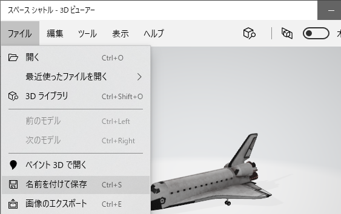

# Three.js(付録 B)

[three_js/Home](./Home.md)

- - -

## Microsoft 3D ライブラリの活用

[付録 1](./three_js_app_A_01.md#workA1(2)-glTF-モデルのロード)で拡張子`gltf`のモデルデータを利用した。
ここでは手早く3D モデルを得る方法として Windows 10 で利用できる「[3D ビューアー](https://www.microsoft.com/ja-jp/p/3d-viewer/9nblggh42ths?activetab=pivot:overviewtab)」を通じてダウンロード可能な 3D モデルを Three.js 適したデータに変換する方法を紹介する。

3D ビューアーから利用できるモデルのファイルは`gltf`のバイナリ形式である、`glb`である。  
得られるモデルは高品質なものの、ファイルサイズが数十メガバイトと大容量である。
このままブラウザアプリで利用すると、ユーザに大きな負担を与えてしまう。

Visual Studio Code を利用すれば数ステップの手順でファイルサイズを抑えられる。

### 3D ビューアーからモデルをダウンロードする

Windows 10 の「 3D ビューア」を起動する。

「ようこそ」画面を閉じる。

メニューの「 3D ライブラリ」を選択する。

今回は例として「 SF とファンタジー」から「スペースシャトル」を選択する。

名前を付けて保存を選択する。作業場所として空のフォルダを作成すると作業しやすい。

無用なトラブルを避けるため、ファイル名は半角英数字とする。ここでは「`Shuttle.glb`」とした。

### ファイルサイズ削減の流れ

ファイルサイズ削減の概要は次の通りである。上記で例としてダウンロードした`Shuttle.glb`はファイルサイズ約 22MB である。  
このデータサイズの原因のほとんどは高解像度のテクスチャにある。
しかしながら、本演習で想定するような比較的簡単なブラウザアプリではそこまで高品質なテクスチャは必要ない。

そこで、以下の手順でテクスチャの解像度を落とす。

- `glb`ファイルから頂点データとテクスチャデータを分離する。
- テクスチャ画像を縮小する。
- 分離したデータを再度`glb`に統合する。

以上の手順は Visual Studio Code と任意の画像編集ソフトを使って実施する。

## Visual Studio Code で glb ファイルからテクスチャと頂点データを抽出する

まずは、`gltf`拡張機能をインストールする。  
[準備の項](./three_js_prep_01.md)で「 Live Server 」をインストールしたときと同じ要領で実施する。
拡張機能の検索は「 GLTF 」と入力すればよい。

Visual Studio Code で`glb`ファイルを保存したフォルダを開く。

フォルダに存在するオリジナルの`glb`ファイル（例では`Shuttle.glb`）をクリックする。  
Visual Studio Code 上ではエラーが表示されるが、問題はない。

ファイル名が表示されているタブ（例では`Shuttle.glb`）を右クリックして、「 gltf: Import from GLB 」を選択する。

ファイル保存ダイアログが開くので、`glb`ファイルと同じ場所に拡張子を`gltf`に変えて（例では`Shuttle.gltf`）保存する。

`gltf`ファイルと数枚のテクスチャ、拡張子「`bin`」の頂点データが出力される。

テクスチャのサイズは下図の通りである。一枚 4MB 以上もある。

## テクスチャのリサイズ

テクスチャ画像（上記の場合は拡張子`png`の4つのファイル）のサイズを縮小する。  
以下の点に十分注意すること。

- 縮小画像は、元画像のアスペクト比（縦横比）と全く同じにすること。通常はアスペクト比 1 である。
- 縮小画像の縦横画素数は 2 のべき乗とすること。
- 縮小画像の形式およびファイル名は元画像と全く同じとすること。特に`png`には透明度が設定されている場合がある。ペイントブラシなどで縮小すると透明度が消える可能性が高い。
- 元画像を縮小画像で上書きすること。

以上を守れば、どのような方法で画像を縮小しても構わない。
ツールの例としては[Ralpha Image Resizer](https://www.vector.co.jp/soft/winnt/art/se487522.html?ds)がある。

テクスチャを 256 画素四方に縮小するとファイルサイズは次のようになる。

## 分離したデータの glb への統合

最後に、分離したテクスチャと頂点データを再度まとめなおす。
Visual Studio Code で`gltf`ファイル（例では`Shuttle.gltf`）をクリックし、ファイル名が表示されているタブを右クリックして「 Export to GLB 」を選択する。

ファイル保存ダイアログが開くので、名前をオリジナルの`glb`と違うものに変えて（例では`Shuttle_min.glb`としている）保存する。

ファイルサイズが激減していることが分かる。

## サイズ削減後の glb ファイルの見栄えを確認する

ブラウザで[glTF Viewer](https://gltf-viewer.donmccurdy.com/)を開き、完成した`glb`ファイルをドラッグ＆ドロップする。  
オリジナルモデルとサイズ削減後モデルの比較は次の通りである。

- オリジナル

- サイズ削減後

オリジナルに比べると当然テクスチャ解像度低下による劣化があるが、本演習の用途ではこれで十分である。  
また 1 ファイルで数十メガバイトものモデルデータをユーザにダウンロードさせるのはかなりのストレスになるので避けるのが妥当である。

## Three.js で glb を読込む

[THREE.GLTFLoader](https://threejs.org/docs/#examples/en/loaders/GLTFLoader)でロードし、シーンに追加すれば表示できる。  
`Shuttle_min.glb`を`ThreeJS-master/assets/downloads/Shuttle_min.glb`となるように配置して、`ThreeJS-master/lecB/appendixB0.html`をこれまで同様に実行すれば、以下のようになる。

Android 端末で最初に実行した際は、表示されるまでにややタイムラグがあるかもしれない。

- - -

[three_js/Home](./Home.md)
