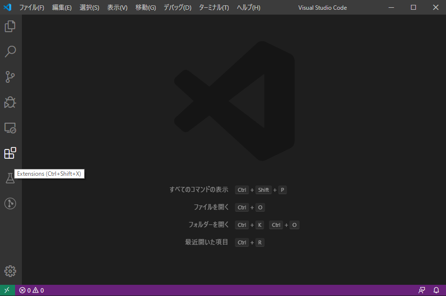
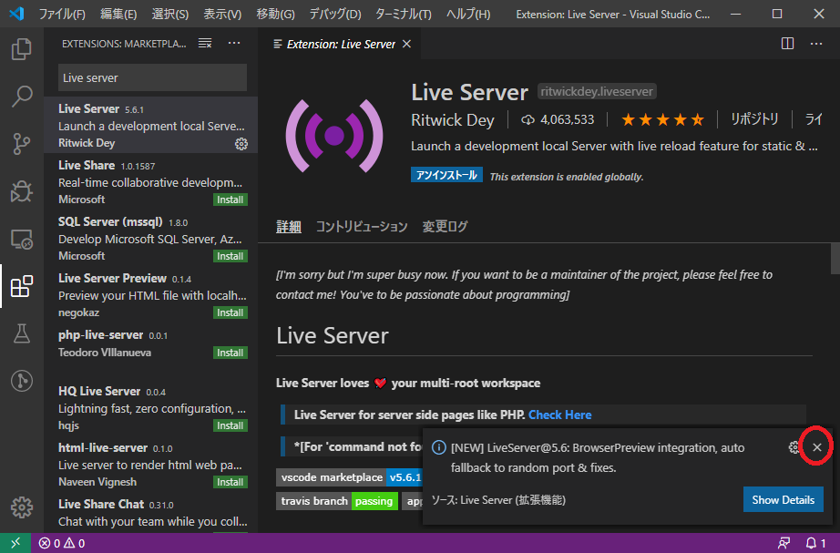
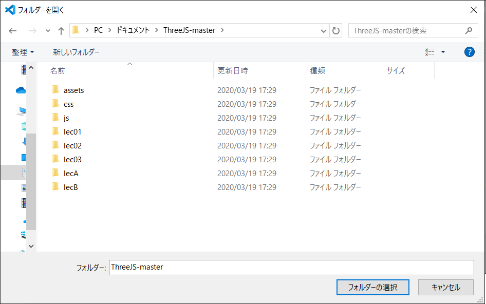

# Three.js(準備 1)

[three_js/Home](./Home.md)

---

## [Three.js](https://threejs.org/) とは

- JavaScript から 3DCG を簡単に扱えるライブラリ。

## 開発環境

- OS
  - 本演習では Windows10 を用いる。
- ウェブブラウザ
  - 本演習では Chrome ブラウザを使って説明する。演習の内容は バージョン: 89.0.4389.114（Official Build） （64 ビット）で確認している。
- エディタ
  - 本演習では[Visual Studio Code](https://code.visualstudio.com/)を使って説明する。演習の内容はバージョン: 1.55.0 で確認している。
  - HTML と JavaScript を書くだけなので、notepad のような単なるテキストエディタも使える。
- Web サーバー
  - 自分の PC にある HTML ファイルをダブルクリックして直接開くと、JavaScript からテクスチャ等を読み込む際に失敗する。
  - 自分の PC で Web サーバーを起動し、http アクセスすると問題はない。どこかのサーバーにファイルをアップロードしてアクセスしても良い。
  - ウェブブラウザのセキュリティ設定により、サーバーなしで実行する方法もある。
  - 本演習では自分の PC でのプログラムテスト時は[簡易な Web サーバー](https://marketplace.visualstudio.com/items?itemName=ritwickdey.LiveServer)を利用する。
  - Android 端末でのプログラム実行時は PC 上でモバイルホットスポット機能により仮想的な Wifi アクセスポイントを構築して用いるか、あるいはネットワーク上の他のサーバーを利用する。
- Android 端末
  - PC で作成したプログラムを実行する際に用いる。
- ネットワーク
  - インターネット接続が必要である。
- USB メモリ
  - データの移動に用いる。

## Visual Studio Code

- [Visual Studio Code](https://code.visualstudio.com/)から Windows 版をダウンロードしインストールする。

### Visual Studio Code の拡張機能 Live Server をインストールする

- Visual Studio Code を起動し、左下の Extensions のボタンを押す。



- 拡張機能の検索ボックスに Live Server と入力する。


- 検索結果の最上位にある Live Server をクリックし install ボタンを押す。


- インストール完了後に右下出現したダイアログは「x」ボタンで閉じる。



### Visual Studio Code のその他の拡張機能をインストールする

- 上記手順は Visual Studio Code で拡張機能をインストールする際の一般的な方法である。参考にし、以下の他の拡張機能もインストールすること。

#### Japanese Language Pack for VS Code（日本語化）

- 拡張機能の検索で japanese と入力し、インストールする。


## 最初の Three.js プログラム

- https://github.com/KMiyawaki/ThreeJS/archive/master.zip をダウンロードし、PC のドキュメントフォルダに展開する。
- ディレクトリ構造は次の通り。演習に関係のあるファイルだけをリストしている。

```text
C:\Users\[ユーザ名]\Documents\ThreeJS-master
│
├─assets
│  │  blue_circle.png
│  │  gray_arrow.png
│  │  red_arrow.png
│  │  red_circle.png
│  │
│  ├─downloads
│  │      ColdDungeon.png
│  │      DesolatedHut.png
│  │      Fiyah.png
│  │      GrayWalls.png
│  │      link.txt
│  │      red-dragon-1549047184nu3.png
│  │      ReflectingTheLava.png
│  │      RockWall_orFloor_height.png
│  │      sword_01.png
│  │
│  ├─models
│  │      rocket.gltf
│  │
│  └─sounds
│          bounce.wav
│
├─css
│      common.css
│
├─js
│      libs.txt
│      myAmmo2020.js
│      myGameCharacter.js
│      myMaze.js
│      myThree2020.js
│
├─lec01
│      base10.html
│
├─lec02
│      base20.html
│
├─lec03
│      base30.html
│
├─lecA
│      appendixA0.html
│      baseA0.html
│
└─lecB
        appendixB0.html
```

- Visual Studio Code を起動し、左の方から Explorer ボタンを押す。


- Visual Studio Code はタブ方式のエディタである。不要なタブはいつでも「x」ボタンで閉じて構わない。


- メニューの「ファイル」から「フォルダーを開く」を選択する。


- 先程ダウンロードし展開した、`ThreeJS-master`を開く。



- `ThreeJS-master`フォルダ内の`lec01`にある`base10.html`をダブルクリックで開く。


- `Ctrl`キー、`Shift`キー`P`キーを同時に押す。
- 拡張機能を文字入力で呼び出すためのテキストボックスが開くので、「Live」と入力し、「Open With Live Server」を選択する。


- Web サーバが起動すると同時にブラウザで`base10.html`が開く。
- 赤、緑、青の軸はそれぞれ、赤： x 軸、緑： y 軸、青： z 軸を表している。


- `OrbitControls.js`の機能により、マウスドラッグやホイールによるカメラ移動ができる。


## Android 端末から HTML を閲覧する

- 下記手順において、上手く行かない場合はWindowsのファイアウォールを無効にすること。
  - 演習が終わったら元に戻すこと。

Windows の[モバイルホットスポット](https://www.billionwallet.com/windows10/windows-use-your-pc-as-a-mobile-hotspot.html)機能を利用する。リンクを参照し設定すればよいが、多人数での演習ではネットワーク名が衝突する可能性が非常に高い。  
**そこで、ネットワーク名の末尾に学籍番号の下 3 桁を追加すること。**  
ネットワーク名の変更はモバイルホットスポットの「編集」ボタンから可能である。


Android 端末が PC で設定したモバイルホットスポットに接続できたら次のようにする。

- まず、PC 側で Live Server を使い、`lec01/base10.html`をブラウザから閲覧できることを確認する。
- 次に、Android 端末の Chrome ブラウザで`http://192.168.137.1:5500/lec01/base10.html`にアクセスする。
- なお、ブラウザで`http://192.168.137.1:5500/`にアクセスすると、フォルダ一覧を見ることができる。
- また、HTML や JavaScript のソースを編集し保存すると、自動的にブラウザがファイルを再読込する。PC でも同様。

## 参考情報

### PC での JavaScript のデバッグ

何らかのプログラムミスにより、画面が真っ暗になるなど正常に表示されなくなる場合がある。その場合は Chrome ブラウザ上で`F12`キーを押すとエラーの場所が分かることがある。  
下記の例ではエラー発生場所のファイル名と行番号が表示されており、リンクをクリックすると原因となった場所が表示されている。  
原因としては`const`宣言してある変数`plane`に新たなインスタンスを代入しようとしてエラーが発生している。


### Android 端末での JavaScript のデバッグ

Android 端末を USB デバッグ接続可能とし、マイクロ USB ケーブルで PC と接続すれば、Chrome ブラウザのアドレスに`chrome://inspect/#devices`と入力することで Android で表示している HTML/JavaScript のデバッグが PC と同じように実施できる。  
ただし、Android 端末の USB デバッグモードはセキュリティ上の問題を発生させ、一部のアプリを動作不可能にしてしまうため、ここでは説明を省略する。

---

[three_js/Home](./Home.md)
