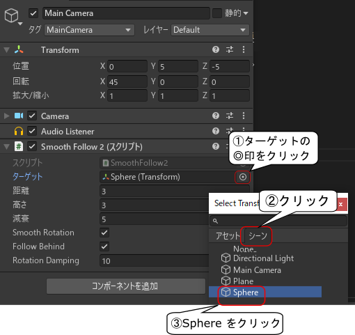

# Unity (1)

[unity/Home](./Home.md)

- - -

## Unity のプロジェクト作成

- 「プロジェクト」の項目をクリックし、「新規作成」をクリックする。

- テンプレートは 3D を選択する。
- Project Name には`BallGame01`と入力する。
- Location はデフォルトで構わない。

- 起動中にアクセス許可の警告が出る場合があるので、許可する。

- アップデートするかどうかを聞いてくる場合があるが、 Skip してよい。 Check for Updates のチェックを外しておけば、起動時に聞かれることは無くなる。

## 初期設定

- 「 Edit 」メニューから「 Preferences 」を選択する。

- 「 Languages 」を選択して日本語にする。

- 「外部ツール (英語：External Tools) 」を選択して「外部スクリプトエディタ (英語：External Script Editor) 」を Visual Studio Code にする。
- 終了後、「 Preferences 」のウィンドウを閉じる。

- このままでは Unity での作業中に常に下図のようなエラーが出た状態になる。

- メニューの「ウィンドウ」から「 Package Manager 」を選択する。

- 下図を参照して、「プロジェクト内」を選択し、「 Visual Studio Code Editor 」を扱う Unity 側のソフトウェアのバージョンを「 1.1.3 」にダウングレードする。
- [Unity 公式サイトの Q and A](https://answers.unity.com/questions/1696108/vscode-index-out-of-range-on-new-project-unity-201.html)

- 設定が完了したら「 Package Manager 」を終了し、一旦 Unity を終了する。終了後先ほど作成したプロジェクト`BallGame01`が「プロジェクト」の項目にあるので、クリックして作業を再開する。

## 床を作る

- Unity の操作画面（以降： Unity Editor と表記する）で「シーン」とかかれたタブをクリックする。
- 3D ビュー上でマウスのホイールを押したままドラッグ、右ボタンドラッグ等の操作を行い、効果を確認すること。

- Unity Editor 左上の「＋」マークをクリックし「3D オブジェクト」->「平面」を選択する。

- Unity Editor 左方の`Plane`をクリックした後右の方の「インスペクター」をクリックし、「位置」を 0, 0, 0 とする。

## 球体を作る

- 平面と同じ要領で「スフィア」を選択して作成する。

- `Sphere`の「位置」を 0, 5, 0 にする。

- 「コンポーネントを追加」をクリックし、検索ボックスに「rigid」と入力すると「リジッドボディ」が出てくるので、クリックする。

- 「リジッドボディ」の「 Constraint 」にある「回転を固定」の X と Z にチェックをいれる。

## カメラを球体に追従させる

- `Main Camera`をクリックして「コンポーネントを追加」をクリックする。

- `SmoothFollow2`と入力すると「新しいスクリプト」と表示されるので、クリックする。

- スクリプト名が`SmoothFollow2`であることを確認し、「作成して追加」をクリックする。

- `SmoothFollow2`左の「▽」印をクリックし出てきた「スクリプト `SmoothFollow2`」をダブルクリックし、 Visual Studio Code でスクリプトを開く。

- 外部サイトにある`SmoothFollow2.cs`のオリジナル（[WEBリンク](https://raw.githubusercontent.com/jrf0110/unity-test-1/master/Assets/Scripts/SmoothFollow2.cs)）を WEB ブラウザで開き、テキスト全てを選択してコピーする。
- コピーしたテキストを Visual Studio Code で開いているスクリプトに上書き貼り付けする。つまり、もともとのスクリプトは全て消去し、完全に書き換える。
- 貼り付け後は保存し、 Visual Studio Code は終了する。

- Unity Editor の`SmoothFollow2`で「ターゲット」を`Sphere`にする。

## パソコンでプレビュー

- 再生ボタンを押す。カメラが落下する球体に追従するように動くはずである。
- 球体が落ちて止まったら、再生ボタンをもう一度押して、プレビューを終了する。

## シーンやプロジェクトを保存する

- `Ctrl`キー＋`S`キーを押す。または「ファイル」メニューから「保存」を選択して保存する。

**シーンやプロジェクトはこまめに保存しよう。**

- - -

[unity/Home](./Home.md)
