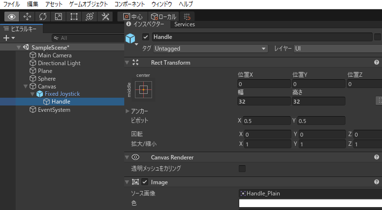
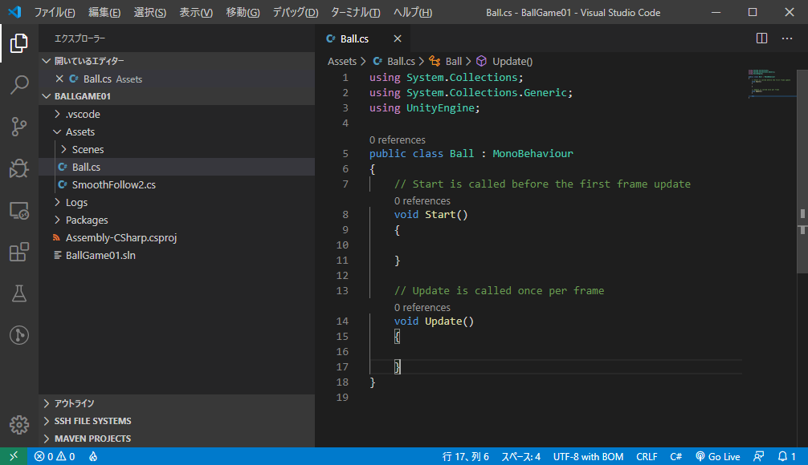

# Unity (2)

[unity/Home](./Home.md)

- - -

## カメラの位置と向きの調節

- `Main Camera`の「位置」「回転」を図のように修正する。


## 仮想ジョイスティック

- 「ウィンドウ」メニューから「アセットストア」を選択する。


- 「アセットストア」を日本語表示にしておく。


- アセット（ゲームに使える素材のこと）の検索ができるので、「JoyStick Pack」と入力して`Enter`キーを押す。


- 検索結果から「JoyStick Pack」をクリックする。


- 「ダウンロード」をクリックする。


- 利用規約に同意する。


- 「インポート」をクリックするとどのファイルを取り込むか聞かれるので「全て」を選択し「インポート」する。


- 「シーン」のタブをクリックし、`Sphere`等を追加したのと同じ要領で「 UI 」->「 Canvas 」を追加する。


- 「 Assets/Joystick Pack/Prefabs 」内の「 Fixed Joystick 」を、`Canvas`にドラッグ＆ドロップする。


- ジョイスティックの位置や大きさは「位置 X」「位置 Y」「幅」「高さ」を適宜調節すること。
- 「幅」「高さ」は等しくしておいた方が良い。調節は`Fixed Joystick`だけではなくその子の`Handle`も必要である（下図を参照）。




## C#スクリプトを書く

- `Main Camera`に`SmoothFollow2`スクリプトを追加したときと同じ要領で、`Sphere`をクリックしてから`Ball`スクリプトを追加して Visual Studio Code で編集を開始する。


- クラス名が`Ball`になっていることを確認する。



- クラス冒頭にフィールドを追加する（下図を参照）。


- フィールドの追記内容は次の通り。

```c#
    private GUIStyle labelStyle;
    private float joyStickH, joyStickV;
    public Joystick joyStick;
```

- `Start`メソッドに次のように実装を追加する。

```c#
    void Start()
    {
        this.labelStyle = new GUIStyle();
        this.labelStyle.fontSize = Screen.height / 22;
        this.labelStyle.normal.textColor = Color.blue;
        joyStickH = 0;
        joyStickV = 0;
        if (this.joyStick == null)
        {
            Debug.Log("this.joyStick is null");
        }
    }
```

- `Update`メソッドに次のように実装を追加する。

```c#
    void Update()
    {
        joyStickH = joyStick.Horizontal;
        joyStickV = joyStick.Vertical;
        float lin = joyStickV * 3 * Time.deltaTime;
        float ang = joyStickH * 60 * Time.deltaTime;
        transform.Rotate(0, ang, 0);
        transform.Translate(Vector3.forward * lin);
    }
```

- `Update`メソッドの下に`OnGUI`メソッドを追加する。

```c#
    void OnGUI()
    {
        float x = Screen.width / 10;
        float y = 0;
        float w = Screen.width * 8 / 10;
        float h = Screen.height / 20;
        for (int i = 0; i < 5; i++)
        {
            y = Screen.height / 10 + h * i;
            string text = string.Empty;
            switch (i)
            {
                case 0://X
                    text = string.Format("transform-X:{0}", System.Math.Round(transform.position.x, 3));
                    break;
                case 1://Y
                    text = string.Format("transform-Y:{0}", System.Math.Round(transform.position.y, 3));
                    break;
                case 2://Z
                    text = string.Format("transform-Z:{0}", System.Math.Round(transform.position.z, 3));
                    break;
                case 3://JoyStick H
                    text = string.Format("joyStick-H:{0}", System.Math.Round(joyStickH, 3));
                    break;
                case 4://JoyStick V
                    text = string.Format("joyStick-V:{0}", System.Math.Round(joyStickV, 3));
                    break;
                default:
                    throw new System.InvalidOperationException();
            }
            GUI.Label(new Rect(x, y, w, h), text, this.labelStyle);
        }
    }
```

- 編集できたら、Unity Editor 上で`Sphere`をクリックし、`Ball`スクリプトの`joyStick`フィールドに`Fixed Joystick`をセットする。


- Unity Editor の再生ボタンを押し、仮想ジョイスティックで球体を動かしてみる。


- - -

[unity/Home](./Home.md)
