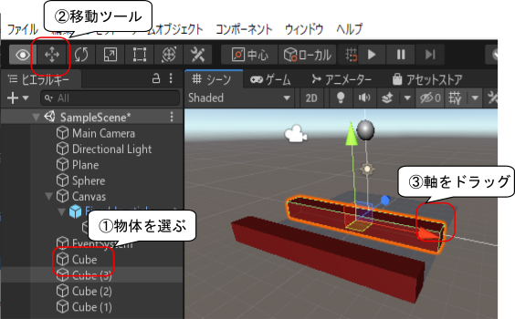

# Unity (3)

[unity/Home](./Home.md)

- - -

## フィールドの作成

- `Sphere`等と同じ要領で「キューブ」を作成する。

- 位置を 0, 0.5, -5 に、拡大縮小を 10, 1, 1 にする。

- Assets フォルダをクリックし、下図の場所を右クリックして「作成」->「マテリアル」を選択する。

- Material 名を「 Wall 」にする。名前は右クリックで変更可能。

- 「アルベド」の右隣の白枠をクリックして「色」ウィンドウを表示し、 RGB のスライダを移動させて好きな色を作る。

- `Wall`マテリアルを`Cube`にドラッグ＆ドロップする。

- `Cube`を右クリックし「複製」で4つ複製を作る。

- 複製された`Cube`を移動・回転させて床の四方に適切に配置する。移動ツール、回転ツールの場所は下図の通り。

**好きな色、大きさの`Cube`を配置する。また、Asset Store から Free のアセットをインポートして使うなどしてみること。**

- フィールドの作成が終わったら PC で再生しテストしてみる。

- - -

[unity/Home](./Home.md)
