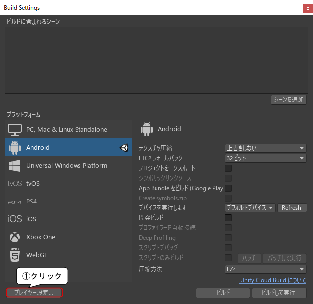

# Unity ( Android 端末向けビルド)

[unity/Home](./Home.md)

- - -

Unity で作成したソフトを Android 端末にインストールするには、端末を USB デバッグ接続可能とし、マイクロ USB ケーブルで PC と接続する必要がある。  
ただし、Android 端末の USB デバッグモードはセキュリティ上の問題を発生させ、一部のアプリを動作不可能にしてしまうため、ここでは説明を省略する。

演習ではあらかじめ設定を済ませた端末と PC を貸し出す。

## Android 端末向けビルドの設定

- 「ファイル」->「ビルド設定」->「 Android 」を選択して、「 Switch Platform 」をクリックする。

- 次に「プレイヤー設定」をクリックする。

- 設定用ウィンドウが出るので、「その他の設定」の「パッケージ名」 を「com.oit.BallGame01」にして`Enter`キーを押す。

- 「解像度と表示」の項目で「デフォルトの向き」を「縦向き」にする。

- 以上の設定が終了したら「Project Settings」のウィンドウは閉じて良い。

## ビルドと Android 端末へのインストール

- `SampleScene`が「ビルドに含まれるシーン」に入っていなければ「 Build Settings 」の「シーンを追加」でシーン`SampleScene`を追加する。

- **開発者向けオプションで USB デバッグを有効にした** Android 端末を PC に接続し、「ビルドして実行」をクリックする。
- ファイル名は`BallGame01`とし、「保存」をクリックする。

- **Android 用のビルドは非常に長い時間がかかる。**
- テクスチャ等が増えればさらに時間がかかるので注意すること。
- ビルドが終了すると、 Android 端末側でソフトが起動する。

## 注意事項

- 全く同じ Unity のプロジェクトを異なる PC から同じ Android 端末にインストールしようとすると Unity 側でエラーが出る場合がある。
- その場合は Android 端末からソフトをアンインストールし、再度 Unity からインストールを試してみること。

## （参考）Android ビルド用ソフトのインストール

- Unity を一旦終了し、 Unity Hub の「インストール」の項目から自分がインストールした Unity の「モジュールを加える」で Android Build Support と SDK、 NDK をインストールする。

- 追加モジュールは下図の通り。

- Android SDK 、 NDK の利用規約に同意し、インストールする。かなりの時間がかかる。

- - -

[unity/Home](./Home.md)
