# Unity (準備)

[unity/Home](./Home.md)

- - -

## Unity Hub のインストール

- [Unity Hub](https://unity3d.com/jp/get-unity/download)をダウンロードしてインストールする。

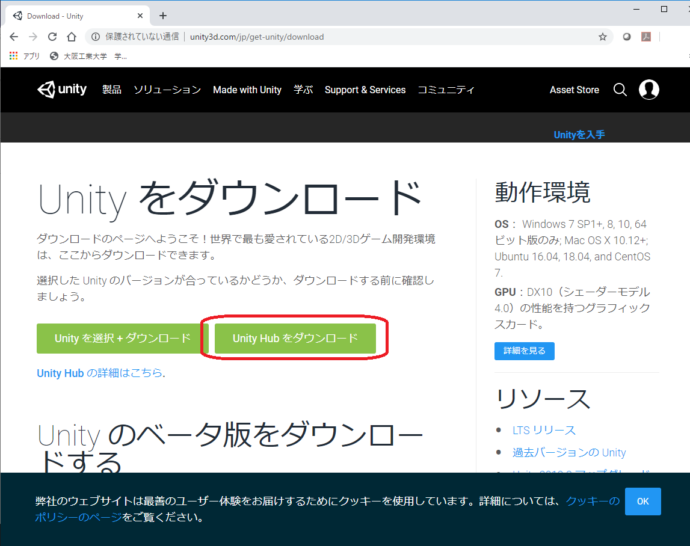

## アカウント作成

- Unity Hub を起動し、右上のアイコンから「サインイン」をクリックする。

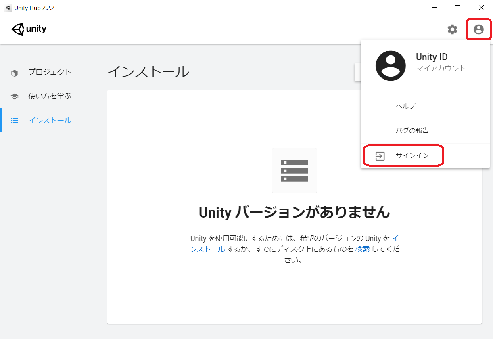

- まだ Unity アカウントが無いならの「 ID を作成」をクリックする。既に、 Unity のアカウントがあるなら、そのメールアドレスとパスワードでサインインし、「 Unity のインストール」に進む。
- Google や FaceBook アカウントによるサインインでも良いが、 Google アカウントによるサインインは[エラーが発生](https://support.google.com/accounts/thread/25001028?hl=en)する可能性が高い。

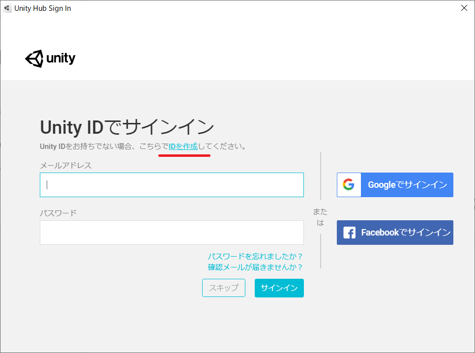

- メールアドレス、パスワード、ユーザ名等、必要事項を入力し、「 Unity ID アカウントを作成」をクリックする。

- 登録したアドレスにメールが届く。

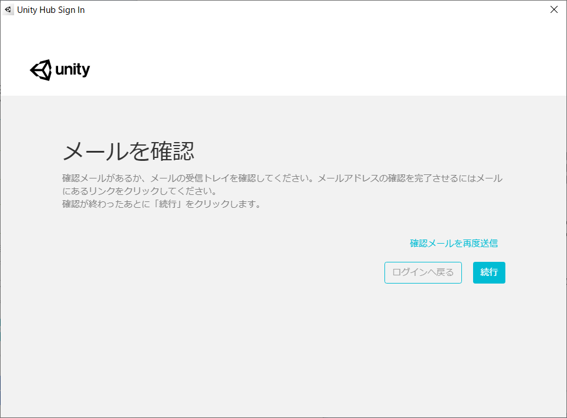

- メールに記載されている「 Link to confirm email 」をクリックする。

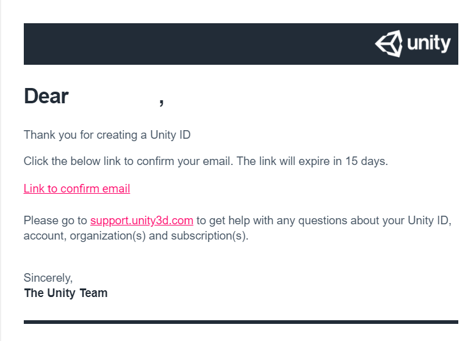

- WEB ブラウザでロボットでないことを証明するページが開くので、チェックして「検証」をクリックする。

- 「続行」をクリックする。

- 登録したアドレスとパスワードでサインインする。

## Unity のインストール

- インストールされた Unity Hub を起動し、 Unity の正式リリースをインストールする。
- Unity Hub の画面の左の方「インストール」の項目をクリックし、青い「インストール」というボタンを押す。
- 本演習では 2019.3.3.f1 を使用する。

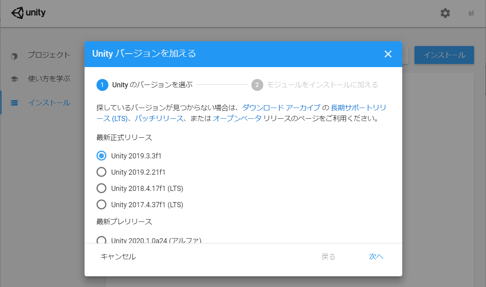

- Windows Build Support 、日本語を選択し、「次へ」をクリックしてインストールを最後まで進める。

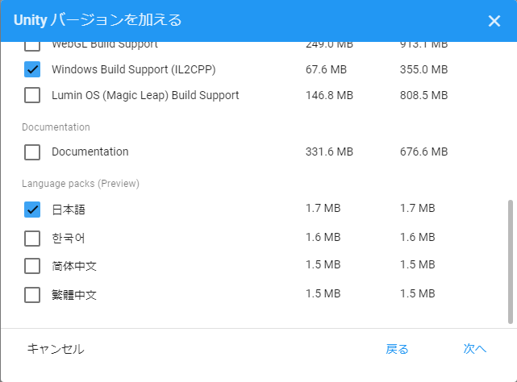

- Unity Hub の「インストール」の項目をクリックして、確かに自分がインストールしたバージョンがあることを確認する。

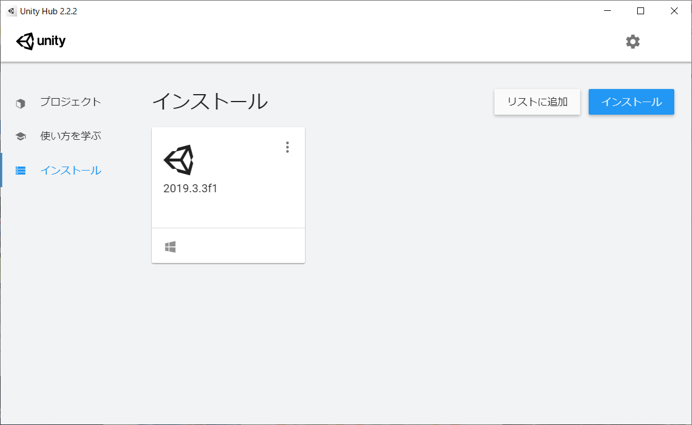

## ライセンス認証

講義等で使用する場合、別途配布されるライセンスキーにより教育用ライセンスの認証を受ける必要がある。ライセンス認証は Unity Hub から次のような手順で行う。

- Unity Hub 右上の歯車のマークをクリックして、環境設定を表示する。

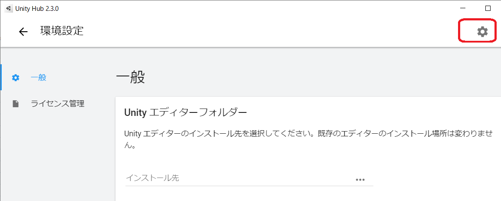

- 「ライセンス管理」を押し「新規ライセンスの認証」をクリックする。

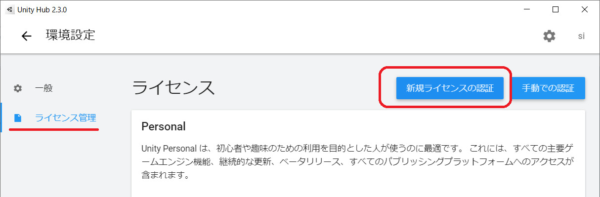

- Unity Plus または Pro を選択してライセンスキーを入力し「実行」をクリックする。

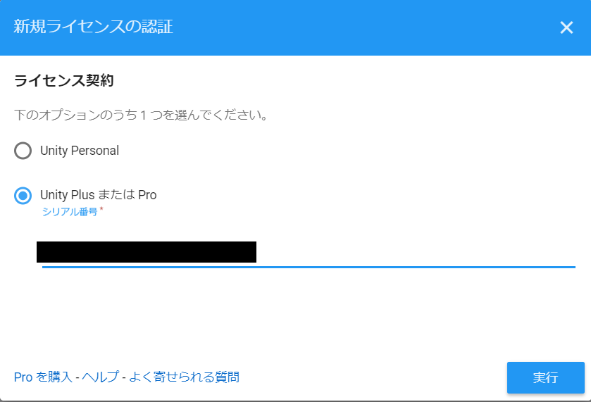

- Unity を起動しエディタ画面が黒くなっていれば認証されている。

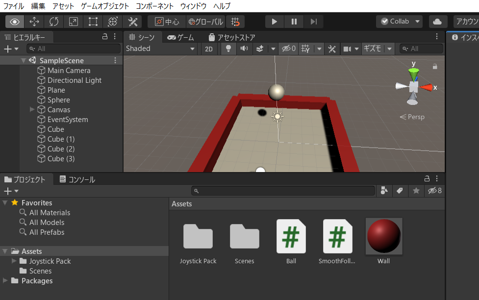

## Visual Studio Code に Unity tools をインストールする

- Visual Studio Code をまだインストールしていないなら、[Visual Studio Code](https://code.visualstudio.com/)からダウンロードしインストールする。
- Visual Studio Code を起動し、拡張機能の「 Unity tools 」を下図を参照してインストールする。
  - 左下の方の拡張機能追加のボタンをクリックする。
  - 拡張機能を検索できるので「 unity tools （大文字小文字は関係ない）」を検索し、「 install 」ボタンでインストールする。

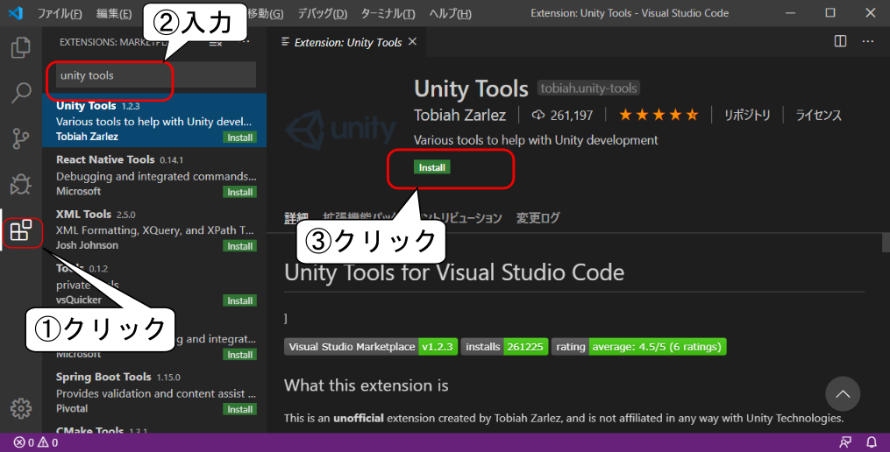

- もし、 Visual Studio Code を日本語化していないのであれば、「 Japanese Language Pack for Visual Studio Code 」の拡張機能をインストールしておく。
- インストール後は Visual Studio Code を終了する。

- - -

[unity/Home](./Home.md)
