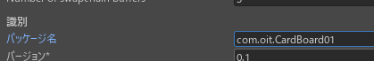

# Android スマートフォンでの VR（1）

[unity/Home](./Home.md)

---

本項目は 2020/07/20 時点での情報である。  
旧来の[Google VR SDK for Unity](https://developers.google.com/vr/develop/unity/get-started-android)は最新の Unity では動作しない。  
[Cardboard SDK](https://developers.google.com/cardboard)を導入する必要がある。

基本的には[Quickstart for Google Cardboard for Unity](https://developers.google.com/cardboard/develop/unity/quickstart)に沿って実施すればよい。

## 開発環境

- Unity ver 2019.3.3f1 ＋ Android Build Support ＋**iOS Build Support**
  - 実際に iOS のアプリを作るのではないが、プラグインのプログラムエラーを回避するのに必要。
- [Google Cardboard XR Plugin for Unity v1.1.0](https://github.com/googlevr/cardboard-xr-plugin)
- [GIT for Windows](https://gitforwindows.org/)

## GIT コマンドのチェック

Windows コマンドプロンプトで`git`コマンドの存在をチェックする。

- Windows のアプリ検索ボックスから`cmd`を入力し「コマンドプロンプト」を起動する。


- コマンドプロンプトで`git`と入力して Enter キーを押し、以下のような表示が出れば OK。


上手く行かない場合は[GIT for Windows](https://gitforwindows.org/)からダウンロードしてインストールする。

## プロジェクトの作成

- プロジェクト名「CardBoard01」とし、タイプは 3D で作成する。


- 「ウィンドウ」→「パッケージマネージャ」を開く。


- 「＋」マークをクリックし「Add package from git URL」を実行する。


- `https://github.com/googlevr/cardboard-xr-plugin.git`という URL をペーストして Add ボタンを押す。


- しばらく（10 秒程度）待つとインポートが始まる。


- 「Import into Project」をクリックする。


- 「Assets」フォルダに以下のようなフォルダが追加されたら、Package Manager を閉じる。


- `Assets/Samples/Google Cardboard/1.1.0/Hello Cardboard/Assets`の`HelloCardboard`を開く。


- 「ファイル」→「ビルド設定」を開き、「Android」を選択して「Switch Platform」する。


- 「シーンを追加」を押す。


- ここでプラグインのプログラムに下記エラーがある場合は iOS の Build Support がインストールされていないので Unity Hub から iOS Build Support をインストールする。
  - メッセージに「iOS」が含まれているのが特徴。

```text
Library\PackageCache\com.google.xr.cardboard@8979e065b7c0223f80c7fa5101ffc696f28bf2eb\Editor\BuildPostProcessor.cs(27,23): error CS0234: The type or namespace name 'iOS' does not exist in the namespace 'UnityEditor' (are you missing an assembly reference?)
```

- 「プレイヤー設定」を押す。「Player」の「解像度と表示」を「横向き（左）」にする。


- **Unity Pro ライセンスの場合のみ**「スプラッシュ画像」の「スプラッシュスクリーンを表示」のチェックを外す。


- 「その他の設定」の「Graphics APIs」で「＋」ボタンを押し「**OpenGLES2**」を追加する。


- 「その他の設定」の「Graphics APIs」から「Vulkan」「**OpenGLES3**」を「－」ボタンを押して消す。


- 最終的には「**OpenGLES2 だけ**」が残る。


- 「パッケージ名」を`com.oit.CardBoard01`にして`Enter`キーを押す。



- 「スクリプティングバックエンド」を「MONO」にする。
  - [オリジナルの資料](https://developers.google.com/cardboard/develop/unity/quickstart#other_settings)では「スクリプティングバックエンド」は「IL2CPP」にすることになっている。
  - しかし「IL2CPP」だと「スプラッシュ画像」の「スプラッシュスクリーンを表示」をオフにしない場合、黒い画面が出て操作不能となる。
  - スプラッシュスクリーンとは、アプリ起動時の Unity ロゴ表示のことで、Unity Personal ライセンスではオフにできない。


<!--  -->

- 「ターゲットアーキテクチャ」で ARMv7 と ARM64 の両方にチェックを入れる。


- インターネットアクセスを必須にする。


- 「公開設定」で「カスタム Gradle テンプレート」にチェックを入れる


- `Assets/Plugins/Android/mainTemplate.gradle`を右クリックし、エクスプローラーで開く。


- エクスプローラーで開かれた`mainTemplate.gradle`を右クリックし、「プログラムから開く」でメモ帳などのテキストエディタで開く。


- 以下の 4 行を図のように貼り付けて保存し、テキストエディタは閉じる。

```text
  implementation 'com.android.support:appcompat-v7:28.0.0'
  implementation 'com.android.support:support-v4:28.0.0'
  implementation 'com.google.android.gms:play-services-vision:15.0.2'
  implementation 'com.google.protobuf:protobuf-lite:3.0.0'
```


- 「XR Plugin Management」で「CardBoard XR Plugin」にチェックを入れる。


- `HelloCardBoard`シーンをビルドして、Android 端末にインストールすると VR アプリとして再生される。
- パソコンの UnityEditor 上で再生してはいけない。再生すると次のようなエラーが出て、「XR Plugin Management」から「CardBoard XR Plugin」が消えてしまう。
  - この場合は Unity を再起動する。
  - ただし、一旦「CardBoard XR Plugin」にチェックした後はビルドおよび Android 端末へのインストールは可能なようである。

```text
DllNotFoundException: cardboard_api
Google.XR.Cardboard.Api.HasDeviceParams () (at Library/PackageCache/com.google.xr.cardboard@8979e065b7c0223f80c7fa5101ffc696f28bf2eb/Runtime/Api.cs:101)
CardboardStartup.Start () (at Assets/Samples/Google Cardboard XR Plugin for Unity/1.1.0/Hello Cardboard/Assets/Scripts/CardboardStartup.cs:39)
```

---

[unity/Home](./Home.md)
