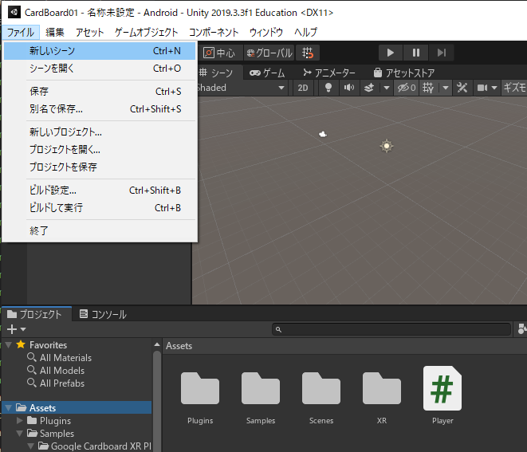

# Android スマートフォンでの VR（2）

[unity/Home](./Home.md)

---

## 新規シーンを作成する

- Assets をクリックしてから「ファイル」→「新しいシーン」



- Plane および Cube を利用して図のようなシーンを作成する。
  - シーン名「Main」として忘れないように保存すること。


## プレイヤーキャラクタを置く

- エディタ左上の「＋」マークでカプセルを作成する。


- Position は 0,1,0


- ヒエラルキーの「Cupsule」をクリックしてから「コンポーネントを追加」を押す。


- 検索ボックスに「リジッド」と入力し「リジッドボディ」を追加する。


- Rigid Body の「Freeze Rotation」の X と Z にチェックする。


## カメラの設定

- Main Camera をドラッグ＆ドロップで Capsule 内に移動する。
- Main Camera の Position を 0,0.6,0 とする。


- Main Camera にコンポーネント「Tracked Pose Driver」を追加する。


## デバッグ用のテキスト表示を配置する

- Main Camera を右クリックし、「3D オブジェクト」の「3D Text」を追加する。


- 3D Text の名前を「`Debug Text`」とする。


- 位置、拡大縮小、フォントサイズ、色を下図のようにする。


## C# スクリプトを書く

- Assets 内に新規スクリプト「Player」を作成する。
- Capsule にドラッグ＆ドロップする。
- Player スクリプトをダブルクリックして編集開始。


- フィールドを追加する。

```C#
public float moveSpeed = 1.0f;
private Transform headCamera;
private TextMesh debugText;
```


- Start メソッドを修正する。

```C#
void Start () {
    headCamera = transform.Find("Main Camera");
    if (headCamera == null) {
        Debug.LogError ("Can‘t find Main Camera.");
        return;
    }
    debugText = (TextMesh)headCamera.transform.Find("Debug Text").GetComponent<TextMesh> ();
    if (debugText == null) {
        Debug.LogError ("Can't find Debug Text.");
    }
}
```


- FixedUpdate メソッドを Start の下に追加する。

```C#
void FixedUpdate ()
{
    Vector3 headRot = headCamera.transform.rotation.eulerAngles;
    Vector3 move = new Vector3 (0, 0, 1);
    move = Quaternion.Euler (0, headRot.y, 0) * move;
    move = move * Time.deltaTime * moveSpeed;
    transform.Translate (move, Space.World);
}
```


- Update メソッドを修正する。

```C#
void Update () {
    Vector3 headRot = headCamera.transform.rotation.eulerAngles;
    debugText.text = string.Format  ("position:({0:F2},{1:F2},{2:F2})\n", transform.position.x, transform.position.y, transform.position.z);
    debugText.text += string.Format("rotation:({0:F2},{1:F2},{2:F2})", headRot.x, headRot.y, headRot.z);
}
```


スクリプトの編集が終わったら、実機にインストールして動作させてみる。  
顔を向けている方向に前進するような VR シーンが再生されるはずである。


## 課題

- このままでは、プレイヤーキャラクタ（Capsule）の動きを止められない。
  - ジョイスティック等外部のデバイスなしに、動きを止めたり、開始させたり自由にコントロールできないか。
- フィールドが Plane や Cube では味気ない。
  - Asset Store を使って素材を収集してみよう。
  - ただし、作成したアプリを実機にインストールする際の時間や動作速度に注意すること。

---

[unity/Home](./Home.md)
