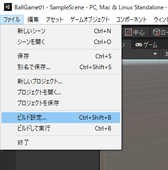
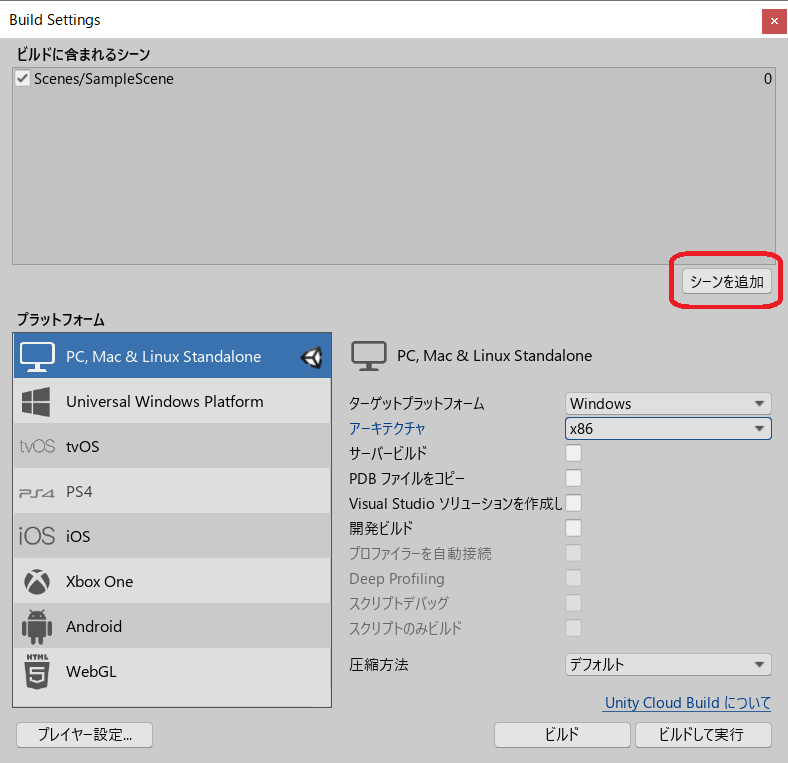
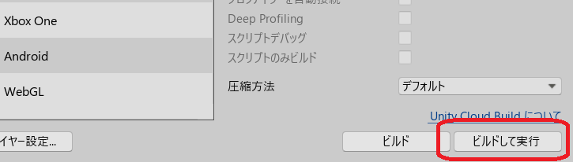
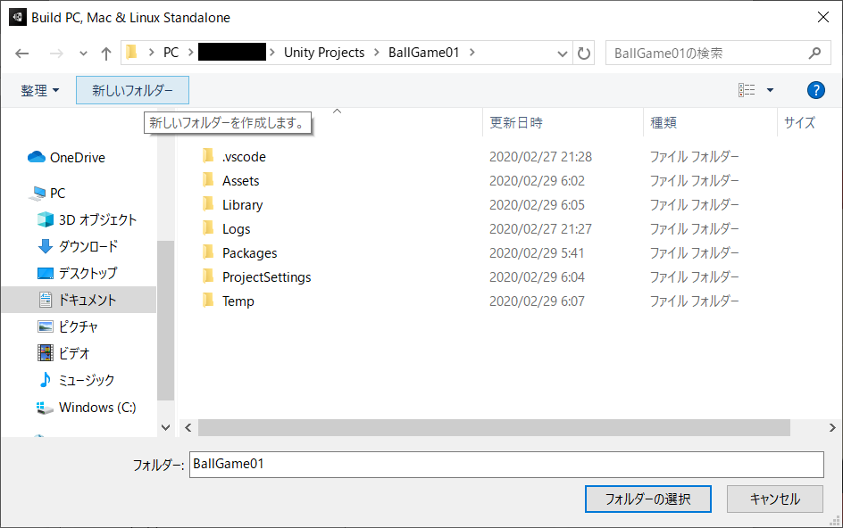
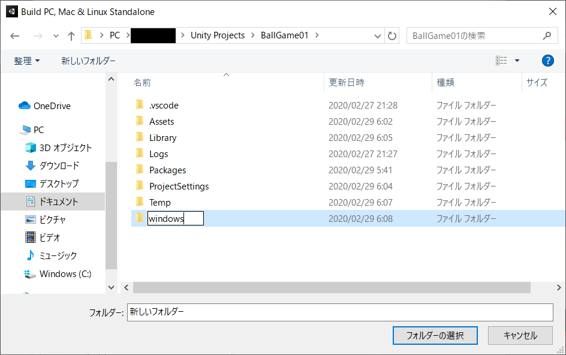
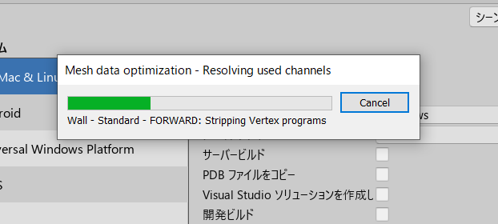
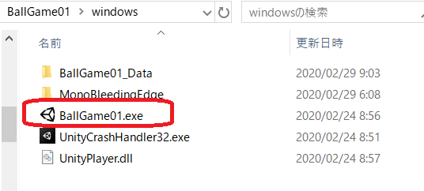

# Unity ( Windows 向けビルド)

[unity/Home](./Home.md)

- - -

- 「ファイル」->「ビルド設定」を開く

- `SampleScene`が「ビルドに含まれるシーン」に入っていなければ「 Build Settings 」の「シーンを追加」でシーン`SampleScene`を追加する。

- 「ビルドして実行」をクリックする。

- Windows 向けビルドの出力を保存するフォルダを選択するダイアログが出るので、任意の名前で新しいフォルダを作成し、「フォルダーの選択」を押す。

- ビルドが始まり、終了するとゲームがフルスクリーンで起動する。終了させたい場合は`Alt`キー＋`F4`キーを押す。

- 以降は再ビルドが不要であれば、`BallGame01.exe`をダブルクリックすればゲームを起動できる。

- - -

[unity/Home](./Home.md)
