# Visual Studio Code

ちょっと便利なプログラミング用エディタ。

[Home.md](../README.md)

---

## インストール

* PC にインストールされているかどうか下記コマンドで確認する。

```shell
dpkg -l|grep "Code editing"
```

* インストールされていれば、次のような出力が得られる。

```shell
ii  code  1.26.1-1534444688  amd64  Code editing. Redefined.
```

* 何も出力がない場合は次の手順でインストール。
* https://code.visualstudio.com/ から`.dep`をクリックしてダウンロード。
* ダウンロードしたファイルを右クリック->「ソフトウェアのインストールで開く」等でインストール。

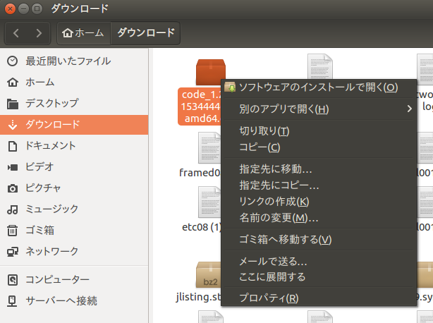

## パッケージのソースコードを編集する

* 下記コマンドで Visual Studio Code を起動する。

```shell
roscd beginner_tutorials
code . （ピリオドを忘れないように）
```

* 下図のアイコンをクリックして必要な拡張機能をインストール。

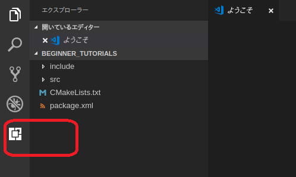

* 拡張機能の検索で`Python`を検索してインストール。検索後「インストール」ボタンを押す。インストール後「再読み込み」ボタンが出たら押す。

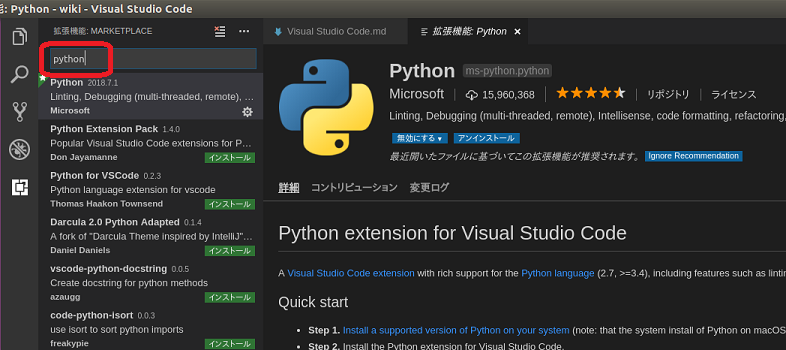

* 拡張機能の検索で`C++`を検索してインストール。検索後「インストール」ボタンを押す。インストール後「再読み込み」ボタンが出たら押す。

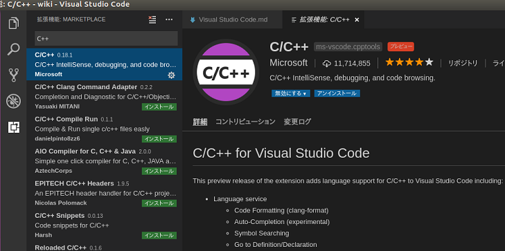

* 拡張機能の検索で`ROS`を検索してインストール。検索後「インストール」ボタンを押す。インストール後「再読み込み」ボタンが出たら押す。

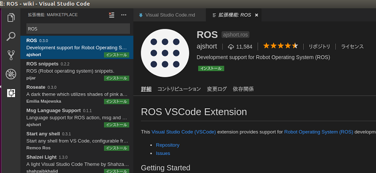

* 拡張機能の検索で`GitLense`を検索してインストール。検索後「インストール」ボタンを押す。インストール後「再読み込み」ボタンが出たら押す。

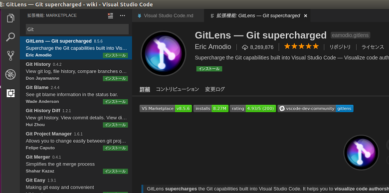

## コンソールの表示

* 「表示」メニューから「ターミナル」を選択し、コマンド入力用のコンソールを表示させる。

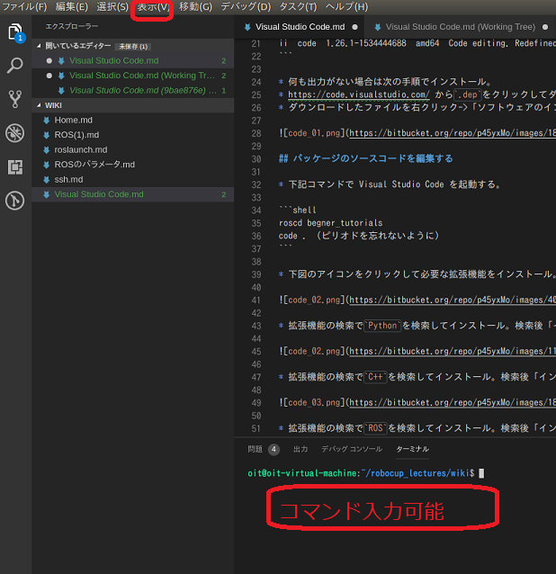

## ファイルの編集

* 下図のアイコンをクリックするとファイルの一覧を表示できる。編集したいファイルをダブルクリックして編集できる。

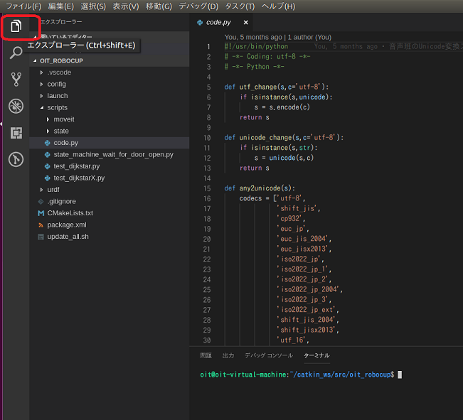

### インテリセンス

* ピリオドを入力することでメソッドの候補を表示できる。
* 例えば`listener.py`の`callback`メソッド内で`rospy.`と入力すると、利用可能なメソッド一覧を表示できる。 

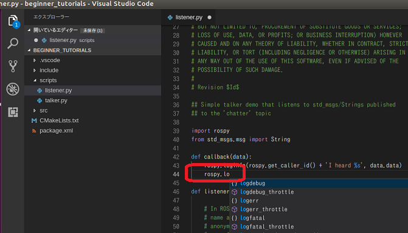

### コードフォーマット

* ソース編集画面で右クリック->「ソースコードのフォーマット」でメソッド間に適切な空行を入れる等して見やすくしてくれる。C++の場合はインデントなども設定してくれる。

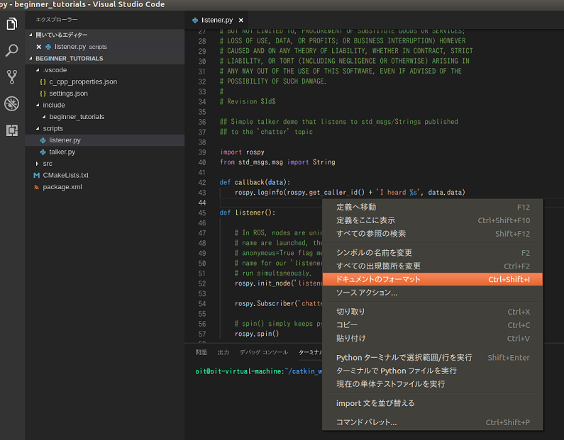

## ROS の機能

* `Ctrl+Shift+P`を同時押しして下図のように`ros`を入力すると ROS の拡張機能を利用できる。

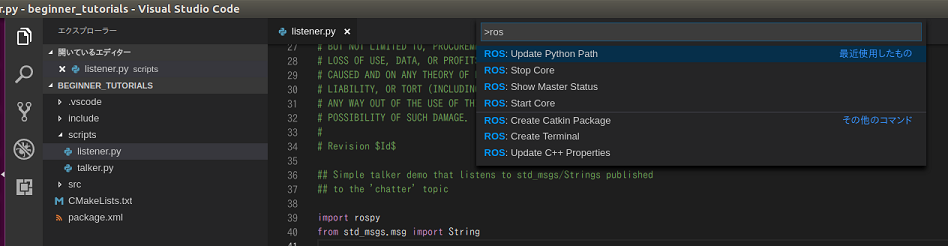

* `Start Core`、`Stop Core`で ROS マスターの起動と終了が可能。`Show Master Status`でマスターの状態が分かる。
* `Update C++ Properties`、`Update Python Properties`はインテリセンスが上手く働かなかった場合に実行してみると良いかもしれない。

## Git の機能

* 一旦 Visual Studio Code を終了後再起動して`Git`の実習で作成したローカルリポジトリを開く。

```shell
cd ~/catkin_ws/src/oit_test_***
code . （ピリオドを忘れないように）
```

* 下図のアイコンをクリックすると、`Git`の最新コミットからどこを編集したのかが分かる。

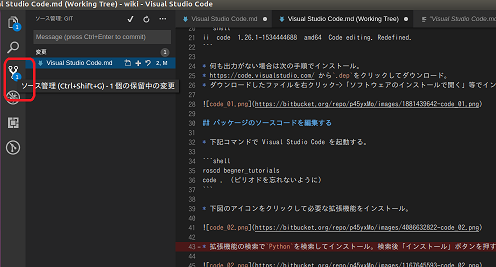

* 下図のアイコンをクリックすると、`Git`のコミット履歴が分かる。

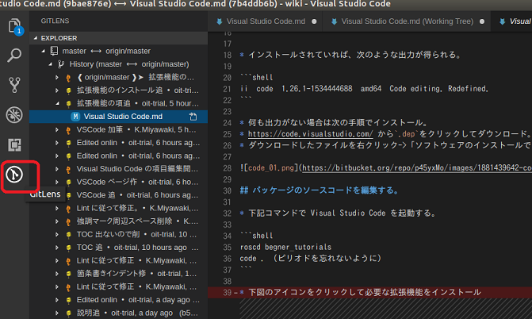

## 再度`.gitignore`

### 問題（1）

* 下図のリポジトリの問題点をファイル名先頭の記号に着目して説明しなさい。

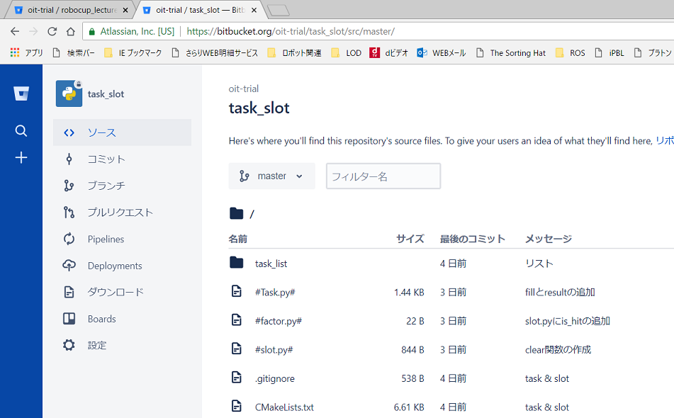

### Visual Studio Code が生成するファイル

* Visual Studio Code で開いたディレクトリには`.vscode`というフォルダが生成され、様々な設定が保存される。

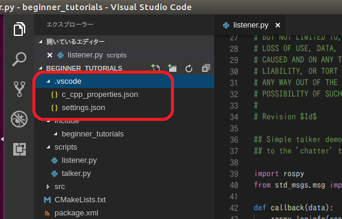

* これも`.gitignore`に含めるべきファイル。

### `ROS`標準の`.gitignore`への追記

* Visual Studio Code や`emacs`での編集も考えると、 https://github.com/github/gitignore/blob/master/ROS.gitignore に最低限下記を追加しておく必要がある。

```text
# Emacs
\#*\#

# Visucal Studio Code
.vscode/*
```

* 参考文献によれば、 Emacs 、 Visual Studio Code ともに上記以外の多くの設定が`.gitignore`に含まれるようだが、調査中。

---

## 参考文献

* [ROS Python スタイルガイド](http://wiki.ros.org/ja/PyStyleGuide)
  * [pep8-ja](https://pep8-ja.readthedocs.io/ja/latest/)
* https://github.com/github/gitignore/blob/master/Global/VisualStudioCode.gitignore
* https://github.com/github/gitignore/blob/master/Global/Emacs.gitignore

---

[Home.md](../README.md)
