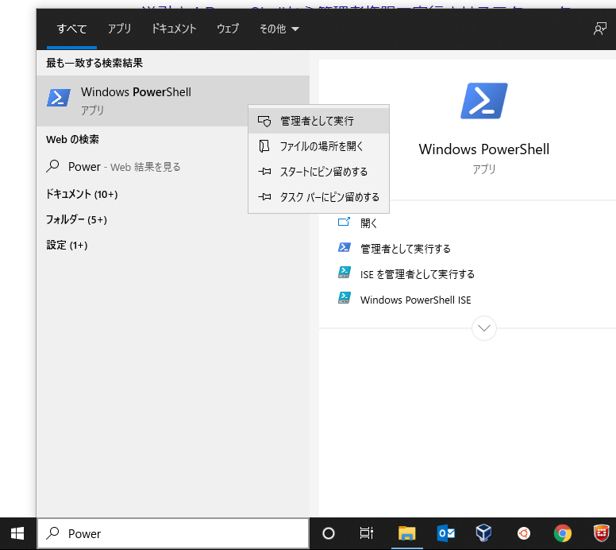
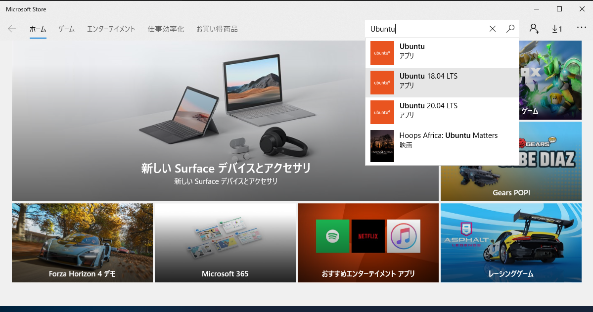
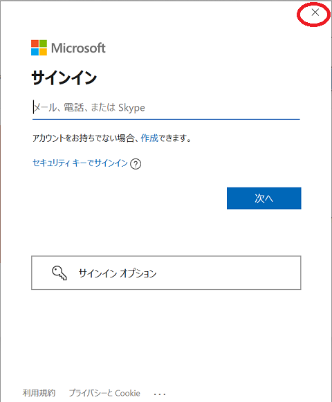
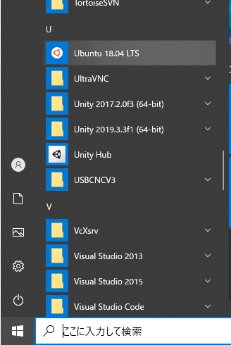
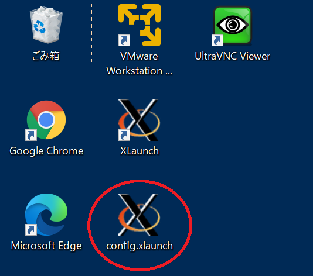
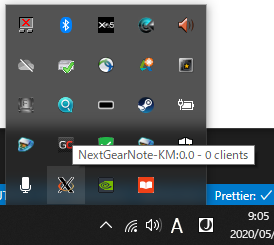
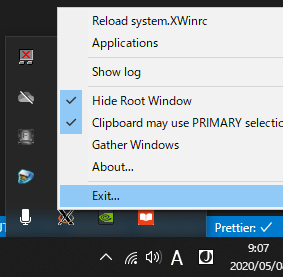
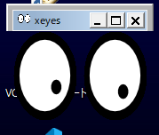

# WSL1

[Home](../README.md)

---

WSL(Windows Subsystem for Linux) は Windows10 上で Linux を動作させるシステムである。
WSL1 と WSL2 があるが、この記事では WSL1 を扱う。  
基本的にはインターネット上で「wsl インストール」などと検索すれば記事が出てくるのでそれに従えばよいが、GUI ソフトを使う際にいくつか注意事項がある。

## Windows を更新する

PC 内のファイルで重要なものがある場合はクラウドストレージにバックアップしておくこと。

- [Windows 10 を更新する](https://support.microsoft.com/ja-jp/windows/windows-%E3%81%AE%E6%9B%B4%E6%96%B0-3c5ae7fc-9fb6-9af1-1984-b5e0412c556a)などを参照し、 Windows を更新する。
- オプションの品質更新プログラムなどもインストールする。

## Windows Power Shell を管理者権限で起動する

Windows の検索ボックスから「PowerShell」と入力すると PowerShell が出るので、右クリックで管理者権限で起動する。



## WSL1 と Ubuntu 18.04 のインストール

PowerShell で以下のコマンドを実行する。

```cmd
dism.exe /online /enable-feature /featurename:Microsoft-Windows-Subsystem-Linux /all /norestart
```

実行結果は以下の通り。

```cmd
展開イメージのサービスと管理ツール
バージョン: 10.0.19041.844

イメージのバージョン: 10.0.19042.1202

機能を有効にしています
[==========================100.0%==========================]
操作は正常に完了しました。
```

- **PCを再起動する。**

Linux ディストリビューション **`Ubuntu18 LTS`** をMicrosoft Storeからインストールする。  
Microsoft Store も PowerShell のときと同じで Windows の検索ボックスから「Store」と検索すれば出てくる。Microsoft Store で「Ubuntu」と検索し `Ubuntu18.04 LTS`を選択する。  



インストール時にマイクロソフトアカウントを要求されるが、キャンセル（アカウント入力画面を「x」ボタンで閉じる）すればそのままインストールできる。



## WSL1 の起動

起動方法は一般的な Windows のプログラムと同じでスタートボタンから起動できる。



起動後はユーザ名とパスワードを設定する。

```shell
Installing, this may take a few minutes...
Please create a default UNIX user account. The username does not need to match your Windows username.
For more information visit: https://aka.ms/wslusers
Enter new UNIX username: oit
Enter new UNIX password: # 文字を入力しても表示はされない。正確に入力すること。
Retype new UNIX password: # 文字を入力しても表示はされない。正確に入力すること。
passwd: password updated successfully
Installation successful!
To run a command as administrator (user "root"), use "sudo <command>".
See "man sudo_root" for details.

oit@MyComputer:~$
```

## GUI を使えるようにする

### VcXsrv をインストールする

[VcXsrv](https://sourceforge.net/projects/vcxsrv/)のページで Download ボタンを押し、ダウンロードしてインストールする。

下記ファイルを PC のデスクトップにファイル名「config.xlaunch」としてデスクトップに保存する。
リンクをクリックし、出てきたページで「Raw」ボタンを押す。するとテキストそのものが表示されるので、ブラウザの機能（右クリック）などで保存する。

- **拡張子に注意すること。保存ファイル名は「`config.xlaunch`」** である。
- [`config.xlaunch`](./install_wsl/config.xlaunch) <- 上記の注意を読んでデスクトップに保存する。

`config.xlaunch`をダブルクリックする。



Windows のタスクトレイ右下の「^」マークをクリックし X のアイコンが**一つだけ**出ていれば OK。



X のアイコンが 2 つ以上出ていたときは右クリック->Exit で全て終了させて再度 1 回だけ起動する。



### Ubuntu 側で必要なソフトをインストールする

WSL1 を起動し、以下のコマンドを実行する。  
ここで`$`がある行が入力するコマンドを示す。ただし`$`は入力プロンプトなので、入力不要。
それ以外の行はコマンドの実行結果である。

**コピー＆ペーストで良いが、一行ずつ実行すること！**

```shell
$ sudo apt install -y x11-apps x11-utils x11-xserver-utils dbus-x11
[sudo] password for oit: # パスワードを入れる。
Reading package lists... Done
Building dependency tree
Reading state information... Done
x11-utils is already the newest version (7.7+3build1).
dbus-x11 is already the newest version (1.12.2-1ubuntu1.1).
The following additional packages will be installed:
  cpp cpp-7 gcc-7-base libisl19 libmpc3 libxcursor1 libxkbfile1 xbitmaps
Suggested packages:
  cpp-doc gcc-7-locales mesa-utils nickle cairo-5c xorg-docs-core
The following NEW packages will be installed:
  cpp cpp-7 gcc-7-base libisl19 libmpc3 libxcursor1 libxkbfile1 x11-apps x11-xserver-utils xbitmaps
0 upgraded, 10 newly installed, 0 to remove and 0 not upgraded.
Need to get 10.2 MB of archives.
After this operation, 30.0 MB of additional disk space will be used.
Get:1 http://archive.ubuntu.com/ubuntu bionic-updates/main amd64 gcc-7-base amd64 7.5.0-3ubuntu1~18.04 [18.3 kB]
Get:2 http://archive.ubuntu.com/ubuntu bionic/main amd64 libisl19 amd64 0.19-1 [551 kB]
Get:3 http://archive.ubuntu.com/ubuntu bionic/main amd64 libmpc3 amd64 1.1.0-1 [40.8 kB]
# 省略
Processing triggers for libc-bin (2.27-3ubuntu1) ...
Processing triggers for man-db (2.8.3-2ubuntu0.1) ...
```

以下も実行する。

```shell
$ cd
$ echo 'export DISPLAY=localhost:0.0' >> ~/.bashrc
$ echo 'export LIBGL_ALWAYS_INDIRECT=0' >> ~/.bashrc
$ source ~/.bashrc
```

終了後、`xeyes`コマンドを実行して次のようなウィンドウが開けば OK。

```shell
$ xeyes
```



### PC と VcXsrv の再起動

一旦 PC を再起動する。  

1. デスクトップ上の`config.xlaunch`をダブルクリックする。
2. 完了したら再び`xeyes`コマンドで GUI の動作確認をする。

以降、PC 起動後はこの手順で VcXSrv を起動する。

---

[Home](../README.md)
